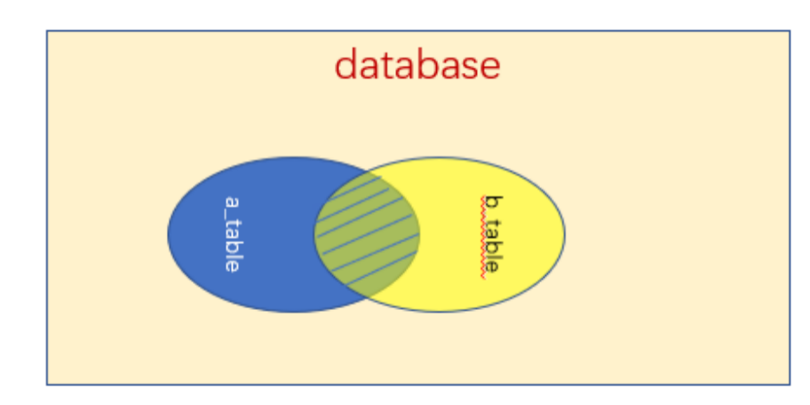
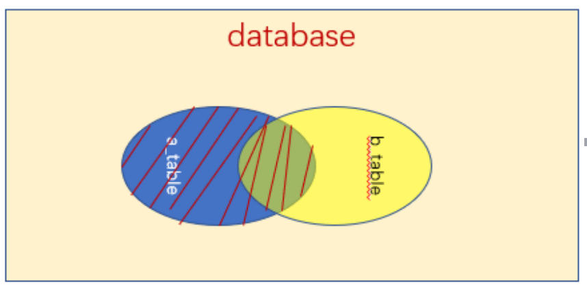
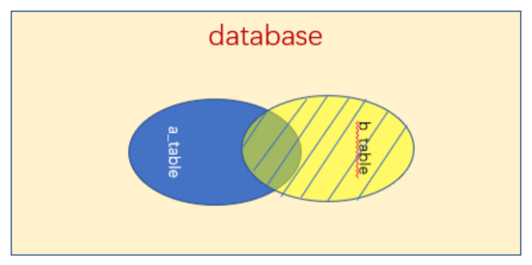
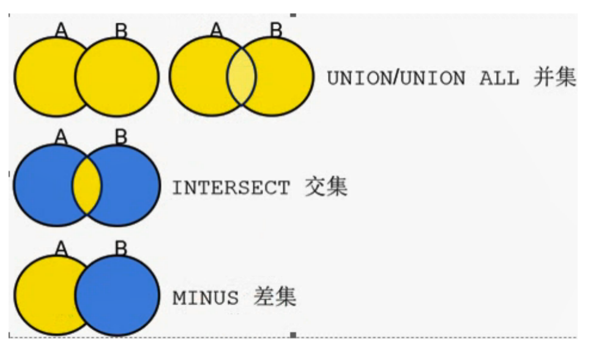

# 表数据的查询
## 基本的查询语句

> SELECT语句是最常用的查询语句，它的使用方式有些复杂，但功能是相当强大的。SELECT语句的基本语法如下：

> select selection_list//要查询的内容，选择哪些列

> from 数据表名//指定数据表

> where primary_constraint//查询时需要满足的条件，行必须满足的条件

> group by grouping_columns//如何对结果进行分组

> order by sorting_cloumns//如何对结果进行排序

> having secondary_constraint//查询时满足的第二条件

> limit count//限定输出的查询结果

### 使用select语句查询一个数据表
`select * from hero;`

### 查询表中的一列或多列
`select heroId , heroName from hero;`

### 从一个或多个表中获取数据
```
select hero.heroId ,hero.heroName, dept.deptId,dept.deptName from hero,dept where hero.deptId = dept.deptId;
```
## 单表查询

### 查询所有字段
`select * from hero;`

### 查询指定字段
`select heroId , heroName from hero;`
### 查询指定数据
1. 在hero表中查询漩涡鸣人的信息
`select * from hero where heroName = '漩涡鸣人';`
2. 查询工资小于5000的人员信息
`select * from hero where salary < 5000;`

### 带关键字In的查询
1. 查看hero表中所有上忍和中忍的信息
`select * from hero where job in ('上忍','中忍');`
2. 查看直属上司不是火影的人员信息
`select * from hero where leaderId not in (70000);`

### 带关键字 between  and 的范围查询
1. 查询英雄编号80000 到90000之间的人员信息
`select * from hero where heroId between 80000 and 90000;`
2.	查询工资在7000到10000之间的人员信息
`select * from hero where salary between 7000 and 10000;`
3.	查看雇佣日期不在2000~2010 年的人员信息
`select * from hero where hireDate not between '2000-01-01' and '2010-12-31';`

### 带like的字符匹配查询
1. 查看姓 ‘日向’的人员信息
`select * from hero where heroName like'日向%';`
2.	查看名字一共3个字的人员信息
`select * from hero where heroName like '___';`

### 用关键字is null查询空值
1. 查询没有奖金的人员信息
`select * from hero where commission is null;`
2. 查询有奖金的人员信息
`select * from hero where commission is not null;`

### 带关键字and的多条件查询
1. 查询职位为上忍并且工资大于等于9000的人员信息
`select * from hero where job = '上忍' and salary >= 9000;`

### 带关键字or的多条件查询
1. 查询部门编号为20或者30的人员信息
`
select * from hero where deptId in (20,30);`

### 用关键字 distinct 去除结果中重复行
1. 查看一共有多少种职位
`select distinct job from hero;`

### 用关键字 order by 对查询结果排序
1. 按照工资进行降序显示
`select * from hero order by salary desc;`
2. 按照部门编号降序，如果部门编号相同 ，按照工资进行升序排列
`select * from hero order by deptId desc, salary asc;`
3. 按照奖金升序排序
`select * from hero order by commission;`
<mark>注：这里NULL会排在最前，MySQL中默认认为NULL为最小，因此排列时候回在最前。</mark>
4.	`select * from hero order by isnull(commission), commission;`
<mark>可以利用isnull（expr）函数让NULL显示到最后。isnull（expr）代表如何expr是NULL返回1，否则返回0；

### 用关键字 group by 分组查询
通过GROUP BY子句可以将数据划分到不同的组中，实现对记录进行分组查询。在查询时，所查询的列必须包含在分组的列中，目的是使查询到的数据没有矛盾。
#### 使用group by 分组查询
1. 分组查询有哪些职位
`select  job from hero group by job;`
2. 分组查看都有哪些工资
`select salary from hero group by salary;`

#### group by 与 group_concat()函数一起使用
1. 分组查询各个职位都有哪些人
`select job, group_concat(heroName) from hero group by job;`

#### 按多个字段分组
1. 分组查询不同岗位的不同部门编号有哪些
`select job, deptId from hero group by job, deptId;`
<mark>先按照deptId进行分组，如果deptId相同，再按照job进行分组

###  用关键字limit 限制查询结果的数量
1. 查询前3名工资的人员信息
`select * from hero order by salary desc limit 3;`<mark>使用limit也可以查询中间部分取值，要定义两个参数，参数1代表开始读取的第一条记录编号（从0开始索引），参数2代表要查询的个数。
2. 显示排名前4到前8的工资的人员信息
`select * from hero order by salary desc limit 3,5;`

## 聚合函数查询
> 聚合函数的最大特点是它们根据一组数据求出一个值。聚合函数的结果值只根据选定行中非NULL的值进行计算，NULL值被忽略。

###  COUNT()函数
`select count(*) from hero;`

### AVG()函数
`select avg(salary) from hero;`

### MAX()函数
`select max(salary)from hero;`

### MIN()函数
`select min(salary) from hero;`

## 连接查询

### 内连接查询

```select heroId,heroName,deptName from hero,dept where hero.deptId = dept.deptId;```

### 外连接查询

与内连接不同，外连接是指使用OUTER JOIN关键字将两个表连接起来。外连接生成的结果集不仅包含符合连接条件的行数据，而且还包括左表（左外连接时的表）、右表（右外连接时的表）中所有的数据行。
#### 数据准备

在hero表中插入一个新的数据：

```
insert into hero (heroId,heroName,job,leaderId) values  ( 190000,'我爱罗','下忍', 170000);
```

在dept表中也插入新数据：

```
insert into dept values(40,'警务部','木叶边境');
```

#### 左外连接



内连接
```
select dept.deptId, dept.deptName, count(heroId) from hero, dept where dept.deptId = hero.deptId group by deptId , deptName;
```

左外连接
```
select dept.deptId, dept.deptName, count(heroId) from hero left join dept on dept.deptId = hero.deptId group by deptId , deptName;
```

####右外连接


内连接
```
select dept.deptId, dept.deptName, count(heroId) from hero, dept where dept.deptId = hero.deptId group by deptId , deptName;
```

右外连接结果
```
select dept.deptId, dept.deptName, count(heroId) from hero right join dept on dept.deptId = hero.deptId group by deptId , deptName;
```

#### 复合条件连接查询
分组查询部门编号 大于等于 20 的 部门编号、部门名称的人员个数
```
select dept.deptId, dept.deptName, count(heroId) from hero, dept where dept.deptId = hero.deptId  and  dept.deptId >= 20 group by  deptId, deptName;
```

## 子查询
> 子查询就是select查询是另一个查询的附属，MySQL4.1以上可以嵌套多个查询，在外面一层的查询中使用里面的查询产生的结果集。这样就不是执行两个（或多个）独立的查询，而是执行包含一个（或多个）子查询的单独查询。
当遇到这样的多层查询时，MySQL从最内层的查询开始，然后从它开始向外向上移动到外层查询，在这个过程中每个查询产生的结果集都被赋给包围它的父查询，接着这个父查询被执行，它的结果也被指定给父查询。


### 带关键字IN的子查询
> <mark>只有子查询返回的结果列包含一个值时，比较运算符才适用。假如一个子查询返回的结果集是值的列表，这时比较运算符就必须用IN运算符代替。

> IN运算符可以检测结果集中是否存在某个特定的值，如果检测成功就执行外部的查询。

1. 查询是领导的人员信息
`select * from hero where heroId in (select distinct leaderId from hero);`
2. 查询有上司的人员信息
`select * from hero where heroId not in (select distinct leaderId from hero where leaderId is not null);`
<mark>注：not in集合里不能有NULL，如果有就都查询不出来了。

### 带比较运算符的子查询
> 子查询可以使用比较运算符，包括 =  !=   >  >=  <  <= 等。


例：查询 只要比30部门任意一个英雄的工资高就可以 的人员信息。
`select * from hero where salary > (select min(salary)from hero where deptId = 30);`

例：查询 任意一个英雄都比30号部门人员工资高 的人员信息。
`select * from hero where salary > (select max(salary)from hero where deptId = 30);`

### 带ANY关键字的子查询

> ANY关键字表示满足其中任意一个条件。使用ANY关键字时，只要满足内层查询语句返回的结果中的任意一个，就可以通过该条件来执行外层查询语句。

例：查询 只要比30部门任意一个英雄的工资高就可以 的人员信息。
`select * from hero where salary > any(select salary from hero where deptId = 30);`

### 带ALL关键字的子查询

> ALL关键字表示满足所有条件。使用ALL关键字时，只有满足内层查询语句返回的所有结果，才可以执行外层查询语句。

例：查询 任意一个英雄都比30号部门人员工资高 的人员信息。
`select * from hero where salary > all(select salary from hero where deptId = 30);`

### 带关键字EXISTS的子查询

> 使用EXISTS关键字时，内层查询语句不返回查询的记录。而是返回一个真假值。如果内层查询语句查询到满足条件的记录，就返回一个真值（true），否则，将返回一个假值（false）。当返回的值为true时，外层查询语句将进行查询；当返回的为false时，外层查询语句不进行查询或者查询不出任何记录。

例1： 如果有总部，查询部门表所有信息。
`select * from dept where exists(select * from dept where deptName = '总部');`

例2： 如果有暗部，查询部门表所有信息。
`select * from dept where exists (select * from dept where deptName = '暗部');`

## 合并查询结果

合并查询结果是将多个SELECT语句的查询结果合并到一起。合并查询结果使用UNION和UNION ALL关键字。

例1：利用union 求在10、20 号部门的人员与 在20、30 号部门的人员的并集。

```
select * from hero where deptId in (10,20) union select * from hero where deptId in(20,30);
```
例2：利用union all 求在10、20 号部门的人员与 在20、30 号部门的人员的并集。

```
select * from hero where deptId in (10,20) union all select * from hero where deptId in(20,30);
```

## 定义表和字段的别名

> 在查询时，可以为表和字段取一个别名，这个别名可以代替其指定的表和字段。为字段和表取别名，能够使查询更加方便。而且可以使查询结果以更加合理的方式显示。

### 给表起别名
> 当表的名称特别长时，在查询中直接使用表名很不方便。这时可以为表取一个贴切的别名。

例：查询姓名为旗木卡卡西的信息 （给表hero 起别名 h）
`select * from hero h where h.heroName = '旗木卡卡西';` 

### 给字段起别名
> 当查询数据时，MySQL会显示每个输出列的名词。默认情况下，显示的列名是创建表时定义的列名。我们同样可以为这个列取一个别名。

例：查询hero表中所有英雄的信息(中文显示字段名)

```
select heroId as 英雄id ,heroName as 英雄姓名, job as 职位 , leaderId as 上级id, hireDate as 雇佣日期,  salary as 工资 ,commission as 奖金 , deptId as 部门编号 from hero;
```
起别名时的as 关键字为可选项，可以不加。
```
select heroId  英雄id ,heroName  英雄姓名, job  职位 , leaderId  上级id, hireDate  雇佣日期,  salary   工资 ,commission  奖金 , deptId  部门编号 from hero;
```
## 使用正则表达式查询

> 正则表达式是用某种模式去匹配一类字符串的一个方式。正则表达式的查询能力比通配字符的查询能力更强大，而且更加的灵活。下面详细讲解如何使用正则表达式来查询。

在MySQL中，使用REGEXP关键字来匹配查询正则表达式。其基本形式如下：
字段名 REGEXP '匹配方式'

### 匹配指定字符中的任意一个
>	使用方括号（[]）可以将需要查询字符组成一个字符集。只要记录中包含方括号中的任意字符，该记录将会被查询出来。

例1：查看英雄姓名中带 ‘日’ 字的人员信息
```
select * from hero where heroName regexp '[日]';
```
例2： 查询英雄职位不是上忍的人员信息
```
select * from hero where job regexp '[^上忍]';
```
### 使用“*”和“+”来匹配多个字符

> 正则表达式中，“* ”和“+”都可以匹配多个该符号之前的字符。但是，“+”至少表示一个字符，而“*”可以表示0个字符。 

例1：查询英雄Id中 数字2前面有x个 1的 人员信息。（x可以为0）;
`select * from hero where heroId  regexp '1*2';`
例2：查询英雄Id中 数字2前面有x个 1的 人员信息。（x大于0）;
`select * from hero where heroId  regexp '1+2';`
### 匹配以指定的字符开头和结束的记录

> 正则表达式中，^表示字符串的开始位置，$表示字符串的结束位置。下面将通过一个具体的实例演示如何匹配以指定的字符开头和结束的记录

例：查询雇佣时间是2018年开始23号结尾的人员信息。

`select * from hero where hireDate  regexp '^2018....23';`
