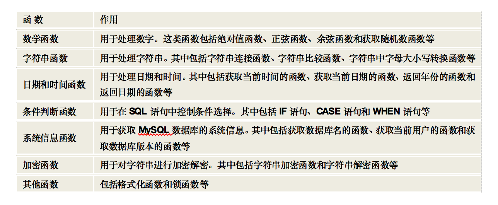
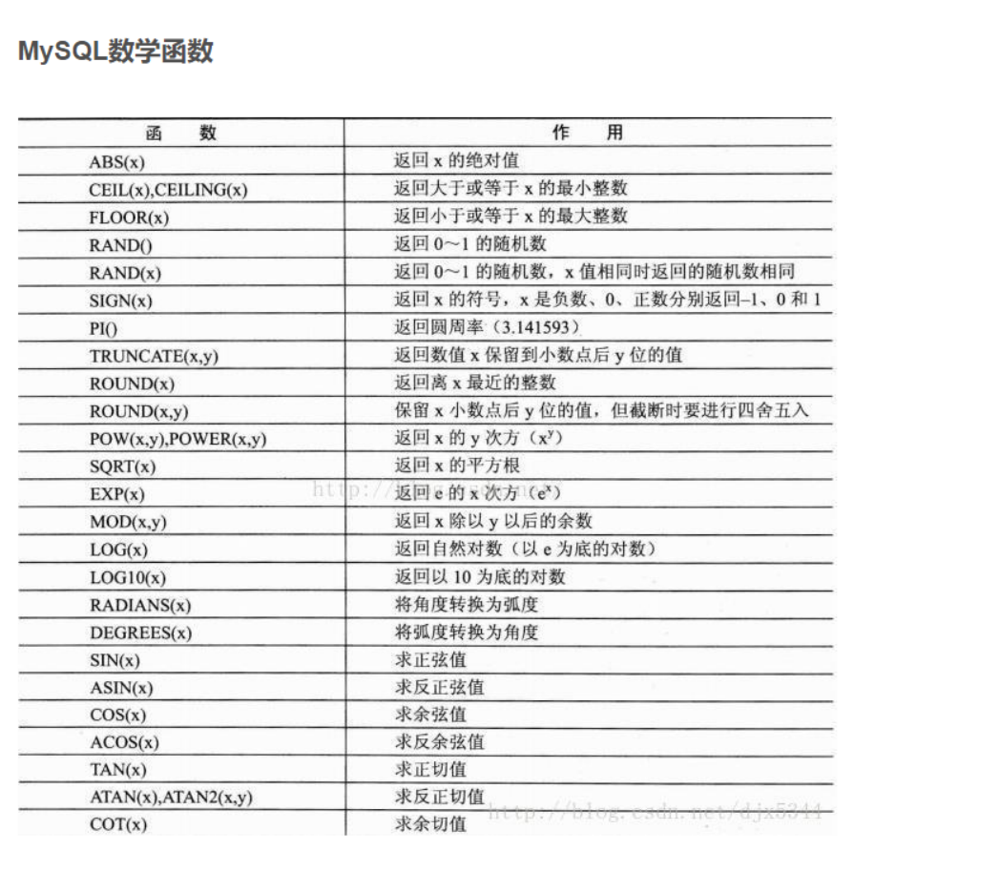
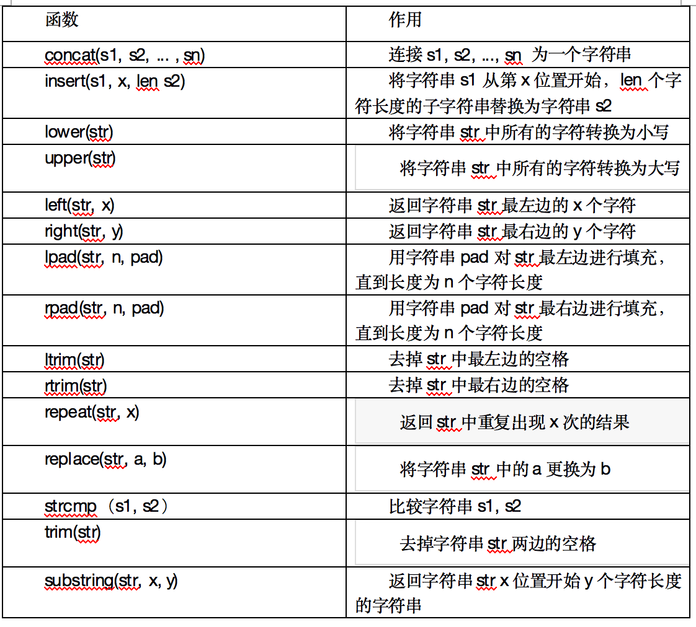
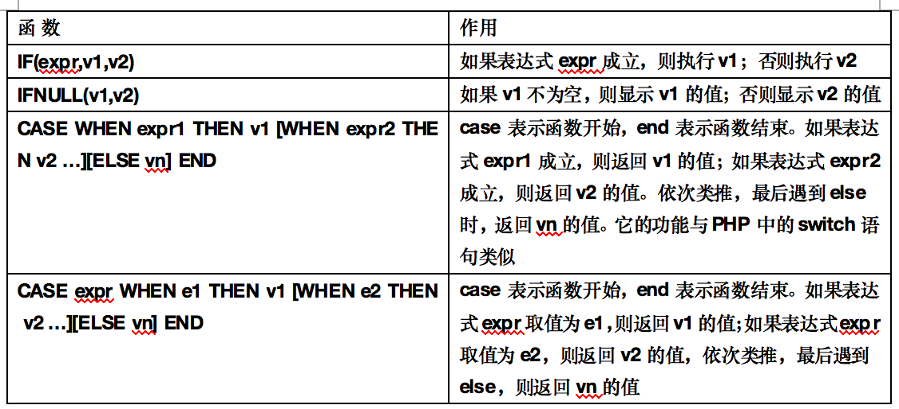
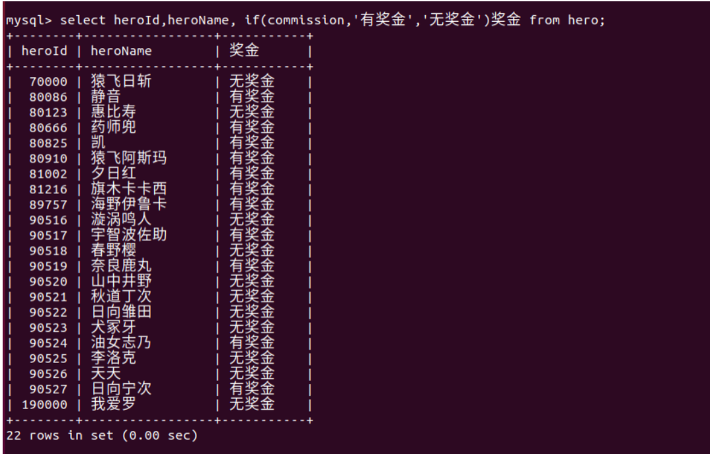
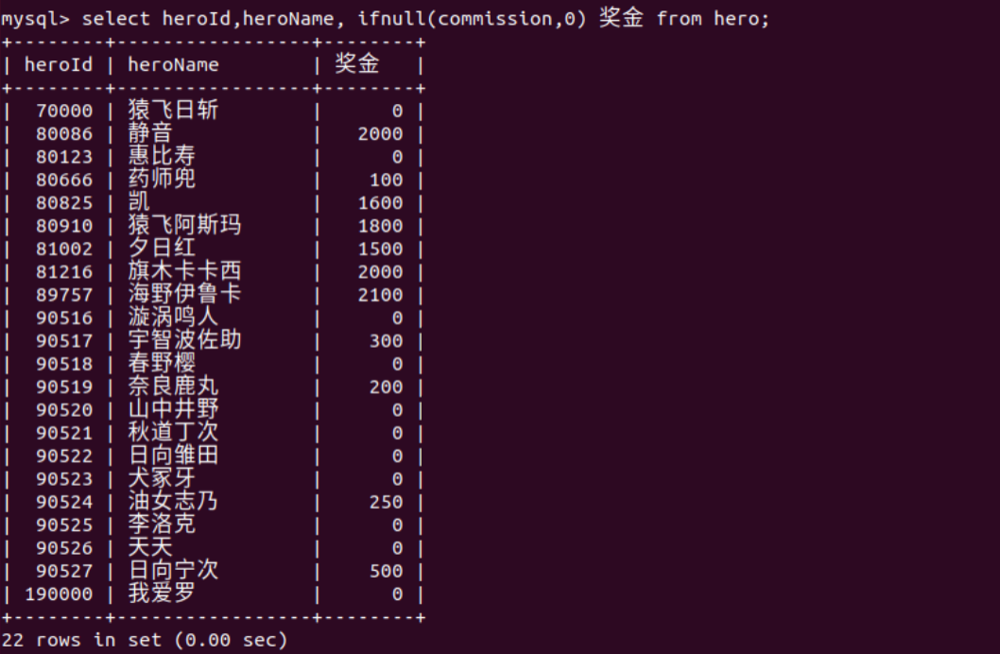
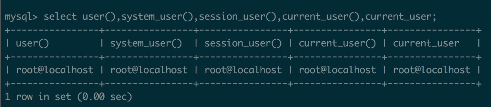
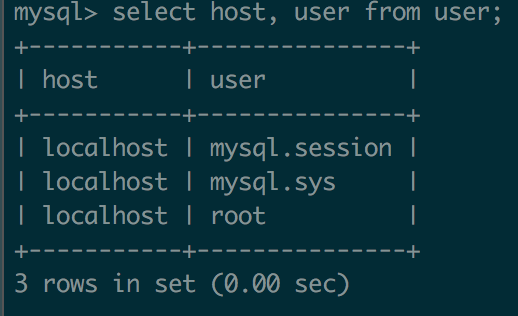

> 	MySQL函数是MySQL数据库提供的内置函数。这些内置函数可以帮助用户更加方便地处理表中的数据


# 数学函数

> 	数学函数是MySQL中常用的一类函数。其主要用于处理数字，包括整型和浮点数等等。



## ABS(x)函数
>	ABS(x)函数用于求绝对值。

例：求10、-10的绝对值

`select abs(10), abs(-10);`

##	 FLOOR(x)函数
>	FLOOR(x)函数返回小于或等于x的整数

例：求小于或等于 1.5 和 -1.5 的整数

`select floor(1.5), floor(-1.5);`

##	 CEILING(x)函数
>	CEILING(x)函数返回大于或等于x的整数

例：返回大于或等于1.5和 -1.5的整数
`select ceiling(1.5), ceiling(-1.5);`

##	 ROUND(x)函数和ROUND(x,y)函数
>	ROUND(x)函数返回离x最近的整数，也就是对x进行四舍五入处理；ROUND(x,y)函数返回x保留到小数点后y位的值，截断时需要进行四舍五入处理。

例1： 返回 接近123.456的整数（四舍五入处理）
`select  round(123.456);`

例2： 将123.456保留2位小数的结果返回
`select  round(123.456,2);`

## RAND()函数
>	RAND()函数是返回0~1的随机数。但是RAND()返回的数是完全随机的。

例1：生成3个0~1之间的随机数
`select rand() , rand() , rand();`
例2：生成3个0到100随机整数
```
select round(rand()*100) ,floor(rand()*100) , ceiling(rand()*100);
```

例3：生成3个60~100的随机整数
```
select round(rand()*40)+60 ,floor(rand()*40)+60 , ceiling(rand()*40)+60;
```

## PI()函数
>	PI()函数用于返回圆周率

例：求半径为10的圆的周长和面积(结果保留两位小数)
`select  round(2*pi()*10,2) 周长, round(pi()*10*10,2) 面积;`

## TRUNCATE(x,y)函数
>	TRUNCATE(x,y)函数返回x保留到小数点后y位的值（不四舍五入）

例：查看圆周率小数点6位的值。

`select  truncate(pi(),6);`

## sqrt(x)函数
>	SQRT(x)函数用于求平方根

例：求16和25的平方根。

`select  sqrt(16), sqrt(25);`
# 字符串函数

>	字符串函数是MySQL中最常用的一类函数。字符串函数主要用于处理表中的字符串



##	 INSERT(s1,x,len,s2)

>	INSERT(s1,x,len,s2)函数将字符串s1中x位置开始长度为len的字符串用字符串s2替换。


例： 将字符串 ‘abcdefg’ 中的 ‘cd’ 替换为 ‘xx’;

`select insert('abcdefg',3,2,'xx');`

## UPPER(s)函数 和 UCASE(s)函数

>	UPPER(s)函数和UCASE(s)函数将字符串s的所有字母变成大写字母。

例： 将字符串’abcdefg’ 转为 大写

`select upper('abcdefg'),ucase('abcdefg');`

##	 LOWER(s)函数 和 LCASE(s)函数
>	LOWER(s)函数和和 LCASE(s)函数将字符串s的所有字母变成小写字母。

例：将字符串’ABCDEFG’转为小写

`select lower('ABCDEFG'),lcase('ABCDEFG');`

## LEFT(s,n)函数 和 RIGHT(s,n) 函数
>	LEFT(s,n)函数返回字符串s的前n个字符RIGHT(s,n)函数返回字符串s的最后的n个字符

例1：返回字符串 ‘abcdefg’ 的前4个字符

`select left('abcdefg',4);`

例2：返回字符串 ‘abcdefg’ 的后4个字符

`select right('abcdefg',4);`

## CONCAT(s1,s2,...)函数
>	CONCAT(s1,s2,...)函数，返回s1 、s2 ... 拼接后的字符串

例：返回字符串 ‘abc’ 和 ‘def’  和 ‘ghi’拼接后的字符串

`select concat('abc','def','ghi');`

##  LTRIM(s)、 RTRIM(s)、 TRIM(s)函数
>	LTRIM(s)函数将去掉字符串s开始处的空格。
>	RTRIM(s)函数将去掉字符串s结尾处的空格。
>	TRIM(s)函数将去掉字符串s开始和结尾处的空格。

例1： 去掉字符串 tom 开始处的空格

`select concat('+',ltrim(' tom '),'+');`

例2： 去掉字符串 tom 结尾处的空格

`select concat('+',rtrim(' tom '),'+');`

例3：去掉字符串 tom 开始和结尾处的空格

`select concat('+',trim(' tom '),'+');`

##	 SUBSTRING(s,n,len)函数
>	SUBSTRING(s,n,len)函数从字符串s的第n个位置开始获取长度为len的字符串。

例：从字符串’abcdefg’中的第3个位置起截取4个字符

`select substring('abcdefg',3,4);`

## REVERSE(s)函数
>	REVERSE(s)函数将字符串s的顺序反过来。

例：将字符串’abcdefg’ 反转

`select reverse('abcdefg');`

## FIELD(s,s1,s2,…)函数
>	FIELD(s,s1,s2,…)函数返回第一个与字符串s匹配的字符串的位置。

例：返回第一个与字符串 tom  一样的字符串的位置

`select field('tom','tomcate','tom2','tom','tom');`

## LOCATE(s1,s)、POSITION(s1 IN s)和INSTR(s,s1)函数
>	在MySQL中，可以通过LOCATE(s1,s)、POSITION(s1 IN s)和INSTR(s,s1)函数获取子字符串相匹配的开始位置。这3个函数的语法格式如下。

例：返回字符串’me’在’you love me . he love me’中第一次出现的位置。

`select locate('me','you love me . he love me')`

`select position('me' in 'you love me . he love me');`

`select instr('you love me .he love me' , 'me');`

# 日期和时间函数
>	日期和时间函数是MySQL中另一最常用的函数。其主要用于对表中的日期和时间数据的处理。

## CURDATE()和CURRENT_DATE()函数获取当前日期
>	CURDATE()和CURRENT_DATE()函数获取当前日期

获取当前日期

`select curdate(),current_date();`

##	CURTIME()函数和CURRENT_TIME()函数
>	CURTIME()和CURRENT_TIME()函数获取当前时间

获取当前时间

`select curtime(),current_time();`

##	NOW()函数

>	NOW()函数获取当前日期和时间。还有URRENT_TIMESTAMP()函数、LOCALTIME()函数、SYSDATE()函数和LOCALTIMESTAMP()函数也同样可以获取当前日期和时间。

例：获取当前的日期和时间

```
select now(),current_timestamp(),localtime(),sysdate(),localtimestamp();
```

## DATEDIFF(d1,d2)函数

>	DATEDIFF(d1,d2)用于计算日期d1与d2之间相隔的天数。

例：计算2018年8月8日到2019年8月8日相隔的天数。

`select datediff('2019-08-08','2018-08-08');`

##	 ADDDATE(d,n)函数
>	ADDDATE(d,n)用于返回起始日期d加上n天的日期。

例：求2018年8月31日过7天后的日期

`select adddate('2018-08-31',7);`

##	ADDDATE(d,INTERVAL expr type)函数
>	ADDDATE(d,INTERVAL expr type)函数返回起始日期d加上一个时间段后的日期。

例：求2018年8月1日过1年3个月后的日子

```
select adddate('2018-08-01',interval '1 3' year_month);
```

##SUBDATE(d,n)函数
>	SUBDATE(d,n)函数返回起始日期d减去n天的日期。

例：求2018年1月31日 减去60天的日期

`select subdate('2018-01-31',60);`

#	条件判断函数
>	条件函数用来在SQL语句中进行条件判断。根据不同的条件，执行不同的SQL语句。MySQL支持的条件判断函数及作用


例1：查看有奖金和无奖金的人员信息，如果有显示有奖金，如果没有显示无奖金

```
select heroId,heroName, if(commission,'有奖金','无奖金')奖金 from hero;
```



例2：查看有奖金和无奖金的人员信息，如果有显示奖金数量，如果没有显示0

```
select heroId,heroName, ifnull(commission,0) 奖金 from hero;
```



例3：如果工资大于等于10000以上则输出very good，工资在大于等于5000到1000之间输出good，其余人员输出soso。

```
select heroId,heroName, case when salary >= 10000 then 'very good' when salary >=5000 and salary <10000 then 'good' else 'soso' end as 能力 from hero;
```

# 系统信息函数

>	系统信息函数用来查询MySQL数据库的系统信息。

## 获取MySQL版本号、连接数和数据库名的函数

>	VERSION()函数返回数据库的版本号；CONNECTION_ID()函数返回服务器的连接数，也就是到现在为止MySQL服务的连接次数；DATABASE()和SCHEMA()返回当前数据库名。

例1：查看当前mysql版本号、连接次数

`select version(), connection_id();`

例2：查看使用的当前数据库的名称

`select database(),schema();`

## 获取用户名的函数

>	USER()、SYSTEM_USER()、SESSION_USER()、CURRENT_USER()和CURRENT_USER这几个函数可以返回当前用户的名称。

例：查看当前用户名

```
select user(),system_user(),session_user(),current_user(),current_user;
```



<mark>注：USER()、SYSTEM_USER()、SESSION_USER()显示的是当前登陆的用户名与它对应的host；CURRENT_USER()和CURRENT_USER显示当前登陆用户对应在user表中的哪一个



## 获取字符串的字符集和排序方式的函数

>	CHARSET(str)函数返回字符串str的字符集，一般情况下这个字符集就是系统的默认字符集；COLLATION(str)函数返回字符串str的字符排列方式。

例：查看当前的字符串字符集和排序方式

`select charset('localhost'),collation('root');`


# 加密函数
>	加密函数是MySQL中用来对数据进行加密的函数。因为数据库中有些很敏感的信息不希望被其他人看到，所以就可以通过加密的方式来使这些数据变成看似乱码的数据。 

## 加密函数MD5(str)
>	MD5(str)函数可以对字符串str进行加密。MD5(str)函数主要对普通的数据进行加密。

例：用md5加密方式给字符串加密

`select md5('123456');`

## 加密函数SHA(str)

例：用sha加密方式给字符串加密

`select sha('123456');`

# 其他常用函数

## 格式化函数FORMAT(x,n)

>	FORMAT(x,n)函数可以将数字x进行格式化，将x保留到小数点后n位。这个过程需要进行四舍五入。

例：查看圆周率pi小数点后3位

`select format( pi() ,3);`

## 改变字符集的函数

>	CONVERT(s USING cs)函数将字符串s的字符集变成cs。

例：将字符串zhangtao的字符集变为gbk格式

`select charset('zhangtao'), charset( convert('zhangtao' using gbk));`

## 改变字段数据类型的函数

>	CAST(x AS type)和CONVERT(x,type)这两个函数将x变成type类型。这两个函数只对BINARY、CHAR、DATETIME、TIME、SIGNED INTEGER、UNSIGNED INTEGER这些类型起作用。但两种方法只是改变了输出值得数据类型，并没有改变表中字段的类型。

例：将当期的日期和时间times，变为date类型和time类型。

```
select now(), cast(now() as date), convert(now(),time) ;
```
