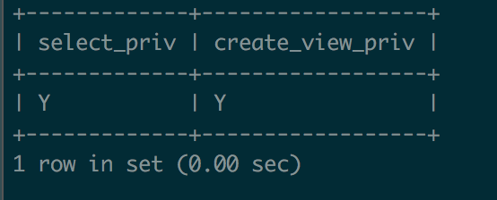
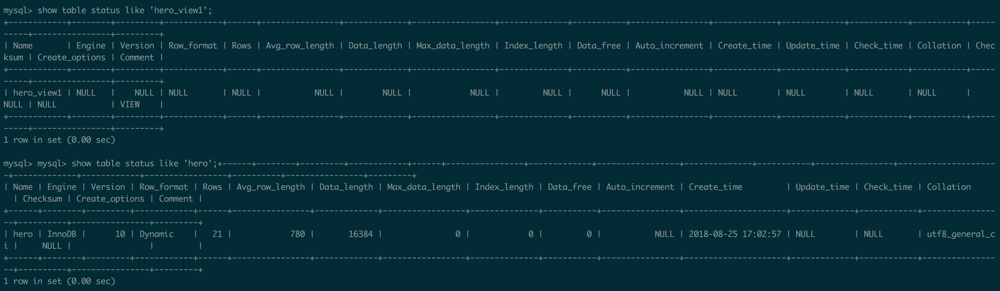

# 视图
## 视图概述

>	视图是一个虚拟表，是从数据库中一个或多个表中导出来的表，其内容由查询定义。同真实的表一样，视图包含一系列带有名称的列和行数据。

>	视图是存储在数据库中的查询的sql语句，它主要出于两种原因：安全原因，视图可以隐藏一些数据。

视图的作用：
对其中所引用的基础表来说，视图的作用类似于筛选。定义视图的筛选可以来自当前或其它数据库的一个或多个表，或者其它视图。通过视图进行查询没有任何限制，通过它们进行数据修改时的限制也很少。

下面将视图的作用归纳为如下几点：
简单性  ---    复杂的查询可以简化
安全性  ---    可以让有权限的用户看到特定的行和列，保证数据安全

<mark>注：视图不是表，本身没有数据；视图不能提高查询效率；不要通过视图去修改原表中的数据。

## 创建视图

### 查看创建视图的权限
>	创建视图需要具有CREATE VIEW的权限。同时应该具有查询涉及的列的SELECT权限。可以使用SELECT语句来查询这些权限信息。

查询语法如下：

`select select_priv,create_view_priv from mysql.user where user = '用户名';`



1. `select_priv` 属性表示用户是否具有SELECT权限，Y表示拥有，N表示没有
2. `create_view_priv` 属性表示用户是否拥有CREATE VIEW 权限

### 创建视图的步骤

MySQL中，创建视图是通过CREATE VIEW语句实现的。其语法如下：
 
```
CREATE [ALGORITHM={UNDEFINED|MERGE|TEMPTABLE}]
        VIEW 视图名[(属性清单)]
        AS SELECT语句
        [WITH [CASCADED|LOCAL] CHECK OPTION];
```

1. ALGORITHM可选参数，表示视图选择的算法
2. “视图名”参数表示要创建的视图名称
3. “视图清单”可选参数，指定视图中各个属性的名词，默认情况下与SELECT语句中的查询属性相同
4. SELECT语句参数是一个完整的查询语句，表示从某个表中查出来某些满足条件的记录，将这些记录导入视图中。
5. WITH [CASCADED|LOCAL] CHECK OPTION 可选参数，表示更新视图时要保证在该视图的权限范围之内。

例：在表hero中创建视图，视图命名为hero_view1，并设置视图属性分别为`v_heroId,v_heroName,v_salary`

```
create view hero_view1(v_heroId,v_heroName,v_salary) as select heroId,heroName,salary from hero;
```
查看视图结果：

`select * from hero_view1;`

## 视图操作

### 查看视图

>	查看视图是指查看数据库中已存在的视图。查看视图必须要有SHOW VIEW的权限。查看视图的方法主要包括DESCRIBE语句、SHOW TABLE STATUS语句、SHOW CREATE VIEW语句等。

#### DESCRIBE语句

>	DESCRIBE可以简写为DESC

例：查看hero_view1视图中的结构

`desc hero_view1;`

#### SHOW TABLE STATUS语句

语法：SHOW TABLE STATUS LIKE ‘视图名’

例：利用SHOW TABLE STATUS查看视图信息

`show table status like 'hero_view1'`

`show table status like 'hero'`



从执行结果可以看出，存储引擎、数据长度等信息都显示为NULL，则说明视图为虚拟表，与普通数据表是有区别的。

#### SHOW CREATE VIEW语句

语法：SHOW CREATE VIEW 视图名

例：利用SHOW CREATE VIEW查看视图详细定义

`show create view hero_view1;`

### 修改视图

>	修改视图是指修改数据库中已存在的表的定义。当基本表的某些字段发生改变时，可以通过修改视图来保持视图和基本表之间一致。MySQL中通过CREATE OR REPLACE VIEW语句和ALTER语句来修改视图。

#### CREATE OR REPLACE VIEW

>	在MySQL中，CREATE OR REPLACE VIEW可以用来修改视图，该语句非常灵活。在视图已经存在的情况下对视图进行修改，如果视图不存在，可以创建视图。

例：通过CREATE OR REPLACE VIEW实现将视图`hero_view1`的字段`v_heroId`,和`v_heroName`

```
create or replace view hero_view1(v_heroId,v_heroName) as select heroId ,heroName from hero;
```
