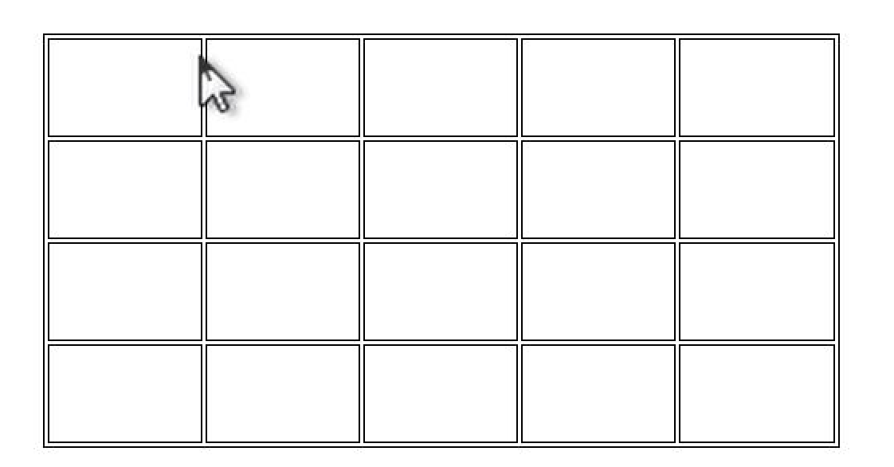
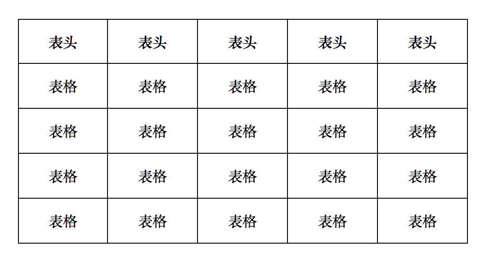
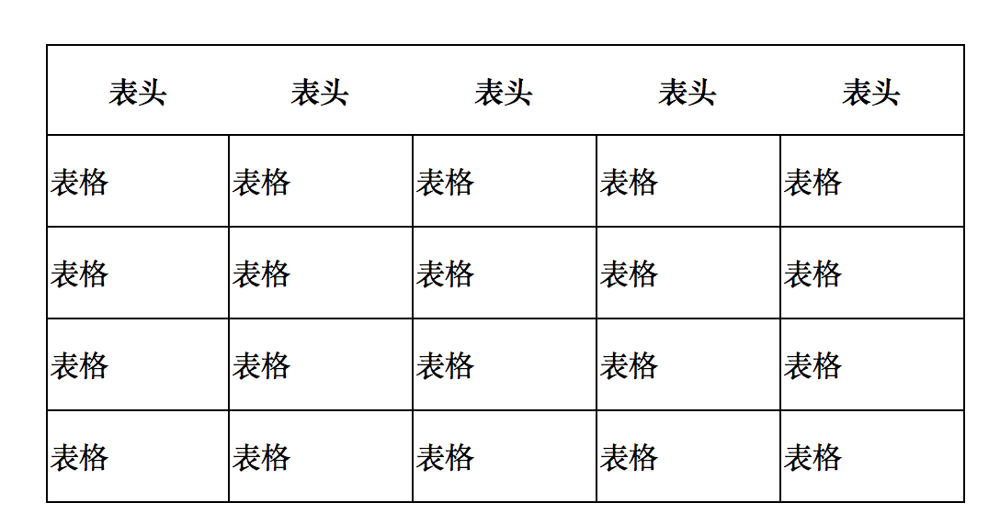
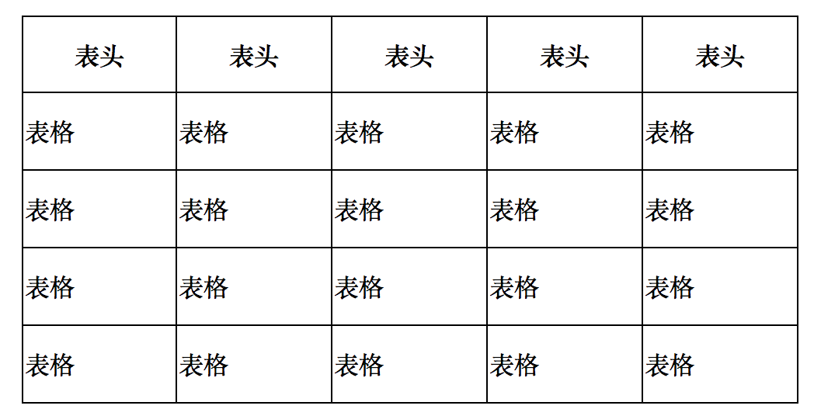

# 表格
*	table 表格
* 	tr表格一行
*  	td普通单元格
*  	th表头单元格

1.	创建表格

	table>(tr>td*5)*4


2.	设置表格居中，大小，边线

	```
	.tablestyle01 {
            /* 剧中 */
            margin: 50px auto;
            width: 500px;
            height: 250px;
            border: 1px solid black;
        }
	```
	
2.	去除双线

	```
	.tablestyle01 {
            /* 剧中 */
            margin: 50px auto;
            width: 500px;
            height: 250px;
            border: 1px solid black;
            /* 将表格的边线合并 */
            border-collapse: collapse
        }
	```
	
	
3.	设置单元格边线，居中

	```
	.tablestyle01 td {
            text-align: center;
            border: 1px solid black;
        }
	```
	
4.	添加表头

	```
   	<tr>
        <th>表头</th>
        <th>表头</th>
        <th>表头</th>
        <th>表头</th>
        <th>表头</th>
    </tr>
	```
	

5.	给表头加边线

	```
	.tablestyle01 th {
            border: 1px solid black;
   	}
	```
	

6.	给单元格设置水平居中

	```
	.tablestyle01 td {
            text-align: center;
            border: 1px solid black;
   }
	```
