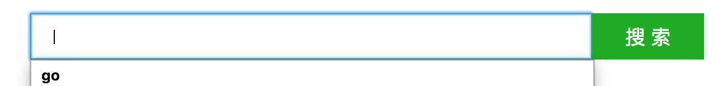

#搜索框实现

## text,submit
这是一个form表单，其中一个输入普通文本text，一个提交submit,根据ui标图去设置大小，颜色

```
<form class = "form_style">
      <input type="text" class="input_text">
      <input type="submit" class="input_submit">
</form>
```

```
<style>
        .form_style{
            width: 602px;
            height: 42px;
            background: red;
            margin: 100px auto;
        }
        .input_text{
            width: 502px;
            height: 42px;
        }
        .input_submit{
            background: #0fad10;
            width: 100px;
            height: 42px;
        }
</style>
```
效果如下：

## 边线
设置边线颜色，按钮字体颜色大小

```
<form action=""class = "form_style">
            <input type="text" class="input_text">
            <input type="submit" class="input_submit"value ="搜 索">
</form>
```
```
<style>
        .form_style{
            width: 602px;
            height: 42px;
            background: red;
            margin: 100px auto;
        }
        .input_text{
            width: 500px;
            height: 40px;
            border: 1px solid#0fad10;
            padding: 0px;
        }
        .input_submit{
            background: #0fad10;
            width: 100px;
            height: 42px;
            border: 0px;
            font-size: 18px;
            color: white;
        }
</style>
```
效果如下：

##	 换行，缩进
通过设置<mark>float:left</mark>解决换行问题，<mark>text-indent</mark>设置缩进
```
.input_text{
    width: 500px;
    height: 42px;
    border: 1px solid#0fad10;
    padding: 0px;
    float: left;
    text-indent: 20px;
}
.input_submit{
    background: #0fad10;
    width: 100px;
    height: 40px;
    border: 0px;
    font-size: 18px;
    color: white;
    float: left;
}
```

效果如下：

但是会有按压效果，我们不需要

## 按压，搜索
通过<mark>outline:=none</mark>去除按压效果，<mark>form的action和name</mark>实现搜索

```
<!DOCTYPE html>
<html lang="en">

<head>
    <meta charset="UTF-8">
    <meta name="viewport" content="width=device-width, initial-scale=1.0">
    <meta http-equiv="X-UA-Compatible" content="ie=edge">
    <title>Document</title>
    <style>
        .form_style {
            width: 602px;
            height: 42px;
            margin: 100px auto;
        }

        .input_text {
            width: 500px;
            height: 40px;
            border: 1px solid#0fad10;
            padding: 0px;
            float: left;
            outline: none;
            text-indent: 20px;
        }

        .input_submit {
            background: #0fad10;
            width: 100px;
            height: 42px;
            border: 0px;
            font-size: 18px;
            color: white;
            float: left;
            padding: 0px;
            outline: none
        }
    </style>
</head>

<body>
    <form action="https://cn.bing.com/search" class="form_style">
        <input type="text" class="input_text" placeholder="请输入" name="q">
        <input type="submit" class="input_submit" value="搜 索">
    </form>
</body>

</html>
```

最终图如下：


[效果](012搜索框实现.html)