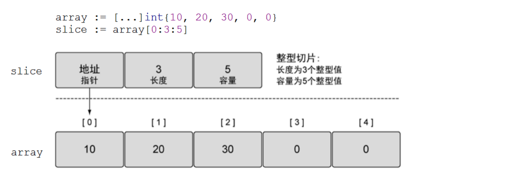
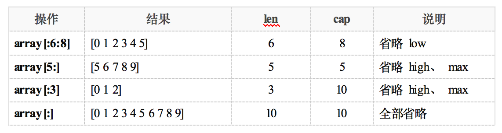

# 切片简述

*	数组的长度在定义之后无法再次修改；数组是值类型，每次传递都将产生一份副本。显然这种数据结构无法完全满足开发者的真实需求。Go语言提供了数组切片（slice）来弥补数组的不足。
*  Slice（切片）代表变长的序列，序列中每个元素都有相同的类型。一个slice类型一般写作[]T，其中T代表slice中元素的类型；slice的语法和数组很像，只是没有固定长度而已。
*  数组和slice之间有着紧密的联系。一个slice是一个轻量级的数据结构，提供了访问数组子序列（或者全部）元素的功能，而且slice的底层确实引用一个数组对象。一个slice由三个部分构成：***指针***、***长度***和***容量***。***指针指向第一个slice元素对应的底层数组元素的地址***，要注意的是slice的第一个元素并不一定就是数组的第一个元素。

*	切片并不是数组或数组指针，它通过内部指针和相关属性引⽤数组⽚段，以实现变⻓⽅案。

*	slice并不是真正意义上的动态数组，而是一个引用类型。slice总是指向一个底层array，slice的声明也可以像array一样，只是不需要长度。



# 创建切片

1. 自动推导类型创建

	`slice s1 := [] int {1, 2, 3, 4}`
	
	创建 有 4 个元素的切片，分别为：1234
2. 借助make创建 slice，格式：make(切片类型，长度，容量) 

	`s2 := make([]int, 5, 10)`
	
	len(s2) = 5, cap(s2) = 10
3. make时，没有指定容量，那么 长度==容量

	`s3 := make([]int, 5)  len(s3) = 5, cap(s3) = 5`

**注意：make只能创建slice、map和channel，并且返回一个有初始值(非零)的对象。**

# 切片操作

操作   					|     含义
------------------	| ----------------------------------
s[n]  					| 切片s中索引位置为n的项
s[:]  					| 从切片s的索引位置0到len(s)-1处所获得的切片
s[low:]				|从切片s的索引位置low到len(s)-1处所获得的切片
s[:high]				|从切片s的索引位置0到high处所获得的切片，len=high
s[low:high]			|从切片s的索引位置low到high处所获得的切片，len=high-low
s[low : high : max] |从切片s的索引位置low到high处所获得的切片，len=high-low，cap=max-low
len(s)					|切片s的长度，总是<=cap(s)
cap(s)					|切片s的容量，总是>=len(s)

截取可表示为s[low：high：max]。low：表示下标的起点。 high：表示下标的终点（左闭右开，不包括此下标）。 长度 len = high – low。容量 cap = max – low。长度对应slice中元素的数目；长度不能超过容量，容量一般是从slice的开始位置到底层数据的结尾位置。内置的len()和cap() 函数分别返回slice的长度和容量。


**示例说明：**

`array := []int{0, 1, 2, 3, 4, 5, 6, 7, 8, 9}`



**切片和底层数组关系**

```
func main()  {
   arr := [] int {0, 1, 2, 3, 4, 5, 6, 7, 8, 9}
   s1 := arr[2:5]             	// 从arr[2]开始，取 5-2 个元素，组成切片s1。
   fmt.Println("s1=", s1)    	// s1= [2 3 4]

   s1[1] = 666                   	// 这样将arr数组中 3 --> 666。
   fmt.Println("arr=", arr)   	// arr= [0 1 2 666 4 5 6 7 8 9]

   s2 := s1[2:7]     		// 从s1[2]开始， 取 7-2 个元素，组成 s2。
   fmt.Println("s2=", s2)    	// 实际上还是取的 数组arr。   s2= [4 5 6 7 8]

   s2[2] = 777                   	// 这会将arr中的 6 --> 777
   fmt.Println("arr=", arr)   	// arr= [0 1 2 666 4 5 777 7 8 9]
}
```

利用数组创建切片。切片在操作过程中，是直接操作原数组。切片是数组的引用！因此，在go语言中，我们常常使用切片代替数组。
#切片做函数参数

切片作为函数参数时，传引用。

```
func testFunc(s []int) {    // 切片做函数参数
   s[0] = -1           	// 直接修改 main中的 slice
}

func main() {
   slice := []int{0, 1, 2, 3, 4, 5, 6, 7, 8, 9}
   fmt.Println(slice)

   testFunc(slice)          // 传引用
   fmt.Println(slice)
}
```

#常用操作函数

##append函数
append() 函数可以向 slice 尾部添加数据，可以自动为切片扩容。常常会返回新的 slice 对象：

```
var s1 []int 		//创建nil切片，或者：s1 := make([]int, 0)
  
s1 = append(s1, 1)       	//追加1个元素
s1 = append(s1, 2, 3)    	//追加2个元素
s1 = append(s1, 4, 5, 6) 	//追加3个元素
fmt.Println(s1)          	//[1 2 3 4 5 6]

s2 := make([]int, 5)
s2 = append(s2, 6)
fmt.Println(s2) 		//[0 0 0 0 0 6]

s3 := []int{1, 2, 3}
s3 = append(s3, 4, 5)
fmt.Println(s3)		//[1 2 3 4 5]
```
append函数会智能的将底层数组的容量增长，一旦超过原底层数组容量，通常以2倍（1024以下）容量重新分配底层数组，并复制原来的数据。因此，使用append 给切片做扩充时，切片的地址可能发生变化。但，数据都被重新保存了，不影响使用。

```
func main() {
   s := make([]int, 0, 1)
   c := cap(s)
   for i := 0; i < 100; i++ {
      s = append(s, i)
      if n := cap(s); n > c {
         fmt.Printf("cap: %d -> %d\n", c, n)
         c = n
      }
   }
}
```
输出结果如下：

```
cap: 1 -> 2
cap: 2 -> 4
cap: 4 -> 8
cap: 8 -> 16
cap: 16 -> 32
cap: 32 -> 64
cap: 64 -> 128
```

##copy函数
函数 copy 在两个 slice 间复制数据，复制⻓度以 len 小的为准，两个 slice 指向同⼀底层数组。直接对应位置覆盖。

```
data := [...]int{0, 1, 2, 3, 4, 5, 6, 7, 8, 9}
s1 := data[8:]  	//{8, 9}
s2 := data[:5] 	//{0, 1, 2, 3, 4}
copy(s2, s1)    	// dst:s2, src:s1

fmt.Println(s2)   	//[8 9 2 3 4]
fmt.Println(data) 	//[8 9 2 3 4 5 6 7 8 9]
```

# 练习
## 练习1：
给定一个字符串列表，在原有slice上返回不包含空字符串的列表， 如：

`{"red", "", "black", "", "", "pink", "blue"}
——> {"red", "black", "pink", "blue"}`
## 练习2：
写一个函数，消除[]string中重复字符串，如：

`{"red", "black", "red", "pink", "blue", "pink", "blue"}
	——>	{"red", "black", "pink", "blue"}`
## 练习3：
要删除slice中间的某个元素并保存原有的元素顺序， 如：

`{5, 6, 7, 8, 9} ——> {5, 6, 8, 9}`

# 练习答案：
## 答案1

```
package main

import "fmt"

func main() {
	strs:= []string{"red", "", "black", "", "", "pink", "blue"}
	outStrs:=deleteEmptyString(strs)
	fmt.Println(outStrs)
}
func deleteEmptyString(strs []string)[]string {
	outStrs:=make([]string,0)
	for _,v:=range strs{
		if v!="" {
			outStrs = append(outStrs,v)
		}
	}
	return outStrs
}
```

## 答案2

```
package main

import "fmt"

//map   _,ok:= m[V]
func main() {

	srcArr:=[]string{"red", "black", "red", "pink", "blue", "pink", "blue"}
	dst:=deleteRepeatElement(srcArr)
	fmt.Println(dst)
	dst2:=deleteEmptyStringByMap(srcArr)
	fmt.Println(dst2)
}
func deleteEmptyStringByMap(src []string)(dst []string) {
	m:=make(map[string]int)
	for _,v:= range src{
		m[v]=0
	}
	for k:=range m{
		dst= append(dst,k)
	}
	return
}
func deleteRepeatElement(src []string)(dst[]string) {
	for _,v:=range src{
		flag:=false
		//先判断输出的slice里面有没有
		for _,str:=range dst{
			//设置一个flag
			if str==v {
				flag=true
			}
		}
		//没有就append
		if !flag {
			dst = append(dst,v)
		}
	}
	return
}

```

## 答案3

第一种：

```
//切片不能通过 = 互相赋值
func main() {
	src:=[]int{5, 6, 7, 8, 9}
	outSlice:=deleteElementByPosition(src,2)
	fmt.Println(outSlice)
}
func deleteElementByPosition(src []int,index int)[]int {
	copy(src[index:],src[index+1:])//两个切片之间互相赋值要用copy
	return src[:len(src)-1]
}
```


第二种：

```
//利用append 的第二个不定长参数
func main() {
	arr := []int{5, 6, 7, 8, 9}
	outSlice := deleteElementAppend(arr, 2)
	fmt.Println(outSlice)
}
func deleteElementAppend(src []int, i int) []int {
	return append(src[:i], src[i+1:]...)//append第二个形参时不定长参数
}

```

第三种：

```
/*
	目标元素用末尾元素替换
*/
func main() {
	arr:=[]int{5, 6, 7, 8, 9}
	outSlice:=deleteElementByPositionNoOrder(arr,2)
	fmt.Println(outSlice)
}
func deleteElementByPositionNoOrder(src []int,index int)[]int {
	src[index]=src[len(src)-1]
	return src[:len(src)-1]
}

```


# 拓展

##切片作为函数参数如何传值？

只有同时保证两个切片的，第一个元素的地址，len，cap完全相同，二者才是同一个切片，也就是说函数内操作切片才可以修改外边的切片的值。

```
func main() {
	arr1 := []int{1, 2, 3, 4, 5, 6}
	arr2 := []int{1, 2, 3, 4, 5, 6}
	arr3 := []int{1, 2, 3, 4, 5, 6}
	arr4 := []int{1, 2, 3, 4, 5, 6}
	arr5 := []int{1, 2, 3, 4, 5, 6}
	//删除
	Delete(arr1)
	fmt.Println("删除", arr1) //[1 2 3 4 5 6]
	//修改
	Modify(arr2)
	fmt.Println("修改", arr2) //[0 2 3 4 5 6]
	//追加
	Append(arr3)
	fmt.Println("追加", arr3) //[1 2 3 4 5 6]
	//先删除第一个再追加
	DeleteFirstThenAppend(arr4)
	fmt.Println("先删除第一个再追加", arr4) //[1 2 3 4 5 6]
	//先删除非第一个再追加
	DeleteNotFirstThenAppend(arr5)
	fmt.Println("先删除非第一个再追加", arr5) //[1 2 3 4 5 10]
}

func DeleteNotFirstThenAppend(arr []int){
	arr = arr[:len(arr)-1]
	arr = append(arr, 10)
}
func DeleteFirstThenAppend(arr []int) {
	arr = arr[1:]
	arr = append(arr, 20)
}
func Append(arr []int) {
	arr = append(arr, 10)
}
func Modify(arr []int) {
	arr[0] = 0
}
func Delete(arr []int) {
	arr = arr[:len(arr)-1]
}
```

## 深入理解切片和底层数组的关系

```
/*
	一个切片由指针（首元素），长度，容量 组成
	截取的时候左闭右开
	s[low:high:max]
	len = high-low
	cap = max-low
*/

func main() {
	s := []int{1, 2, 3, 4, 5, 6}

	s1 := s[:3]
	fmt.Println(s1)      //[1 2 3]
	fmt.Println(cap(s1)) //6
	s2 := s1[:4]         //根据首元素的地址找到底层数组的起始位置，向后截取
	fmt.Println(s2)      //[1 2 3 4]
	//s3:= s1[4] 		 //error 下标 可能是根据s1长度遍历取出来的
	//fmt.Println(s3)
	s11 := s[3:4]
	fmt.Println(s11)      //[4]
	fmt.Println(cap(s11)) //3 由于没有指定s1的cap，那么cap就为s1的首元素到原切片末尾的长度
}
```

##创建切片的第四种方式：

```

/*
	可以指定索引去初始化
*/
func main() {
	//0 make 只能创建slice map channel
	slice0 := make([]int, 5, 5)
	//1 如果不指定那么容量等于长度
	slice1 := make([]int, 5)
	//2
	slice2 := []int{1, 2, 3, 4}
	//3
	slice3 := []string{1: "一月", 2: "二月"}

	fmt.Println(len(slice3))                    //3
	fmt.Println(slice0, slice1, slice2, slice3) //[0 0 0 0 0] [0 0 0 0 0] [1 2 3 4] [ 一月 二月]
}
```

##append第二个参数可以是切片吗？

```
func main() {
	//1
	ss := make([]int, 0)
	s := make([][]int, 0)
	ss = append(ss, 1)
	s = append(s, ss)
	fmt.Println(s)
	//2
	c:=[]int{1}
	cc:=make([]int,0)
	cc = append(cc,c...)
	fmt.Println(cc)
}
```

##切片可以互相比较吗？

```
//1，数组，结构体之间可以 互相比较 ，map不可以互相比较
//2，slice 之间不能互相比较，只能和nil 比较。结构体包含了map或slice也不可以比较
//slice can only be compared to nil
//原因：一个 slice 的元素是间接引用的，一个 slice甚至可以包含自身。虽然有很多办法处理这种情形，但是没有一个是简单有效的。
type stru1 struct {
}

func main() {
	arr1 := [3]int{1, 2, 3}
	arr2 := [3]int{1, 2, 3}
	fmt.Println(arr1 == arr2)//true
	st1 := stru1{}
	st2 := stru1{}
	fmt.Println(st1 == st2) //true
	//s1 := make([]int, 10)
	//s2 := make([]int, 10)
	//s2 = append(s2, 10)
	//fmt.Println(s1 == s2) //error slice can only be compared to nil
}
```

## interface切片的类型如何判断？

```
// v.(type)
// v.(int)
func main() {
	var interfaces []interface{}
	interfaces = append(interfaces, 1)
	interfaces = append(interfaces, "str")
	interfaces = append(interfaces, true)
	for _, v := range interfaces {
		switch v.(type) {
		case string:
			fmt.Printf("%T\n", v)
		case bool:
			fmt.Printf("%T\n", v)
		case int:
			fmt.Printf("%T\n", v)
		}
		if _, ok := v.(int); ok {
			fmt.Printf("%T\n", v)
		}
		if _, ok := v.(bool); ok {
			fmt.Printf("%T\n", v)
		}
		if _, ok := v.(string); ok {
			fmt.Printf("%T\n", v)
		}
	}
}
```

## 结构体切片作为map的值

```
type player struct {
	name string
	age  int
}

func main() {
	allPlayers := make(map[string][]player)
	chinaPlayers := make([]player, 0)
	chinaPlayers = append(chinaPlayers, player{"uzi", 18})
	chinaPlayers = append(chinaPlayers, player{"clearlove7", 27})
	koreaPlayers := []player{{"faker", 20}, {"deft", 19}}
	allPlayers["China"] = chinaPlayers
	allPlayers["Korea"] = koreaPlayers
	for k, v := range allPlayers {
		fmt.Printf("%s的选手有：\n", k)
		for _, play := range v {
			fmt.Println(play.name, "年龄为", play.age)
		}
	}
}
```