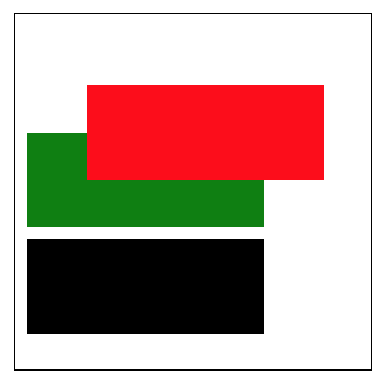
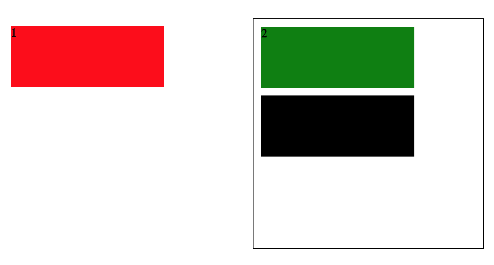
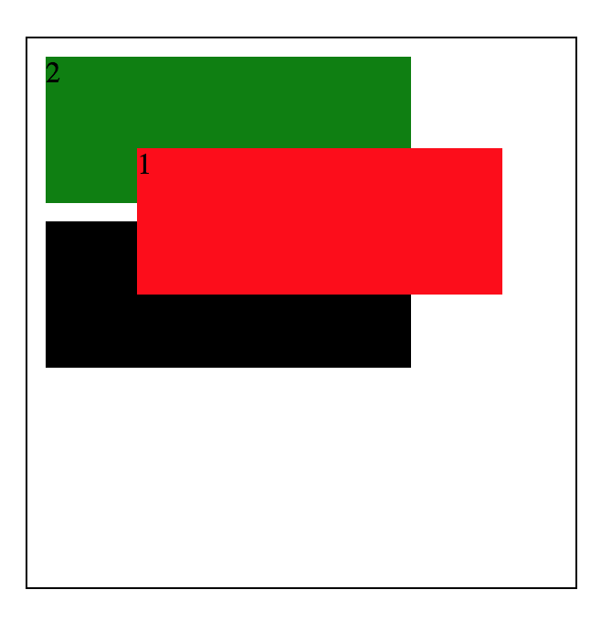
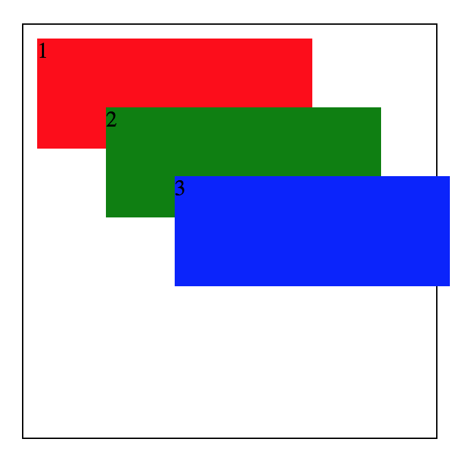
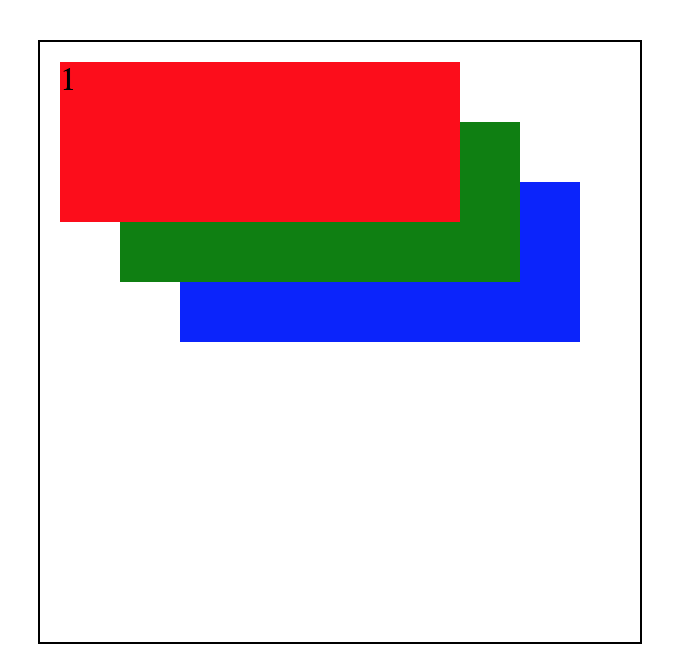
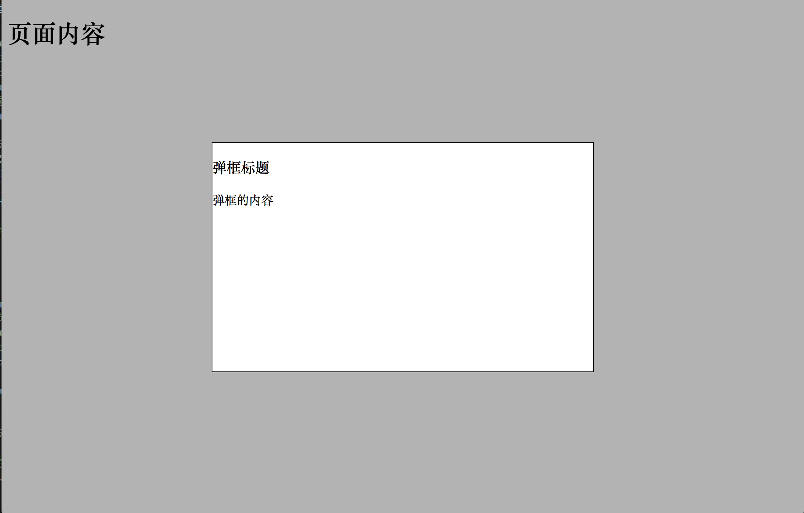

# 定位
## 文档流
文档流（相当于线性布局），是指盒子按照html标签编写顺序依次从上到下或从左到右排列
## 定位（相当于相对布局）
*	relative
* 	absolute
*  fixed
*  定位元素的偏移

### relative
相对自己原来位置偏移

```
.box01{
            background: red;
            /* 设置相对定位属性 */
            position: relative;
            /* 设置偏移属性 */
            left: 50px;
            top: 50px;
        }
```



### absolute
找父级来做参照，如果父级没有定位属性就找body

```
.box01{
            background: red;
            /* 设置相对定位属性 */
            position: absolute;
            /* 设置偏移属性 */
            left: 50px;
            top: 50px;
        }
```



<mark>一般将父级设置为相对定位，不设置偏移值，父级就有定位属性了而且不一定，子集就可以相对于他作绝对定位</mark>

```
.con {
            position: relative;
            width: 300px;
            height: 300px;
            border: 1px solid black;
            margin: 50px auto;
        }
```



### fixed
固定定位，之间参照浏览器的四个属性

```
.box01{
            background: red;
            /* 设置相对定位属性 */
            position: fixed;
            /* 设置偏移属性 */
            left: 50px;
            top: 50px;
        }
```


###  定位元素层级

```
.con {
            position: relative;
            width: 300px;
            height: 300px;
            border: 1px solid black;
            margin: 50px auto;
        }

        .box01,
        .box02,
        .box03 {
            width: 200px;
            height: 80px;
            margin: 10px;
            /* 设置相对定位属性 */
            position: absolute;
            /* 设置偏移属性 */
        }

        .box01 {
            background: red;
        }

        .box02 {
            background: green;
            /* 设置偏移属性 */
            left: 50px;
            top: 50px;
        }

        .box03 {
            background: blue;
            left: 100px;
            top: 100px;
        }
```




**设置 z-index**


```
   .box01 {
            background: red;
            z-index: 3;
        }

        .box02 {
            background: green;
            /* 设置偏移属性 */
            left: 30px;
            top: 30px;
            z-index: 2;
        }

        .box03 {
            background: blue;
            left: 60px;
            top: 60px;
            z-index: 1;
        }
```



# 水平垂直居中的弹框

```
<!DOCTYPE html>
<html lang="en">

<head>
    <meta charset="UTF-8">
    <meta name="viewport" content="width=device-width, initial-scale=1.0">
    <meta http-equiv="X-UA-Compatible" content="ie=edge">
    <title>Document</title>
    <style>
        .pop {
            width: 500px;
            height: 300px;
            border: 1px solid black;
            position: fixed;
            background: white;
            /* 控件左边距离浏览器左边的距离 */
            /* 定位元素水平垂直居中的技巧 */
            left: 50%;
            margin-left: -251px;
            top: 50%;
            margin-top: -151px;
            /* 保证弹窗永远层级最高，盖住其他任何元素 */
            z-index: 9999;
        }

        .mask {
            position: fixed;
            width: 100%;
            height: 100%;
            background: black;
            left: 0px;
            top: 0px;
            z-index: 9998;
            /* 设置元素的透明度 */
            opacity: 0.3;
            /* 透明度兼容IE6，7，8的写法 */
            filter: alpha(opacity=30)
        }
        .pop_con{
            /* 设置弹框默认不显示 */
            display: none
        }
    </style>
</head>

<body>
    <h1>页面内容</h1>
    <!-- 通过js让弹框弹出来 -->
    <div class="pop_con" style="display:block">
        <div class="pop">
            <h3>弹框标题</h3>
            <p>弹框的内容</p>
        </div>
        <div class="mask"></div>
    </div>
</body>

</html>

```

效果图如下：
