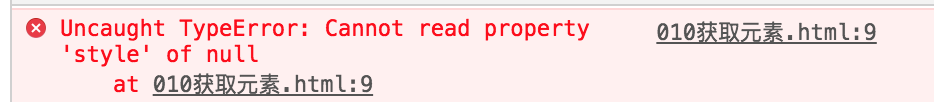

**获取元素方法**

可以使用内置对象document上的getElementById方法来获取页面上设置了id属性的元素，获取到的是一个html对象。然后将它赋值给一个变量，比如：	  

```
<!DOCTYPE html>
<html lang="en">
<head>
    <meta charset="UTF-8">
    <meta name="viewport" content="width=device-width, initial-scale=1.0">
    <meta http-equiv="X-UA-Compatible" content="ie=edge">
    <title>Document</title>
    <script>
        document.getElementById('div01').style.color='green';
    </script>
</head>
<body>
    <div id="div01">这是一个div元素</div>
</body>
</html>
```


**原因：代码顺序执行，找不到div01**

解决方式：

1.	把script代码放到body后面
2. 

```
// 当整个页面加载完，再执行{}里的代码
window.onload = function () {
	document.getElementById('div01').style.color = 'green';
}
```

```
// 当整个页面加载完，再执行{}里的代码
window.onload = function () {
    var oDivStyle = document.getElementById('div01').style;
    document.getElementById('div01').style.color = 'green';
    oDivStyle.width = '300px';
    oDivStyle.height = '300px';
    oDivStyle.background = 'red';
}
```
