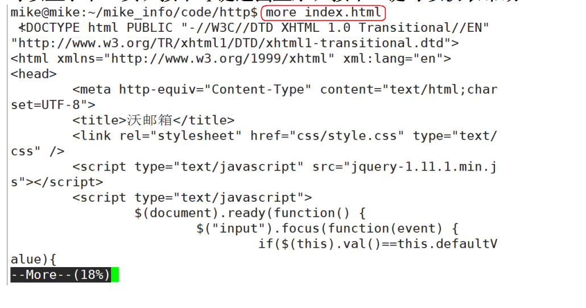
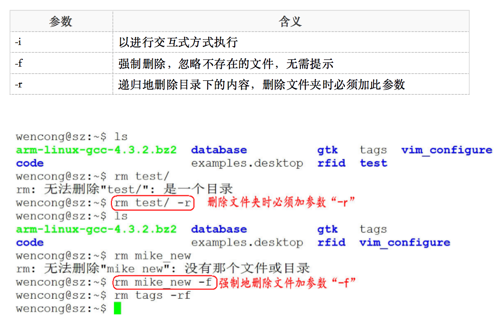
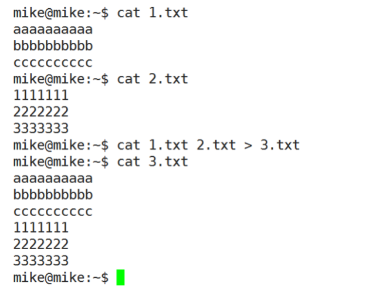
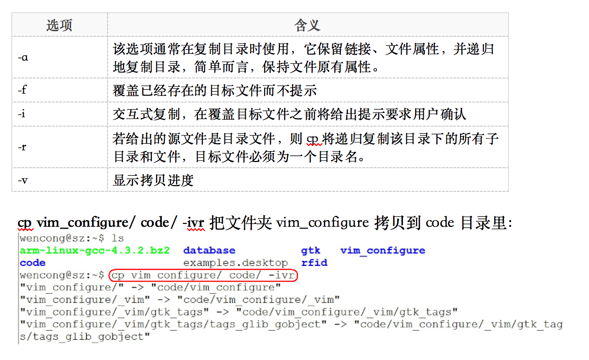
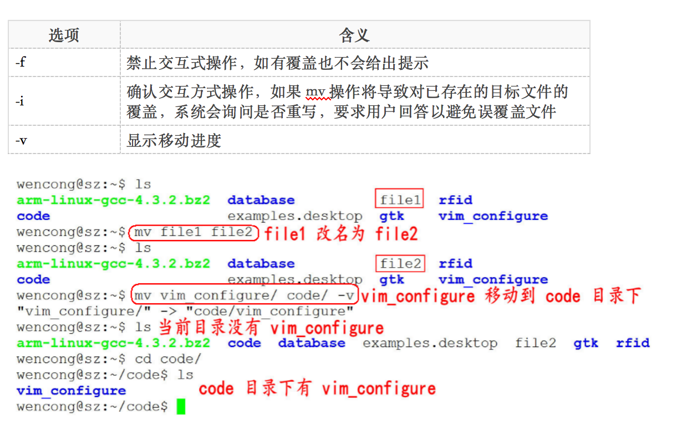
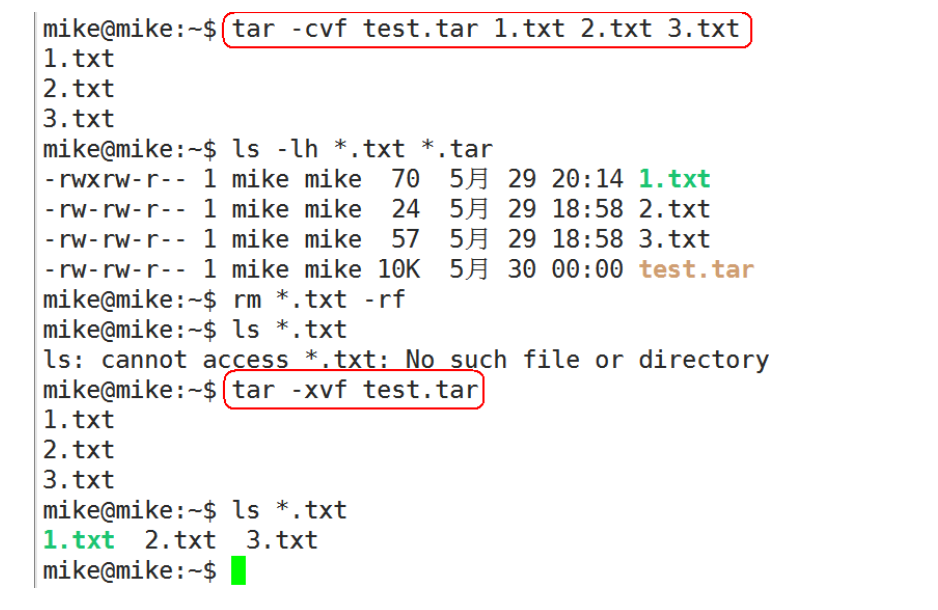
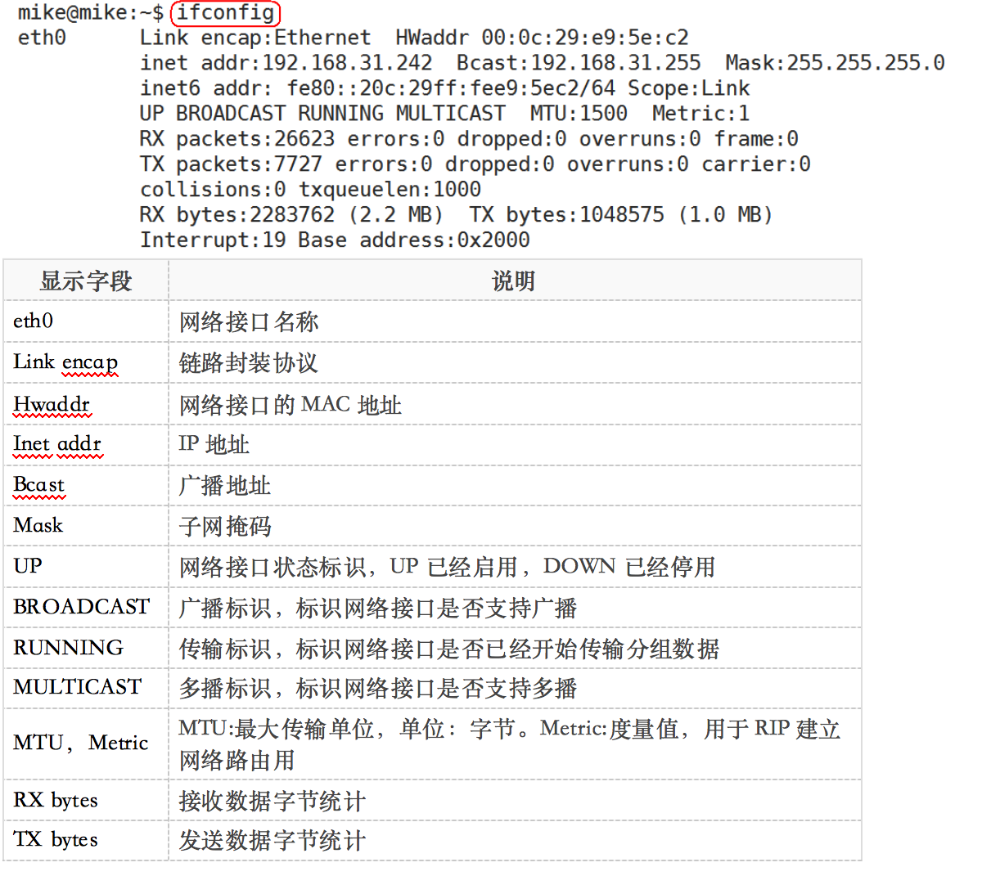
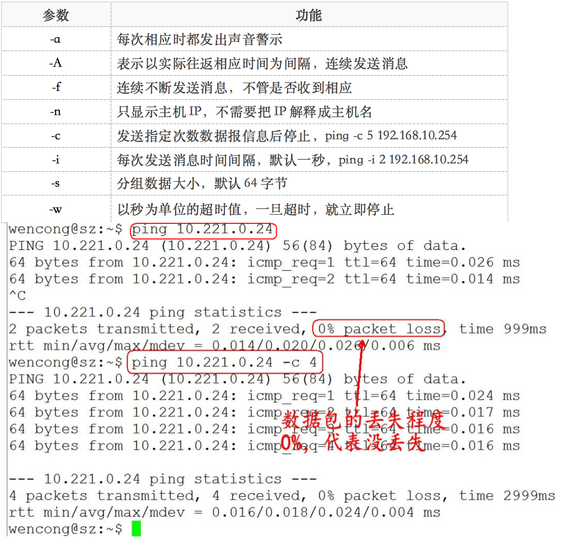

# 常用命令

## 文件管理

### 查看文件信息：ls

>	ls是英文单词list的简写，其功能为列出目录的内容，是用户最常用的命令之一，它类似于DOS下的dir命令。

Linux文件或者目录名称最长可以有256个字符，“.”代表当前目录，“..”代表上一级目录，以“.”开头的文件为隐藏文件，需要用 -a 参数才能显示。

**ls常用参数：**

与DOS下的文件操作类似，在Unix/Linux系统中，也同样允许使用特殊字符来同时引用多个文件名，这些特殊字符被称为通配符。

### 输出重定向命令：>

Linux允许将命令执行结果重定向到一个文件，本应显示在终端上的内容保存到指定文件中。

如：ls > test.txt ( test.txt 如果不存在，则创建，存在则覆盖其内容 )

**>输出重定向会覆盖原来的内容，>>输出重定向则会追加到文件的尾部。**

### 分屏显示：more

查看内容时，在信息过长无法在一屏上显示时，会出现快速滚屏，使得用户无法看清文件的内容，此时可以使用more命令，每次只显示一页，按下空格键可以显示下一页，按下q键退出显示，按下h键可以获取帮助。

### 管道：|

管道：一个命令的输出可以通过管道做为另一个命令的输入。

管道我们可以理解现实生活中的管子，管子的一头塞东西进去，另一头取出来，这里“ | ”的左右分为两端，左端塞东西(写)，右端取东西(读)。

### 清屏：clear 
clear作用为清除终端上的显示(类似于DOS的 3清屏功能)，也可使用快捷键：Ctrl + l ( “l” 为字母 )。

### 切换工作目录： cd 

在使用Unix/Linux的时候，经常需要更换工作目录。cd命令可以帮助用户切换工作目录。<mark>Linux所有的目录和文件名大小写敏感。

cd后面可跟绝对路径，也可以跟相对路径。如果省略目录，则默认切换到当前用户的主目录。

注意：如果路径是从根路径开始的，则路径的前面需要加上 “ / ”，如 “ /mnt ”，通常进入某个目录里的文件夹，前面不用加  “ / ”。

###显示当前路径：pwd

使用pwd命令可以显示当前的工作目录，该命令很简单，直接输入pwd即可，后面不带参数。

### 创建目录：mkdir

通过mkdir命令可以创建一个新的目录。参数-p可递归创建目录。

需要注意的是新建目录的名称不能与当前目录中已有的目录或文件同名，并且目录创建者必须对当前目录具有写权限。

###删除目录：rmdir

可使用rmdir命令删除一个目录。必须离开目录，并且目录必须为空目录，不然提示删除失败。

###删除文件和目录：rm -r
可通过rm删除文件或目录。使用rm命令要小心，因为文件删除后不能恢复。为了防止文件误删，可以在rm后使用-i参数以逐个确认要删除的文件。

常用参数及含义如下表所示：

### 建立链接文件：ln

*	**Linux链接文件类似于Windows下的快捷方式。**
*	**链接文件分为软链接和硬链接。**
*	**软链接：软链接不占用磁盘空间，源文件删除则软链接失效。**
*	**硬链接：硬链接只能链接普通文件，不能链接目录。**

**使用格式：**

*	**ln 源文件 链接文件**
*	**ln -s 源文件 链接文件**

如果没有-s选项代表建立一个硬链接文件，两个文件占用相同大小的硬盘空间，即使删除了源文件，链接文件还是存在，所以-s选项是更常见的形式。

注意：如果软链接文件和源文件不在同一个目录，源文件要使用绝对路径，不能使用相对路径。

### 查看或者合并文件内容：cat

### 拷贝文件：cp
cp命令的功能是将给出的文件或目录复制到另一个文件或目录中，相当于DOS下的copy命令。

常用选项说明：

### 移动文件：mv

用户可以使用mv命令来移动文件或目录，也可以给文件或目录重命名。

常用选项说明：

### 获取文件类型：file
Linux系统文件类型不是根据文件扩展名分类的，通过file命令可以确认文件具体类型。

### 归档管理：tar

计算机中的数据经常需要备份，tar是Unix/Linux中最常用的备份工具，此命令可以把一系列文件归档到一个大文件中，也可以把档案文件解开以恢复数据。

tar使用格式

tar  [参数]  打包文件名  文件

tar命令很特殊，其参数前面可以使用“-”，也可以不使用。

常用参数：

注意：除了f需要放在参数的最后，其它参数的顺序任意。

### 文件压缩解压：gzip

*	tar与gzip命令结合使用实现文件打包、压缩。
*	tar只负责打包文件，但不压缩，用gzip压缩tar打包后的文件，其扩展名一般用xxxx.tar.gz。

gzip使用格式如下：

gzip  [选项]  被压缩文件

tar这个命令并没有压缩的功能，它只是一个打包的命令，但是在tar命令中增加一个选项(-z)可以调用gzip实现了一个压缩的功能，实行一个先打包后压缩的过程。

压缩用法：tar czvf 压缩包包名 文件1 文件2 ...

>	-z	指定压缩包的格式为：file.tar.gz

例如：tar zcvf test.tar.gz 1.c 2.c 3.c 4.c把 1.c 2.c 3.c 4.c 压缩成 test.tar.gz

解压用法： tar zxvf 压缩包包名

>	-z	指定压缩包的格式为：file.tar.gz

解压到指定目录：-C （大写字母“C”）

例子：tar -xvf new.tar.gz -C ./test/ 将 new.tar.gz 解压到当前目录下的 test 目录下：

### 文件压缩解压：bzip2

*	tar与bzip2命令结合使用实现文件打包、压缩(用法和gzip一样)。
*	tar只负责打包文件，但不压缩，用bzip2压缩tar打包后的文件，其扩展名一般用xxxx.tar.bz2。
*	在tar命令中增加一个选项(-j)可以调用bzip2实现了一个压缩的功能，实行一个先打包后压缩的过程。
*	压缩用法：tar cjvf 压缩包包名 文件...(tar jcvf bk.tar.bz2 *.c)
*	解压用法：tar xjvf 压缩包包名 (tar jxvf bk.tar.bz2)

### 文件压缩解压：zip

*	通过zip压缩文件的目标文件不需要指定扩展名，默认扩展名为zip。
*	压缩文件：zip  [-r] 目标文件(没有扩展名) 源文件
*	解压文件：unzip -d 解压后目录文件 压缩文件

类似的，Linux同样支持rar格式文件的压缩。不过需要事先安装rar工具。

**压缩： rar a -r xxx.rar 待压缩文件群**

**解压缩：rar x xxx.rar**

### 查看命令位置：which

## 用户、权限管理

*	用户是Unix/Linux系统工作中重要的一环，用户管理包括用户与组账号的管理。
*	在Unix/Linux系统中，不论是由本机或是远程登录系统，每个系统都必须拥有一个账号，并且对于不同的系统资源拥有不同的使用权限。
*	Unix/Linux系统中的root账号通常用于系统的维护和管理，它对Unix/Linux操作系统的所有部分具有不受限制的访问权限。
*	在Unix/Linux安装的过程中，系统会自动创建许多用户账号，而这些默认的用户就称为“标准用户”。
*	在大多数版本的Unix/Linux中，都不推荐直接使用root账号登录系统。

### 查看当前登录用户：whoami

`whoami`该命令用户查看当前系统当前账号的用户名。可通过cat/etc/passwd查看系统用户信息。

由于系统管理员通常需要使用多种身份登录系统，例如通常使用普通用户登录系统，然后再以su命令切换到root身份对传统进行管理。这时候就可以使用`whoami`来查看当前用户的身份。

### 退出登录账户： exit

*	如果是图形界面，退出当前终端；
*	如果是使用ssh远程登录，退出登陆账户；
*	如果是切换后的登陆用户，退出则返回上一个登陆账号。

### 切换用户：su

可以通过su命令切换用户，su后面可以加“-”。su和su –命令不同之处在于，su -切换到对应的用户时会将当前的工作目录自动转换到切换后的用户主目录：

<mark>注意：如果是ubuntu平台，需要在命令前加“sudo”，如果在某些操作需要管理员才能操作，ubuntu无需切换到root用户即可操作，只需加“sudo”即可。sudo是ubuntu平台下允许系统管理员让普通用户执行一些或者全部的root命令的一个工具，减少了root 用户的登陆和管理时间，提高了安全性。

###添加、删除用户：adduser、deluser
*	adduser 新建用户
*	deluser 删除用户
*	cat /etc/passwd 查看用户组

### 添加、删除用户组：addgroup、delgroup

*	addgroup 新建用户组
*	delgroup 删除用户组
*	cat /etc/group 查看用户组

### 设置用户密码：passwd
在Unix/Linux中，超级用户可以使用passwd命令为普通用户设置或修改用户口令。用户也可以直接使用该命令来修改自己的口令，而无需在命令后面使用用户名。

### 修改文件所有者：chown
使用方法：chown  用户名  文件或目录名

###修改文件所属组：chgrp
使用方法：chgrp  用户组名  文件或目录名

### 修改文件到新的用户、用户组
使用命令chown 用户名:用户组名 文件或目录名
可直接同时修改文件的所有者和所属组。如：
sudo chown nobody:nogroup a.c	
可将a.c文件设置到 nobody用户、nogroup 用户组下。

### 修改文件权限：chmod

chmod 修改文件权限有两种使用格式：字母法与数字法。

#### 字母法：chmod u/g/o/a  +/-/=  rwx  文件

**chmod o+w file 给文件file的其它用户增加写权限：**

**chmod u-r file 给文件file的拥有者减去读的权限：**

**chmod g=x file设置文件file的同组用户的权限为可执行，同时去除读、写权限：**

**chmod g=x file设置文件file的同组用户的权限为可执行，同时去除读、写权限：**

#### 数字法：“rwx” 这些权限也可以用数字来代替

*	**r	读取权限，数字代号为 "4"**
*	**w	写入权限，数字代号为 "2"**
*	**x	执行权限，数字代号为 "1"**
*	**-	不具任何权限，数字代号为 "0"**

**如执行：chmod u=rwx,g=rx,o=r filename**

**就等同于：chmod u=7,g=5,o=4 filename**

chmod 751 file：

*	文件所有者：读、写、执行权限
*	同组用户：读、执行的权限
*	其它用户：执行的权限

注意：如果想递归所有目录加上相同权限，需要加上参数“ -R ”。

如：chmod 777 test/ -R 递归 test 目录下所有文件加 777 权限。
## 系统管理

### 查看进程信息：ps

进程是一个具有一定独立功能的程序，它是操作系统动态执行的基本单元。

ps命令可以查看进程的详细状况，常用选项(选项可以不加“-”)如下：

*	-a	显示终端上的所有进程，包括其他用户的进程
*	-u	显示进程的详细状态
*	-x	显示没有控制终端的进程
*	-w	显示加宽，以便显示更多的信息
*	-r	只显示正在运行的进程

### 终止进程：kill

kill命令指定进程号的进程，需要配合 ps 使用。

使用格式：

**kill [-signal] pid**

信号值从0到15，其中9为绝对终止，可以处理一般信号无法终止的进程。

kill  9133 ：9133 为应用程序所对应的进程号

**有些进程不能直接杀死，这时候我们需要加一个参数“ -9 ”，“ -9 ” 代表强制结束：**

### 后台程序：&、jobs、fg

*	用户可以将一个前台执行的程序调入后台执行，方法为：命令 &
*	如果程序已经在执行，ctrl+z可以将程序调入后台
*	jobs查看后台运行程序
*	fg编号（编号为通过jobs查看的编号），将后台运行程序调出到前台

### 关机重启：reboot、shutdown、init

 
### 字符界面和图形界面切换

在redhat平台下，可通过命令进行切换：

*	init 3	切换到字符界面
*	init 5	切换到图形界面

通过快捷键切换（适用大部分平台）：

*	Ctrl + Alt + F3	切换到字符界面
*	Ctrl + Alt + F1	切换到图形界面
适用于 18.04系统。

### 查看或配置网卡信息：ifconfig

如果，我们只是敲：ifconfig，它会显示所有网卡的信息：

我们可以通过ifconfig配置网络参数：

*	只有root才能用ifconfig配置参数，其他用户只能查看网络配置
*	ifconfig 网络接口名称 [地址协议类型] [address] [参数]
*	地址协议类型如：inet(IPv4),inet6(IPv6)等
*	如:ifconfig eth0 inet 192.168.10.254 netmask 255.255.255.0 up

**常用参数：**

ifconfig配置的网络参数在内存中，计算机重新启动之后就失效了，如果需要持久有效就需要修改网络接口的配置文件：

*	redhat修改/etc/sysconfig/network-scripts/ifcfg-eth0文件

	IPADDR=IP地址

	GATEWAY=默认网关

*	ubuntu修改/etc/NetworkManager/system-connections/Wired connection 1文件

	[ipv4]
	
	method=manual
	
	addresses1=IP地址;24;默认网关;

###  测试远程主机连通性：ping

*	ping通过ICMP协议向远程主机发送ECHO_REQUEST请求，期望主机回复ECHO_REPLY消息
*	通过ping命令可以检查是否与远程主机建立了TCP/IP连接

使用方法：ping [参数] 远程主机IP地址

## 查找与检索
### find

		
###grep
 按文件内容搜索文件。
 
  grep -R/-r "待搜索的内容"  目录
###find和grep命令结合
先使用find命令查找文件, 然后使用grep命令查找哪些文件包含某个字符串

find . -name "*.c" | xargs grep -n "main"