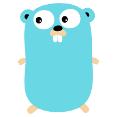
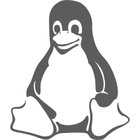

# blockchain-note
## 区块链，go，js，kotlin学习

 
 
 
 

[Golang](Library/Import/blockchain-learning-note/Go/SUMMARY.md)

[Database](Library/Import/blockchain-learning-note/SUMMARY.md)

[Linux](Library/Import/blockchain-learning-note/SUMMARY.md)

[Web](Library/Import/blockchain-learning-note/SUMMARY.md)

[Blockchain](Library/Import/blockchain-learning-note/SUMMARY.md)

[MAC](Library/Import/blockchain-learning-note/SUMMARY.md)