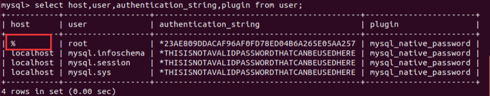

# 附录

## Linux密码修改

`sudo passwd`

## MySQL修改密码

`ALTER USER "root"@"localhost" IDENTIFIED  BY "你的新密码";`

## MySQL设置远程连接

使用mysql数据库输入：

`use mysql`

执行命令为：

`select host,user,authentication_string,plugin from user;`

root 用户的 host默认显示的 localhost，说明只支持本地访问，不允许远程访问。

执行命令为：

`update user set host='%' where user='root';`

刷新

执行命令为：

`flush privileges;`