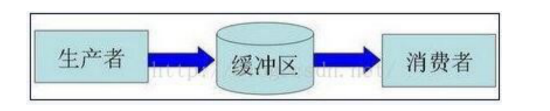

**模型**

单向channel最典型的应用是“生产者消费者模型”
所谓“生产者消费者模型”: 某个模块（函数等）负责产生数据，这些数据由另一个模块来负责处理（此处的模块是广义的，可以是类、函数、协程、线程、进程等）。产生数据的模块，就形象地称为生产者；而处理数据的模块，就称为消费者。

单单抽象出生产者和消费者，还够不上是生产者／消费者模型。该模式还需要有一个缓冲区处于生产者和消费者之间，作为一个中介。生产者把数据放入缓冲区，而消费者从缓冲区取出数据。大概的结构如下图：



举一个寄信的例子来辅助理解一下，假设你要寄一封平信，大致过程如下：

1. 把信写好——相当于生产者制造数据
2. 把信放入邮筒——相当于生产者把数据放入缓冲区
3. 邮递员把信从邮筒取出——相当于消费者把数据取出缓冲区
4. 邮递员把信拿去邮局做相应的处理——相当于消费者处理数据

 那么，这个缓冲区有什么用呢？为什么不让生产者直接调用消费者的某个函数，直接把数据传递过去，而画蛇添足般的设置一个缓冲区呢？
 
**缓冲区的好处大概如下：**

*  **解耦**

假设生产者和消费者分别是两个类。如果让生产者直接调用消费者的某个方法，那么生产者对于消费者就会产生依赖（也就是耦合）。将来如果消费者的代码发生变化，可能会直接影响到生产者。而如果两者都依赖于某个缓冲区，两者之间不直接依赖，耦合度也就相应降低了。

接着上述的例子，如果不使用邮筒（缓冲区），须得把信直接交给邮递员。那你就必须要认识谁是邮递员。这就产生和你和邮递员之间的依赖（相当于生产者和消费者的强耦合）。万一哪天邮递员换人了，你还要重新认识下一个邮递员（相当于消费者变化导致修改生产者代码）。 而邮筒相对来说比较固定，你依赖它的成本比较低（相当于和缓冲区之间的弱耦合）。

*  **处理并发**

生产者直接调用消费者的某个方法，还有另一个弊端。由于函数调用是同步的（或者叫阻塞的），在消费者的方法没有返回之前，生产者只好一直等在那边。万一消费者处理数据很慢，生产者只能无端浪费时间。

使用了生产者／消费者模式之后，生产者和消费者可以是两个独立的并发主体。生产者把制造出来的数据往缓冲区一丢，就可以再去生产下一个数据。基本上不用依赖消费者的处理速度。

其实最当初这个生产者消费者模式，主要就是用来处理并发问题的。

从寄信的例子来看。如果没有邮筒，你得拿着信傻站在路口等邮递员过来收（相当于生产者阻塞）；又或者邮递员得挨家挨户问，谁要寄信（相当于消费者轮询）。

*	**缓存**

如果生产者制造数据的速度时快时慢，缓冲区的好处就体现出来了。当数据制造快的时候，消费者来不及处理，未处理的数据可以暂时存在缓冲区中。等生产者的制造速度慢下来，消费者再慢慢处理掉。

假设邮递员一次只能带走1000封信。万一某次碰上情人节送贺卡，需要寄出去的信超过1000封，这时候邮筒这个缓冲区就派上用场了。邮递员把来不及带走的信暂存在邮筒中，等下次过来时再拿走。

示例代码：

```
// 此通道只能写，不能读。
func producer(out chan<- int)  {
   for i:= 0; i < 10; i++ {
      out <- i*i          		// 将 i*i 结果写入到只写channel
   }
   close(out)
}

// 此通道只能读，不能写
func consumer(in <-chan int)  {
   for num := range in {		// 从只读channel中获取数据
      fmt.Println("num =", num)
   }
}

func main()  {
   ch := make(chan int)		// 创建一个双向channel

   // 新建一个groutine， 模拟生产者，产生数据，写入 channel
   go producer(ch)     		// channel传参， 传递的是引用。

   // 主协程，模拟消费者，从channel读数据，打印到屏幕
   consumer(ch)      		// 与 producer 传递的是同一个 channel
}
```

简单说明：首先创建一个双向的channel，然后开启一个新的goroutine，把双向通道作为参数传递到producer方法中，同时转成只写通道。子协程开始执行循环，向只写通道中添加数据，这就是生产者。主协程，直接调用consumer方法，该方法将双向通道转成只读通道，通过循环每次从通道中读取数据，这就是消费者。

**注意：channel作为参数传递，是引用传递。**

**模拟订单**

在实际的开发中，生产者消费者模式应用也非常的广泛，例如：在电商网站中，订单处理，就是非常典型的生产者消费者模式。

当很多用户单击下订单按钮后，订单生产的数据全部放到缓冲区（队列）中，然后消费者将队列中的数据取出来发送者仓库管理等系统。

通过生产者消费者模式，将订单系统与仓库管理系统隔离开，且用户可以随时下单（生产数据）。如果订单系统直接调用仓库系统，那么用户单击下订单按钮后，要等到仓库系统的结果返回。这样速度会很慢。

下面模拟一个下订单处理的过程。

```
type OrderInfo struct {     // 创建结构体类型OrderInfo，只有一个id 成员
   id int
}

func producer2(out chan <- OrderInfo)  {   	// 生成订单——生产者

   for i:=0; i<10; i++ {              	// 循环生成10份订单
      order := OrderInfo{id: i+1}
      out <- order                  		// 写入channel
   }
   close(out)				// 写完，关闭channel
}

func consumer2(in <- chan OrderInfo)  {       // 处理订单——消费者

   for order := range in {                   	// 从channel 取出订单
      fmt.Println("订单id为：", order.id)    // 模拟处理订单
   }
}

func main()  {
   ch := make(chan OrderInfo)  // 定义一个双向 channel， 指定数据类型为OrderInfo
   go producer2(ch)            // 建新协程，传只写channel
   consumer2(ch)               // 主协程，传只读channel
}
```
OrderInfo为订单信息，这里为了简单只定义了一个订单编号属性，然后生产者模拟10个订单，消费者对产生的订单进行处理。


