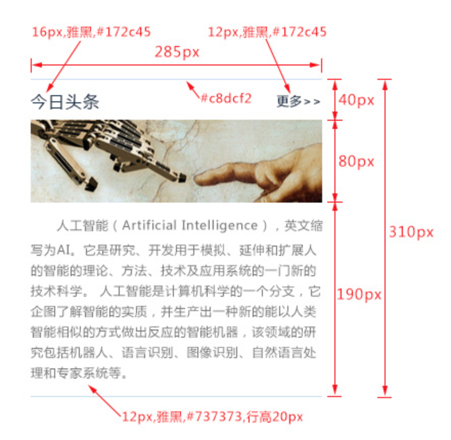

# html布局
## 网页布局原理

标签在网页中会显示成一个个的方块，先按照行的方式，把网页划分成多个行，再到行里面划分列，也就是在表示行的标签中再嵌套标签来表示列，整体按照先整体，后局部，先大后小的顺序来书写结构。



## 布局示例

根据网页布局的原理以及上面的实例，写出网页的html结构代码。

## 标签语义化

在布局中需要尽量使用带语义的标签，使用带语义的标签的目的首先是为了让搜索引擎能更好地理解网页的结构，提高网站在搜索中的排名(也叫做SEO)，其次是方便代码的阅读和维护。

## 带语义的标签 

```
1、h1~h6：表示标题
2、p：表示段落
3、img：表示图片
4、a：表示链接
```

## 不带语义的标签 

```
1、div：表示一块内容

2、span：表示行内的一块内容
```


所以我们要根据网页上显示的内容，使用适合的标签，可以优化之前的代码。

