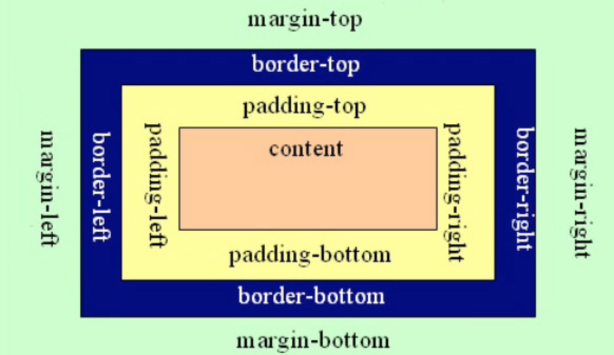

# CSS元素属性及盒子模型
## 盒子模型

元素在页面中显示成一个方块，类似一个盒子，CSS盒子模型就是使用现实中盒子来做比喻，帮助我们设置元素对应的样式。盒子模型示意图如下：

把元素叫做盒子，设置对应的样式分别为：

*  盒子的宽度(width)、
*  盒子的高度(height)、
*  盒子的边框(border)、
*  盒子内的内容和边框之间的间距(padding)、
*  盒子与盒子之间的间距(margin)。

## 设置宽高

```
width:200px;  /* 设置盒子的宽度，此宽度是指盒子内容的宽度，不是盒子整体宽度(难点) */ 
height:200px; /* 设置盒子的高度，此高度是指盒子内容的高度，不是盒子整体高度(难点) */
```

## 设置边框 

设置一边的边框，比如顶部边框，可以按如下设置：

`border-top:10px solid red;`

其中10px表示线框的粗细；solid表示线性。

设置其它三个边的方法和上面一样，把上面的'top'换成'left'就是设置左边，换成'right'就是设置右边，换成'bottom'就是设置底边。

四个边如果设置一样，可以将四个边的设置合并成一句：

`border:10px solid red;`

## 设置内间距padding

设置盒子四边的内间距，可设置如下：

```
padding-top：20px;     /* 设置顶部内间距20px */ 
padding-left:30px;     /* 设置左边内间距30px */ 
padding-right:40px;    /* 设置右边内间距40px */ 
padding-bottom:50px;   /* 设置底部内间距50px */
```
上面的设置可以简写如下：

```
padding：20px 40px 50px 30px; 
/* 四个值按照顺时针方向，分别设置的是 上 右 下 左  
四个方向的内边距值。 */
```

## 设置外间距margin 

外边距的设置方法和padding的设置方法相同，将上面设置项中的'padding'换成'margin'就是外边距设置方法。

## 盒子的真实尺寸 

盒子的width和height值固定时，如果盒子增加border和padding，盒子整体的尺寸会变大，所以盒子的真实尺寸为：

*	盒子宽度 = width + padding左右 + border左右
*	盒子高度 = height + padding上下 + border上下

## 块元素居中技巧 
块元素如果想设置相对页面水平居中，可以使用margin值中的auto关键字，“auto”只能用于左右的margin设置，不能用于上下的：

```
.box{
      width:300px;
      height:300px;
      background:gold;
      margin-left:0px;
      margin-top:0px;
      margin-left:auto;
      margin-right:auto;    
}
```
简写如下：

```
.box{
     width:300px;
     height:300px;
     background:gold;
     margin:0px auto;   
 }
```

## 设置元素浮动属性float

<mark>浮动可以让块元素排列在一行，浮动分为左浮动：float:left; 右浮动：float:right;

## 设置元素背景属性background

设置元素背景色或者背景图片，如：background:gold; 设置元素背景色为金色

