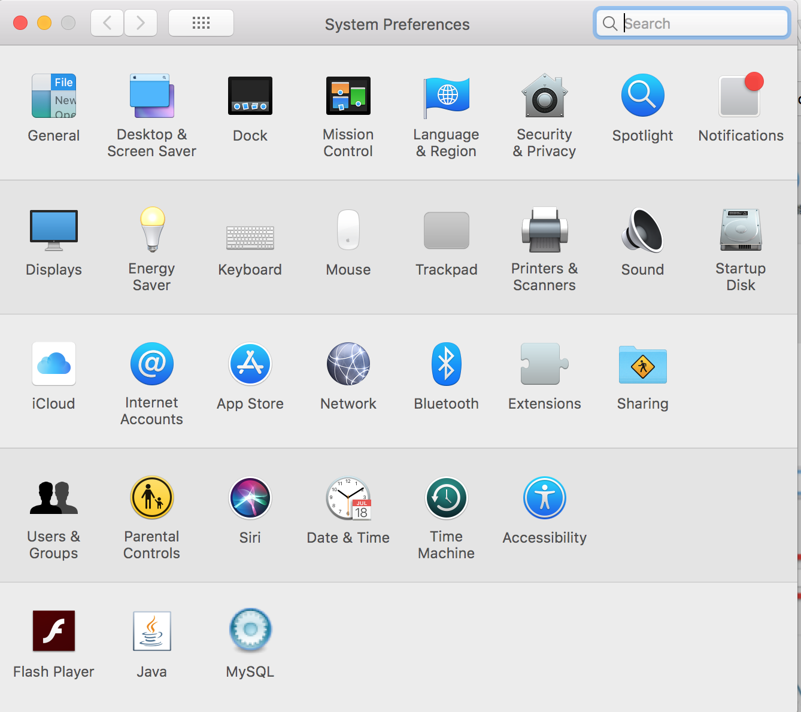
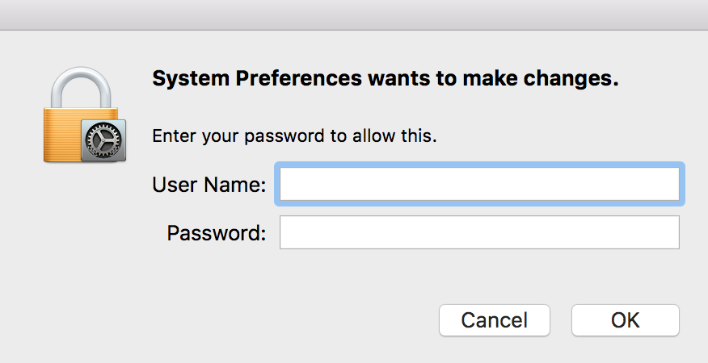
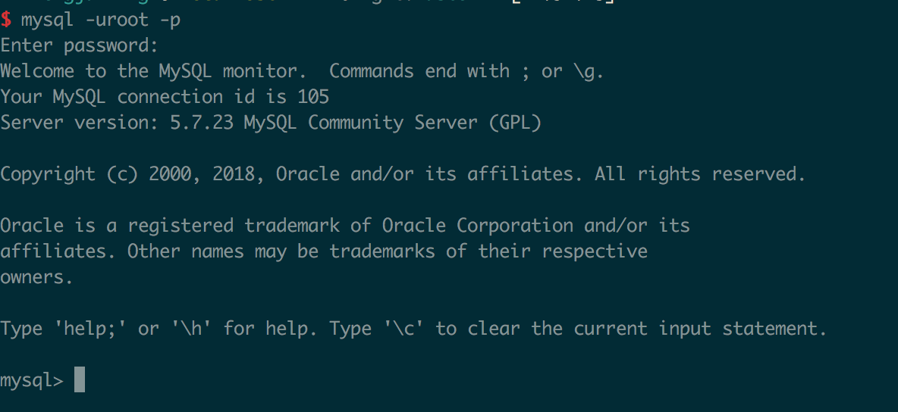

# Mysql断开与连接

## 系统偏好设置

点击mysql

## start or stop

## 输入用户密码

## 连接mysql服务器

打开terminal 
`mysql -u root  -h 127.0.0.1 -p password`

其中-u代表用户名  -p代表密码  -h代表MySQL服务器所在地址，可以省略不写。为了保护MySQL数据库的密码，可以采用下图的密码输入方式，不用明文的方式显示密码。

如果出现上图说明成功，如果出现
`command not found: mysql`

说明环境变量有问题，解决方法如下：
### 打开配置文件

`vim ~/.bash_profile`

### 添加path

`export PATH=$PATH:/usr/local/mysql/bin`

### 让文件生效

`source ~/.bash_profile`
