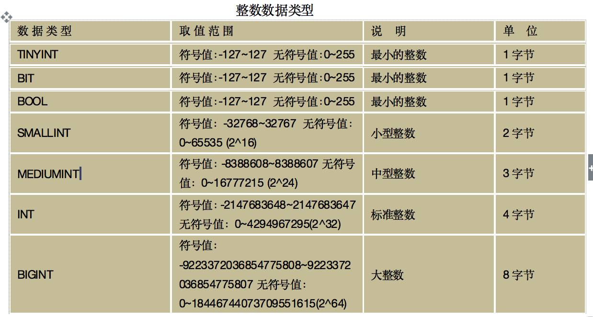
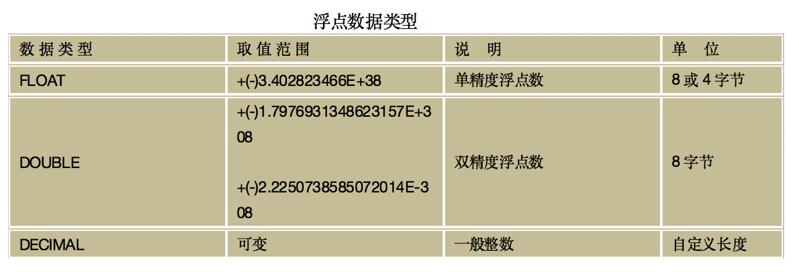
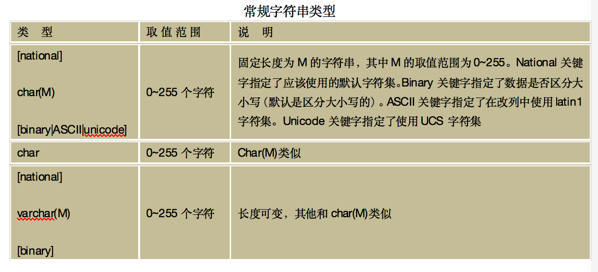
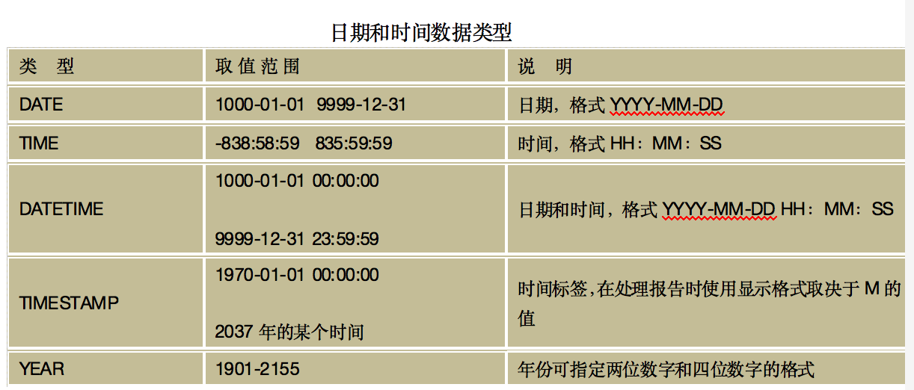

# MySQL数据数据类型
## 数字类型
>	MySQL支持所有的ANSI/ISO SQL 92数字类型。这些类型包括准确数字的数据类型（NUMERIC、DECIMAL、INTEGER和SMALLINT），还包括近似数字的数据类型（FLOAT、REAL和DOUBLE PRECISION）。其中的关键词INT是INTEGER的同义词，关键词DEC是DECIMAL的同义词。

**在创建表时，使用哪种数字类型，应遵循以下原则。**

1.	选择最小的可用类型，如果值永远不超过127，则使用TINYINT比INT强。
2. 	对于完全都是数字的，可以选择整数类型
3. 	浮点类型用于可能具有小数部分的数，如货物单价、网上购物交付金额等。
4. <mark>如果是银行业务数据非常大用DECIMAL</mark>

## 字符串类型
>	字符串类型可以分为3类：普通的文本字符串类型（CHAR和VARCHAR）、可变类型（TEXT和BLOB）和特殊类型（SET和ENUM）。它们之间都有一定的区别，取值的范围不同，应用的地方也不同

### 常规字符串类型

即CHAR和VARCHAR类型，CHAR列的长度被固定为创建表所声明的长度，取值在1~255之间；VARCHAR列的值是可变长度的字符串，取值和CHAR一样。

### 可变类型（TEXT和BLOB）

他们的大小可以改变，TEXT类型适合存储长文本，而BLOB类型适合存储二进制数据，支持任何数据，如文本、声音、图像等。

### 特殊类型(SET和ENUM)

## 日期和时间类型
