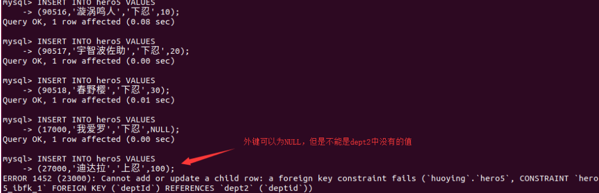

# 定义完整性约束
>	关系模型的完整性规则是对关系的某种约束条件。在关系模型中，提供了实体完整性、参照完整性和用户定义的完整性等三项规则。下面将分别介绍MySQL中对数据库完整性三项规则的设置和实现方式。

## 实体完整性
>	实体（Entity）是一个数据对象，是指客观存在并可以相互区分的事物，实体完整性规则（Entity Integrity Rule）是指关系的主属性，即主码（主键）的组成不能为空，也就是关系的主属性不能是空值（NULL）。

主键约束：
主键可以是表中的某一列，或者多个列所构成的一个组合；其中，由多个列组合而成的主键也称复合主键。主键必须遵守以下规则

*	每个表中只能定义一个主键
主键必须能够唯一标识 表中的每一行记录，且不能为NULL
*	复合主键不能包含多余列。也就是说复合主键中删除一列后剩下的主键仍满足唯一，那么这个复合主键是不正确的。
*	一个列名在复合主键中只能出现一次。

例：在创建hero2表时候将heroId设置为主键

```
create table hero2(heroId int auto_increment primary key, heroName varchar(30) ,job varchar(30));
```

例2：创建hero3，将heroId、deptId设置为主键

```
create table hero3(heroId int auto_increment , heroName varchar(30) ,job varchar(30),deptId int ,primary key(heroId,deptId));
```

## 候选键约束
>	如果一个属性集能唯一标识元组，且又不含有多余的属性，那么这个属性集称为关系的候选键。
>	候选键可以是表中某一列，也可以是表中多个列所构成的一个组合。任何时候，<mark>候选键的值必须是唯一的，且不能为空。候选键可以在CREATE TABLE或者ALTER TABLE语句中使用关键字UNIQUE来定义，其实现方法与主键约束类型，也是可作为列的完整性约束或者表的完整性约束的两种方式。

主键与候选键区别：

*	一个表中只能创建一个主键、但是可以定义若干个候选键。
*	定义主键约束时，系统会自动创建PRIMARY KEY索引，而定义候选键约束时，系统会自动创建UNIQUE索引

例：创建表hero4时，将heroId和deptId字段设置为候选键。

```
create table hero4(heroId int auto_increment unique, heroName varchar(30) ,job varchar(30), deptId int unique);
```

# 参照完整性

>	参照完整性规则（Referential Integrity Rule）就是定义外码（外键）和主码（主键）之间的引用规则，它是对关系间引用数据的一种限制。
>	例如在hero表中有deptId这一项，而这一项又是dept表中的主键，因此在hero表中deptId称为外键，外键在赋值时要么是NULL，代表还没有分配部门，要么必须是dept中的值，否则与实际应用环境不符，就是错误的。

例：创建hero5表，并设置参照完整性约束

准备表数据

```
CREATE TABLE dept2 (
	deptId INT auto_increment PRIMARY KEY,
	deptName VARCHAR(30)
);

desc dept2;


```
代码：

```
CREATE TABLE hero5 (
	heroId INT auto_increment,
	heroName VARCHAR (30),
	job VARCHAR (30),
	deptId INT,
	PRIMARY KEY (heroId),
	FOREIGN KEY (deptId) REFERENCES dept2 (deptId) ON DELETE RESTRICT ON UPDATE RESTRICT
);
```

语句中的 RESTRICT代表限制策略，当要删除或者更新被参照表中被参照列上，并且在外键中出现的值时，系统拒绝对被参照的表进行删除或更新操作。
 
测试：
向dept2中插入数据：

```
INSERT INTO dept2 VALUES (10,'总部');
INSERT INTO dept2 VALUES (20,'医疗部');
INSERT INTO dept2 VALUES (30,'教育部');
```

向hero5中插入数据

```
INSERT INTO hero5 VALUES
(90516,'漩涡鸣人','下忍',10);
INSERT INTO hero5 VALUES
(90517,'宇智波佐助','下忍',20);
INSERT INTO hero5 VALUES
(90518,'春野樱','下忍',30);
INSERT INTO hero5 VALUES
(17000,'我爱罗','下忍',NULL);
INSERT INTO hero5 VALUES
(27000,'迪达拉','上忍',100);
```


上述结果可以看出，前几条数据可以正确的插入到表中，但是最后一条数据无法插入，原因是设置了参照完整性约束。
# 用户定义完整性
>	用户定义完整性规则（User-defined Integrity Rule）是针对某一应用环境的完整性约束条件，它找反映了某一具体应用所涉及的数据应满足的要求。

## 非空约束

>	在MySQL中，非空约束可以通过在CREATE TABLE或ALTERTABLE语句中，某个列定义后面加上关键字 NOT NULL来定义，用来约束该列的取值不能为空。

例：创建hero6表，并且为heroName字段设置为非空约束

```
CREATE TABLE hero6 (
	heroId INT auto_increment,
	heroName VARCHAR (30) NOT NULL,
	PRIMARY KEY (heroId)
);
```

## CHECK约束

与非空约束一样，CHECK约束也可以通过在CREATE TABLE或ALTER TABLE语句中，根据用户的实际完整性的要求来定义。

例：创建表hero7，要求列中的sex性别列字段的值只能在 “男” 和 “女”中，age只能在0~100之间（包括0，不包括100）

```
CREATE TABLE hero7 (
	heroId INT auto_increment,
	heroName VARCHAR (30) NOT NULL,
	sex VARCHAR(10) NOT NULL  CHECK(sex in ('男','女')),
	age int not null CHECK (age >=0 and age <100),
	PRIMARY KEY (heroId)
);
```
```
INSERT INTO hero7 VALUES (90516,'旋涡鸣人','男',18);
```

<mark>注：目前MySQL版本至少对CHECK约束进行了分析处理，但会被直接忽略，插入错误数据并不会报错。


# 命名完整性约束
>	在MySQL中，也可以对完整性约束进行添加、修改和删除等操作。其中，为了删除和修改完整性约束，需要在定义约束的同时对其进行命名。命名完整性约束的方式是在各种完整性约束的定义说明之前加上CONSTRAINT子句实现的。

CONSTRAINT子句的语法格式如下：

```
CONSTRAINT <symbol>
	[PRIMAR KEY 短语 |FOREIGN KEY 短语 |CHECK 短语]
```
例：创建hero8表时，给外键完整性约束命名为 fk_deptId

```
CREATE TABLE hero8 (
	heroId INT auto_increment,
	heroName VARCHAR (30),
	job VARCHAR (30),
	deptId INT,
	PRIMARY KEY (heroId),
	CONSTRAINT fk_deptId FOREIGN KEY (deptId) REFERENCES dept2 (deptId) ON DELETE RESTRICT ON UPDATE RESTRICT
);
```

# 更新完整性约束

## 删除完整性约束
在MySQL中，使用ALTER TABLE语句，可以独立地删除完整性约束，而不会删除表本身。如果使用DROP TABLE语句删除一个表，那么这个表中的所有完整性约束也会自动被删除。删除完整性约束需要在ALTER TABLE语句中使用DROP关键字来实现，具体的语法格式如下： 

```
ALTER  TABLE  表名 DROP [FOREIGN KEY| INDEX| <symbol>] |[PRIMARY KEY]
```

FOREIGN 代表外键
INDEX 代表候选键
symbol 代表约束名称
PRIMARY KEY 代表主键
注：如果删除主键约束，需要注意的是，在删除时，必须再创建一个主键，否则不能删除成功。


例：删除hero8表中的名称为 `fk_deptId`的完整性约束

`alter table hero8 drop foreign key fk_deptId;`

## 修改完整性约束

>	在MySQL中，完整性约束不能直接被修改，若要修改只能是用ALTER TABLE语句先删除除该约束，然后再增加一个与该约束同名的新约束。由于删除完整性约束的语法在13.3.1节已经介绍了，这里只给出在ALTER TABLE语句中添加完整性约束的语法格式。

具体语法格式如下：

`ADD CONSTRAINT <symbol> 各种约束`

例：在hero8中再添加回`fk_deptId`约束

```
ALTER TABLE hero8 
ADD CONSTRAINT fk_deptId FOREIGN KEY (deptId) REFERENCES dept2 (deptId) 
ON DELETE CASCADE ON UPDATE CASCADE;
```