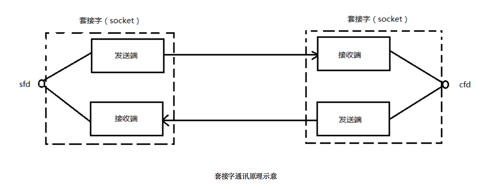

# Socket编程

## 什么是Socket

Socket，英文含义是【插座、插孔】，一般称之为套接字，用于描述IP地址和端口。可以实现不同程序间的数据通信。

>	Socket起源于Unix，而Unix基本哲学之一就是“一切皆文件”，都可以用“打开open –> 读写write/read –> 关闭close”模式来操作。Socket就是该模式的一个实现，网络的Socket数据传输是一种特殊的I/O，Socket也是一种文件描述符。Socket也具有一个类似于打开文件的函数调用：Socket()，该函数返回一个整型的Socket描述符，随后的连接建立、数据传输等操作都是通过该Socket实现的。

套接字的内核实现较为复杂，不宜在学习初期深入学习，了解到如下结构足矣。

在TCP/IP协议中，“IP地址+TCP或UDP端口号”唯一标识网络通讯中的一个进程。“IP地址+端口号”就对应一个socket。欲建立连接的两个进程各自有一个socket来标识，那么这两个socket组成的socket pair就唯一标识一个连接。因此可以用Socket来描述网络连接的一对一关系。
常用的Socket类型有两种：流式`Socket（SOCK_STREAM）`和数据报式`Socket（SOCK_DGRAM）`。流式是一种面向连接的Socket，针对于面向连接的TCP服务应用；数据报式Socket是一种无连接的Socket，对应于无连接的UDP服务应用。