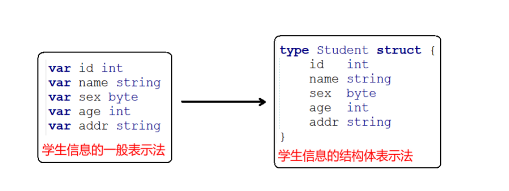

# 结构体类型

有时我们需要将不同类型的数据组合成一个有机的整体，如：一个学生有学号/姓名/性别/年龄/地址等属性。显然单独定义以上变量比较繁琐，数据不便于管理。



结构体是一种聚合的数据类型，它是由一系列具有相同类型或不同类型的数据构成的数据集合，就是java中的实体类。每个数据称为结构体的成员。 

# 结构体初始化

## 普通变量

```
type Student struct {
    id   int
    name string
    sex  byte
    age  int
    addr string
}

func main() {
    //1、顺序初始化，必须每个成员都初始化
    var s1 Student = Student{1, "Luffy", 'm', 18, "EastSea"}
    s2 := Student{2, "Sanji", 'f', 20, "EastSea"}
    //s3 := Student{2, "Nami", 'm', 20} //err, too few values in struct initializer

    //2、指定初始化某个成员，没有初始化的成员为零值
    s4 := Student{id: 2, name: "Zoro"}
}
```
## 指针变量

```
type Student struct {
    id   int
    name string
    sex  byte
    age  int
    addr string
}

func main() {
    var s5 *Student = &Student{3, "Nami", 'm', 16, "EastSea"}
    s6 := &Student{4, "ro", 'm', 3, "NorthSea"}
}
```

# 使用结构体成员

## 普通变量

```
//===============结构体变量为普通变量
    //1、打印成员
    var s1 Student = Student{1, "Luffy", 'm', 18, "EastSea"}
    //结果：id = 1, name = Luffy, sex = m, age = 18, addr = EastSea
    fmt.Printf("id = %d, name = %s, sex = %c, age = %d, addr = %s\n", s1.id, s1.name, s1.sex, s1.age, s1.addr)

    //2、成员变量赋值
    var s2 Student
    s2.id = 2
    s2.name = "Sanji"
    s2.sex = 'f'
    s2.age = 16
    s2.addr = "EastSea"
    fmt.Println(s2) //{2 yoyo 102 16 EastSea}
```
## 指针变量

```
 //===============结构体变量为指针变量
    //3、先分配空间，再赋值
    s3 := new(Student)
    s3.id = 3
    s3.name = "Nami"
    fmt.Println(s3) //&{3 Nami 0 0 }

    //4、普通变量和指针变量类型打印
    var s4 Student = Student{4, "Sanji", 'm', 18, "EastSea"}
    fmt.Printf("s4 = %v, &s4 = %v\n", s4, &s4) //s4 = {4 Sanji 109 18 sz}, &s4 = &{4 Sanji 109 18 EastSea}

    var p *Student = &s4
    //p.成员 和(*p).成员 操作是等价的
    p.id = 5
    (*p).name = "ro"
    fmt.Println(p, *p, s4) //&{5 ro 109 18 EastSea} {5 ro 109 18 EastSea} {5 ro 109 18 EastSea}

```
在Go语言中，普通结构体变量 和 结构体指针变量发访问成员的方法一致。不需要加以区分。
# 结构体比较

如果结构体的全部成员都是可以比较的，那么结构体也是可以比较的，那样的话两个结构体将可以使用 == 或 != 运算符进行比较，但不支持 > 或 < 。

```
func main() {
    s1 := Student{1, "Luffy", 'm', 18, "EastSea"}
    s2 := Student{1, "Luffy", 'm', 18, "EastSea"}

    fmt.Println("s1 == s2", s1 == s2) //s1 == s2 true
    fmt.Println("s1 != s2", s1 != s2) //s1 != s2 false
}
```

# 作函数参数

## 传值

```
func printValue(stu Student) {
    stu.id = 250
    //printValue stu =  {250 Luffy 109 18 s EastSea}
    fmt.Println("printValue stu = ", stu)
}

func main() {
var s Student = Student{1, "Luffy", 'm', 18, "EastSea"}

    printValue(s)        //值传递，形参修改不会影响到实参值
    fmt.Println("main s = ", s) //main s =  {1 Luffy 109 18 EastSea}
}
```
传参过程中，实参会将自己的值拷贝一份给形参。因此结构体“传值”操作几乎不会在实际开发中被使用到。近乎100%的使用都采用“传址”的方式，将结构体的引用传递给所需函数。

## 传引用

```
func printPointer(p *Student) {
    p.id = 250
    //printPointer p =  &{250 Luffy 109 18 EastSea}
    fmt.Println("printPointer p = ", p)
}

func main() {
    var s Student = Student{1, "Luffy", 'm', 18, "EastSea"}

    printPointer(&s)      //传引用(地址)，形参修改会影响到实参值
    fmt.Println("main s = ", s) //main s = {250 Luffy 109 18 EastSea}
}
```

## 注意

*	**结构体传递时尽量使用结构体指针，为了效率。**