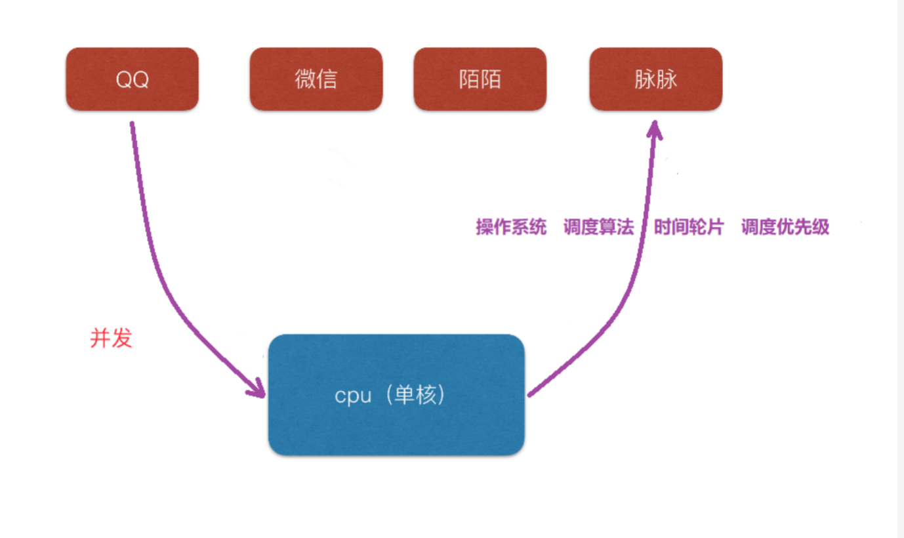
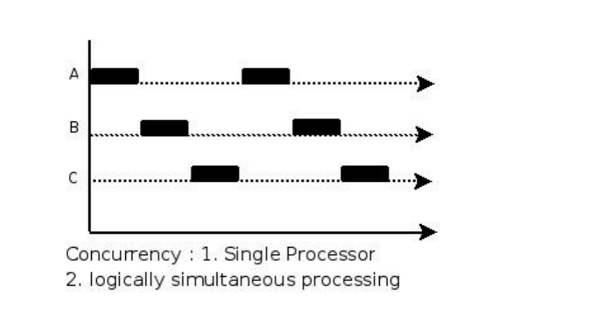
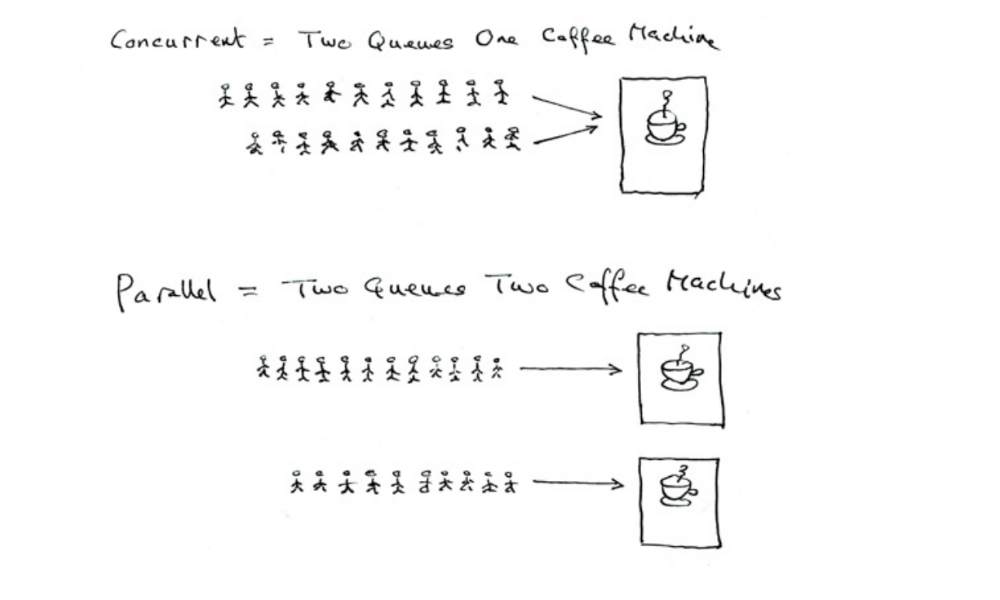
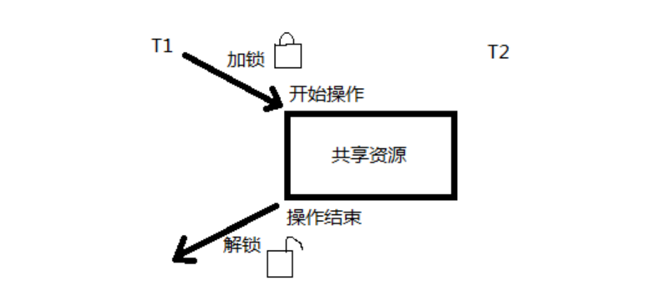

# 概述

简而言之，所谓并发编程是指在一台处理器上“同时”处理多个任务。

随着硬件的发展，并发程序变得越来越重要。Web服务器会一次处理成千上万的请求。平板电脑和手机app在渲染用户画面同时还会后台执行各种计算任务和网络请求。即使是传统的批处理问题--读取数据，计算，写输出--现在也会用并发来隐藏掉I/O的操作延迟以充分利用现代计算机设备的多个核心。计算机的性能每年都在以非线性的速度增长。

宏观的并发是指在一段时间内，有多个程序在同时运行。

并发在微观上，是指在同一时刻只能有一条指令执行，但多个程序指令被快速的轮换执行，使得在宏观上具有多个进程同时执行的效果，但在微观上并不是同时执行的，只是把时间分成若干段，使多个程序快速交替的执行。

#并行和并发
## 并行(parallel)：
指在同一时刻，有多条指令在多个处理器上同时执行。

## 并发(concurrency)：
指在同一时刻只能有一条指令执行，但多个进程指令被快速的轮换执行，使得在宏观上具有多个进程同时执行的效果，但在微观上并不是同时执行的，只是把时间分成若干段，通过cpu时间片轮转使多个进程快速交替的执行。

大师曾以咖啡机的例子来解释并行和并发的区别。

*	并行是两个队列同时使用两台咖啡机 （真正的多任务）
*	并发是两个队列交替使用一台咖啡机 （ 假 的多任务）

# 进程并发

##程序
> 	是指编译好的二进制文件，在磁盘上，不占用系统资源(内存、打开的文件、设备、锁....)

## 进程
>	是一个抽象的概念，与操作系统原理联系紧密。进程是活跃的程序，占用系统资源。在内存中执行。(程序运行起来，产生一个进程) 

**程序 → 剧本(纸)		
进程 → 戏 (舞台、演员、灯光、道具...).     
同一个剧本可以在多个舞台同时上演。同样，同一个程序也可以加载为不同的进程(彼此之间互不影响)**

如：同时开两个终端。各自都有一个bash但彼此ID不同。

## 进程状态

**在使用进程 实现并发时会出现什么问题呢？**

1. 系统开销比较大，占用资源比较多，开启进程数量比较少。
2. 在unix/linux系统下，还会产生“孤儿进程”和“僵尸进程”。

在操作系统运行过程中，可以产生很多的进程。在unix/linux系统中，正常情况下，子进程是通过父进程fork创建的，子进程再创建新的进程。

并且父进程永远无法预测子进程到底什么时候结束。 当一个进程完成它的工作终止之后，它的父进程需要调用系统调用取得子进程的终止状态。

### 孤儿进程
孤儿进程: 父进程先于子进程结束，则子进程成为孤儿进程，子进程的父进程成为init进程，称为init进程领养孤儿进程。

###僵尸进程 
僵尸进程: 进程终止，父进程尚未回收，子进程残留资源（PCB）存放于内核中，变成僵尸（Zombie）进程。 
 
Windows下的进程和Linux下的进程是不一样的，它比较懒惰，从来不执行任何东西，只是为线程提供执行环境。然后由线程负责执行包含在进程的地址空间中的代码。当创建一个进程的时候，操作系统会自动创建这个进程的第一个线程，成为主线程。

# 线程

##什么是线程
*	LWP：light weight process 轻量级的进程，本质仍是进程 (Linux下)
*	进程：独立地址空间，拥有PCB 
*	线程：有独立的PCB，但没有独立的地址空间(共享)
*	区别：在于是否共享地址空间。独居(进程)；合租(线程)。

**线程：最小的执行单位**

**进程：最小分配资源单位，可看成是只有一个线程的进程。**

Windows系统下，可以直接忽略进程的概念，只谈线程。因为线程是最小的执行单位，是被系统独立调度和分派的基本单位。而进程只是给线程提供执行环境。

## 线程同步 

>	同步即协同步调，按预定的先后次序运行。
***线程同步，指一个线程发出某一功能调用时，在没有得到结果之前，该调用不返回。同时其它线程为保证数据一致性，不能调用该功能。***

*	举例1：	银行存款 5000。柜台，折：取3000；提款机，卡：取 3000。剩余：2000
*	举例2： 内存中100字节，线程T1欲填入全1， 线程T2欲填入全0。但如果T1执行了50个字节失去cpu，T2执行，会将T1写过的内容覆盖。当T1再次获得cpu继续	从失去cpu的位置向后写入1，当执行结束，内存中的100字节，既不是全1，也不是全0。

**产生的现象叫做“与时间有关的错误”(time related)。为了避免这种数据混乱，线程需要同步。
	“同步”的目的，是为了避免数据混乱，解决与时间有关的错误。实际上，不仅线程间需要同步，进程间、信号间等等都需要同步机制。
	因此，所有“多个控制流，共同操作一个共享资源”的情况，都需要同步。**

# 锁

## 互斥量mutex 

Linux中提供一把互斥锁mutex（也称之为互斥量）。每个线程在对资源操作前都尝试先加锁，成功加锁才能操作，操作结束解锁。

资源还是共享的，线程间也还是竞争的，但通过“锁”就将资源的访问变成互斥操作，而后与时间有关的错误也不会再产生了。

**注意：同一时刻，只能有一个线程持有该锁。**

当A线程对某个全局变量加锁访问，B在访问前尝试加锁，拿不到锁，B阻塞。C线程不去加锁，而直接访问该全局变量，依然能够访问，但会出现数据混乱。

所以，互斥锁实质上是操作系统提供的一把“建议锁”（又称“协同锁”），建议程序中有多线程访问共享资源的时候使用该机制。但，并没有强制限定。

<mark>因此，即使有了mutex，如果有线程不按规则来访问数据，依然会造成数据混乱。

## 读写锁

与互斥量类似，但读写锁允许更高的并行性。其特性为：***写独占，读共享。***

*	读写锁状态：
特别强调：读写锁只有一把，但其具备两种状态：
	1. 读模式下加锁状态 (读锁) 
	2. 写模式下加锁状态 (写锁)
*	读写锁特性：	
	1. 读写锁是“写模式加锁”时， 解锁前，所有对该锁加锁的线程都会被阻塞。
	2. 读写锁是“读模式加锁”时， 如果线程以读模式对其加锁会成功；如果线程以写模式加锁会阻塞。
	3. 读写锁是“读模式加锁”时， 既有试图以写模式加锁的线程，也有试图以读模式加锁的线程。那么读写锁会阻塞随后的读模式锁请求。优先满足写模式锁。读锁、写锁并行阻塞，<mark>写锁优先级高

读写锁也叫共享-独占锁。当读写锁以读模式锁住时，它是以共享模式锁住的；当它以写模式锁住时，它是以独占模式锁住的。<mark>写独占、读共享。

读写锁非常适合于对数据结构读的次数远大于写的情况。

# 协程

协程：coroutine。也叫轻量级线程。

*	与传统的系统级线程和进程相比，协程最大的优势在于“轻量级”。可以轻松创建上万个而不会导致系统资源衰竭。而线程和进程通常很难超过1万个。这也是协程别称“轻量级线程”的原因。

*	一个线程中可以有任意多个协程，但某一时刻只能有一个协程在运行，多个协程分享该线程分配到的计算机资源。

*	多数语言在语法层面并不直接支持协程，而是通过库的方式支持，但用库的方式支持的功能也并不完整，比如仅仅提供协程的创建、销毁与切换等能力。如果在这样的轻量级线程中调用一个同步 IO 操作，比如网络通信、本地文件读写，都会阻塞其他的并发执行轻量级线程，从而无法真正达到轻量级线程本身期望达到的目标。

*	在协程中，调用一个任务就像调用一个函数一样，消耗的系统资源最少！但能达到进程、线程并发相同的效果。

*	在一次并发任务中，进程、线程、协程均可以实现。从系统资源消耗的角度出发来看，进程相当多，线程次之，协程最少。	

#Go并发
> Go 在语言级别支持协程，叫goroutine。Go 语言标准库提供的所有系统调用操作（包括所有同步IO操作），都会出让CPU给其他goroutine。这让轻量级线程的切换管理不依赖于系统的线程和进程，也不需要依赖于CPU的核心数量。

有人把Go比作21世纪的C语言。第一是因为Go语言设计简单，第二，21世纪最重要的就是并行程序设计，而Go从语言层面就支持并行。同时，并发程序的内存管理有时候是非常复杂的，而Go语言提供了自动垃圾回收机制。

Go语言为并发编程而内置的上层API基于顺序通信进程模型CSP(communicating sequential processes)。这就意味着显式锁都是可以避免的，因为Go通过相对安全的通道发送和接受数据以实现同步，这大大地简化了并发程序的编写。

**Go语言中的并发程序主要使用两种手段来实现。goroutine和channel。**