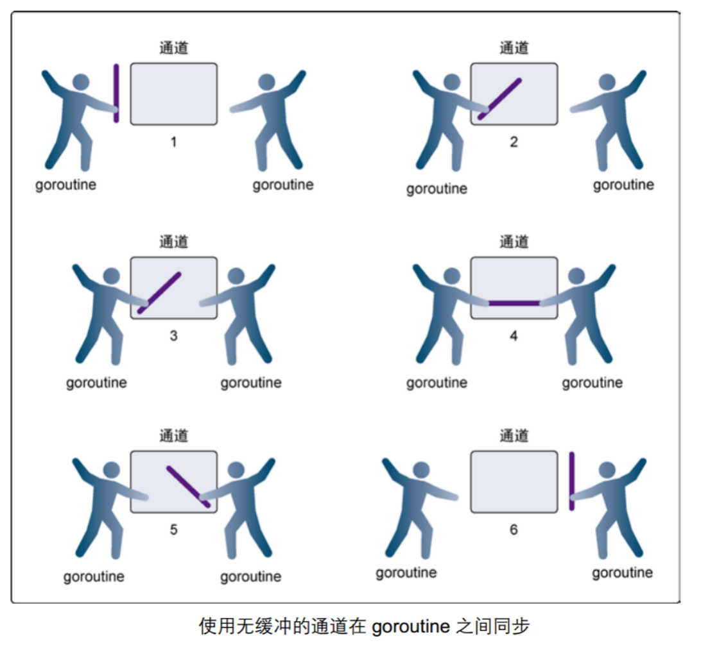
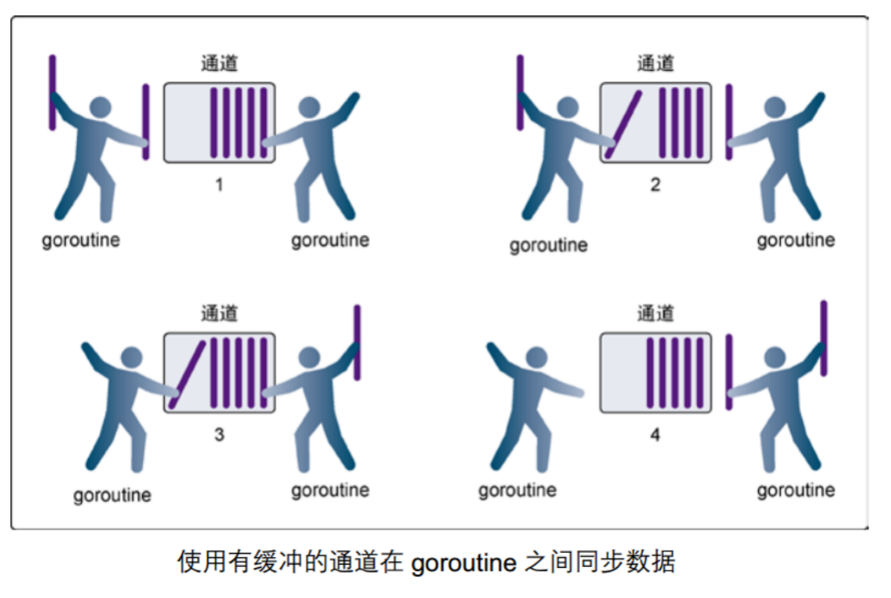
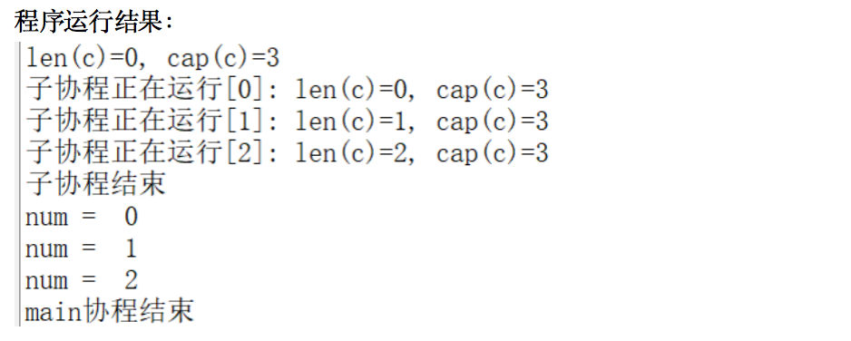

#概念
> channel是Go语言中的一个核心类型，可以把它看成管道。并发核心单元通过它就可以发送或者接收数据进行通讯，这在一定程度上又进一步降低了编程的难度。

channel是一个数据类型，主要用来解决go程的同步问题以及协程之间数据共享（数据传递）的问题。

goroutine运行在相同的地址空间，因此访问共享内存必须做好同步。<mark>goroutine 奉行通过通信来共享内存，而不是共享内存来通信。

引⽤类型 channel可用于多个 goroutine 通讯。其内部实现了同步，确保并发安全。


# 定义channel变量

*	和map类似，channel也一个对应make创建的底层数据结构的引用。
*	当我们复制一个channel或用于函数参数传递时，我们只是拷贝了一个channel引用，因此调用者和被调用者将引用同一个channel对象。和其它的引用类型一样，channel的零值也是nil。
*	定义一个channel时，也需要定义发送到channel的值的类型。channel可以使用内置的make()函数来创建：
*	chan是创建channel所需使用的关键字。Type 代表指定channel收发数据的类型。

```
  make(chan Type)  //等价于make(chan Type, 0)
  make(chan Type, capacity)
```

*	当我们复制一个channel或用于函数参数传递时，我们只是拷贝了一个channel引用，因此调用者和被调用者将引用同一个channel对象。和其它的引用类型一样，channel的零值也是nil。
*	当 参数capacity= 0 时，channel 是无缓冲阻塞读写的；当capacity > 0 时，channel 有缓冲、是非阻塞的，直到写满 capacity个元素才阻塞写入。
*	channel非常像生活中的管道，一边可以存放东西，另一边可以取出东西。channel通过操作符 <- 来接收和发送数据，发送和接收数据语法：

```
	channel <- value      //发送value到channel
    <-channel             //接收并将其丢弃
    x := <-channel        //从channel中接收数据，并赋值给x
    x, ok := <-channel    //功能同上，同时检查通道是否已关闭或者是否为空
```

默认情况下，channel接收和发送数据都是阻塞的，除非另一端已经准备好，这样就使得goroutine同步变的更加的简单，而不需要显式的lock。

示例代码：

```
func main() {
    c := make(chan int)

    go func() {
        defer fmt.Println("子协程结束")

        fmt.Println("子协程正在运行……")

        c <- 666 //666发送到c
    }()

    num := <-c //从c中接收数据，并赋值给num

    fmt.Println("num = ", num)
    fmt.Println("main协程结束")
}
```


# 无缓冲的channel

>	无缓冲的通道（unbuffered channel）是指在接收前没有能力保存任何值的通道。

*	这种类型的通道要求发送goroutine和接收goroutine同时准备好，才能完成发送和接收操作。否则，通道会导致先执行发送或接收操作的 goroutine 阻塞等待。
*	这种对通道进行发送和接收的交互行为本身就是同步的。其中任意一个操作都无法离开另一个操作单独存在。

**阻塞：由于某种原因数据没有到达，当前协程（线程）持续处于等待状态，直到条件满足，才解除阻塞。**

**同步：在两个或多个协程（线程）间，保持数据内容一致性的机制。**



*	在第 1 步，两个 goroutine 都到达通道，但哪个都没有开始执行发送或者接收。
*	在第 2 步，左侧的 goroutine 将它的手伸进了通道，这模拟了向通道发送数据的行为。这时，这个 goroutine 会在通道中被锁住，直到交换完成。
*	在第 3 步，右侧的 goroutine 将它的手放入通道，这模拟了从通道里接收数据。这个 goroutine 一样也会在通道中被锁住，直到交换完成。
*	在第 4 步和第 5 步，进行交换，并最终，在第 6 步，两个 goroutine 都将它们的手从通道里拿出来，这模拟了被锁住的 goroutine 得到释放。两个 goroutine 现在都可以去做其他事情了。

**无缓冲的channel创建格式：**

`make(chan Type)   //等价于make(chan Type, 0)`

如果没有指定缓冲区容量，那么该通道就是同步的，因此会阻塞到发送者准备好发送和接收者准备好接收。
示例代码：

```
func main() {
    c := make(chan int, 0) //创建无缓冲的通道 c 

    //内置函数 len 返回未被读取的缓冲元素数量，cap 返回缓冲区大小
    fmt.Printf("len(c)=%d, cap(c)=%d\n", len(c), cap(c))

    go func() {
        defer fmt.Println("子协程结束")

        for i := 0; i < 3; i++ {
            c <- i
            fmt.Printf("子协程正在运行[%d]: len(c)=%d, cap(c)=%d\n", i, len(c), cap(c))
        }
    }()

    time.Sleep(2 * time.Second) //延时2s

    for i := 0; i < 3; i++ {
        num := <-c //从c中接收数据，并赋值给num
        fmt.Println("num = ", num)
    }

    fmt.Println("main协程结束")
}
```


# 有缓冲的channel

>	有缓冲的通道（buffered channel）是一种在被接收前能存储一个或者多个数据值的通道。

*	这种类型的通道并不强制要求 goroutine 之间必须同时完成发送和接收。通道会阻塞发送和接收动作的条件也不同。
*	只有通道中没有要接收的值时，接收动作才会阻塞。
*	只有通道没有可用缓冲区容纳被发送的值时，发送动作才会阻塞。

这导致有缓冲的通道和无缓冲的通道之间的一个很大的不同：无缓冲的通道保证进行发送和接收的 goroutine 会在同一时间进行数据交换；有缓冲的通道没有这种保证。

示例图如下：



*	在第 1 步，右侧的 goroutine 正在从通道接收一个值。
*	在第 2 步，右侧的这个 goroutine独立完成了接收值的动作，而左侧的 goroutine 正在发送一个新值到通道里。
*	在第 3 步，左侧的goroutine 还在向通道发送新值，而右侧的 goroutine 正在从通道接收另外一个值。这个步骤里的两个操作既不是同步的，也不会互相阻塞。
*	最后，在第 4 步，所有的发送和接收都完成，而通道里还有几个值，也有一些空间可以存更多的值。


**有缓冲的channel创建格式：**

`make(chan Type, capacity)`

如果给定了一个缓冲区容量，通道就是异步的。只要缓冲区有未使用空间用于发送数据，或还包含可以接收的数据，那么其通信就会无阻塞地进行。

示例代码：

```
func main() {
    c := make(chan int, 3) //带缓冲的通道

    //内置函数 len 返回未被读取的缓冲元素数量， cap 返回缓冲区大小
    fmt.Printf("len(c)=%d, cap(c)=%d\n", len(c), cap(c))

    go func() {
        defer fmt.Println("子协程结束")

        for i := 0; i < 3; i++ {
            c <- i
            fmt.Printf("子协程正在运行[%d]: len(c)=%d, cap(c)=%d\n", i, len(c), cap(c))
        }
    }()

    time.Sleep(2 * time.Second) //延时2s
    for i := 0; i < 3; i++ {
        num := <-c //从c中接收数据，并赋值给num
        fmt.Println("num = ", num)
    }
    fmt.Println("main协程结束")
}
```



# 关闭channel

如果发送者知道，没有更多的值需要发送到channel的话，那么让接收者也能及时知道没有多余的值可接收将是有用的，因为接收者可以停止不必要的接收等待。这可以通过内置的close函数来关闭channel实现。
示例代码：

```
func main() {
    c := make(chan int)

    go func() {
        for i := 0; i < 5; i++ {
            c <- i
        }
        //把 close(c) 注释掉，程序会一直阻塞在 if data, ok := <-c; ok 那一行
        close(c)
    }()

    for {
        //ok为true说明channel没有关闭，为false说明管道已经关闭
        if data, ok := <-c; ok {
            fmt.Println(data)
        } else {
            break
        }
    }

    fmt.Println("Finished")
}
```
运行结果：
0
1
2
3
4
Finished

注意：

*	channel不像文件一样需要经常去关闭，只有当你确实没有任何发送数据了，或者你想显式的结束range循环之类的，才去关闭channel；
*	关闭channel后，无法向channel 再发送数据(引发 panic 错误后导致接收立即返回零值)；
*	关闭channel后，可以继续从channel接收数据；
*	对于nil channel，无论收发都会被阻塞。

可以使用 range 来迭代不断操作channel：

```
func main() {
    c := make(chan int)

    go func() {
        for i := 0; i < 5; i++ {
            c <- i
        }
        //把 close(c) 注释掉，程序会一直阻塞在 for data := range c 那一行
        close(c)
    }()

    for data := range c {
        fmt.Println(data)
    }
    fmt.Println("Finished")
}
```
# 单向channel及应用

*	默认情况下，通道channel是双向的，也就是，既可以往里面发送数据也可以同里面接收数据。
*	但是，我们经常见一个通道作为参数进行传递而值希望对方是单向使用的，要么只让它发送数据，要么只让它接收数据，这时候我们可以指定通道的方向。

单向channel变量的声明非常简单，如下：

```
var ch1 chan int       // ch1是一个正常的channel，是双向的
var ch2 chan<- float64 // ch2是单向channel，只用于写float64数据
var ch3 <-chan int     // ch3是单向channel，只用于读int数据
```

*	chan<- 表示数据进入管道，要把数据写进管道，对于调用者就是输出。
*	<-chan 表示数据从管道出来，对于调用者就是得到管道的数据，当然就是输入。

可以将 channel 隐式转换为单向队列，只收或只发，不能将单向 channel 转换为普通 channel：

```
	c := make(chan int, 3)
    var send chan<- int = c // send-only
    var recv <-chan int = c // receive-only
    send <- 1
    //<-send //invalid operation: <-send (receive from send-only type chan<- int)
    <-recv
    //recv <- 2 //invalid operation: recv <- 2 (send to receive-only type <-chan int)

    //不能将单向 channel 转换为普通 channel
    d1 := (chan int)(send) //cannot convert send (type chan<- int) to type chan int
    d2 := (chan int)(recv) //cannot convert recv (type <-chan int) to type chan int
```

示例代码：

```
//   chan<- //只写
func counter(out chan<- int) {
    defer close(out)
    for i := 0; i < 5; i++ {
        out <- i //如果对方不读 会阻塞
    }
}

//   <-chan //只读
func printer(in <-chan int) {
    for num := range in {
        fmt.Println(num)
    }
}

func main() {
    c := make(chan int) //   chan   //读写

    go counter(c) //生产者
    printer(c)    //消费者

    fmt.Println("done")
}
```


