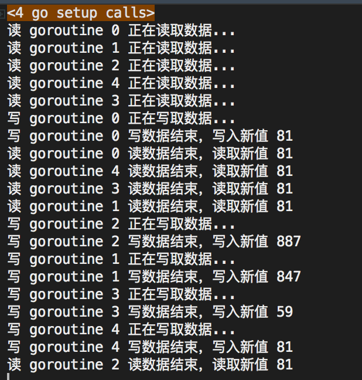

# 锁
>	什么是锁呢？就是某个协程（线程）在访问某个资源时先锁住，防止其它协程的访问，等访问完毕解锁后其他协程再来加锁进行访问。这和我们生活中加锁使用公共资源相似，例如：公共卫生间。

## 死锁 

>	死锁是指两个或两个以上的进程在执行过程中，由于竞争资源或者由于彼此通信而造成的一种阻塞的现象，若无外力作用，它们都将无法推进下去。此时称系统处于死锁状态或系统产生了死锁，

**死锁分为3种情况：**

1. 单go程自己死锁

	```
	//单go程自己死锁
	//channel读写不能在同一个go程中,应该在至少两个go程中通信
	//走到写端时 就阻塞了，下面都执行不了了
	//有缓冲channel 没问题
	func main() {
		ch:=make(chan int)
		ch<-66
		<-ch
	}
	```

2. 多go程死锁

	```
	//多go程死锁
	//程序走到读的时候阻塞了，下面的go程没法执行了，无法写入了
	func main() {
		ch:= make(chan int)
		data:=<- ch
		fmt.Println(data)
		go func() {
			ch<-111
		}()
	}
	```

3. 多个go程之间交叉死锁

	```
	func main() {
		ch1 := make(chan int)
		ch2 := make(chan int)
		go func() {
			for {
				select {
				case <-ch1:
					ch2 <- 11
				}
			}
		}()
		for {
			select {
			case <-ch2:
				ch1 <- 22
			}
	
		}
	}
	```

## 互斥锁

>	每个资源都对应于一个可称为 "互斥锁" 的标记，这个标记用来保证在任意时刻，只能有一个协程（线程）访问该资源。其它的协程只能等待。

*	互斥锁是传统并发编程对共享资源进行访问控制的主要手段，它由标准库sync中的Mutex结构体类型表示。sync.Mutex类型只有两个公开的指针方法，Lock和Unlock。Lock锁定当前的共享资源，Unlock进行解锁。
* 	在使用互斥锁时，一定要注意：对资源操作完成后，一定要解锁，否则会出现流程执行异常，死锁等问题。通常借助defer。锁定后，立即使用defer语句保证互斥锁及时解锁。如下所示：

	```
	import (
	"fmt"
	"sync"
	)
	var mutext sync.Mutex
	func main() {
		go printer1()
		go printer2()
		for{
			;
		}
	}
	func printer1(){
		printer("1111111111111111111111111111")
	}
	func printer2(){
		printer("2222222222222222222222222222")
	}
	func printer(s string){
		mutext.Lock()
		defer mutext.Unlock()
		for _,data:=range s{
			fmt.Println(string(data))
			//time.Sleep(time.Second) 放大go程竞争效果
		}
		fmt.Println()
	}
	```
	
## 读写锁

互斥锁的本质是当一个goroutine访问的时候，其他goroutine都不能访问。这样在资源同步，避免竞争的同时也降低了程序的并发性能。程序由原来的并行执行变成了串行执行。

其实，当我们对一个不会变化的数据只做“读”操作的话，是不存在资源竞争的问题的。因为数据是不变的，不管怎么读取，多少goroutine同时读取，都是可以的。

所以问题不是出在“读”上，主要是修改，也就是“写”。修改的数据要同步，这样其他goroutine才可以感知到。所以真正的互斥应该是读取和修改、修改和修改之间，读和读是没有互斥操作的必要的。

因此，衍生出另外一种锁，叫做读写锁。
>	读写锁可以让多个读操作并发，同时读取，但是对于写操作是完全互斥的。也就是说，当一个goroutine进行写操作的时候，其他goroutine既不能进行读操作，也不能进行写操作。

**GO中的读写锁由结构体类型sync.RWMutex表示。此类型的方法集合中包含两对方法：**

*	一组是对写操作的锁定和解锁，简称“写锁定”和“写解锁”：

	```
	func (*RWMutex)Lock()
	func (*RWMutex)Unlock()
	```
*	另一组表示对读操作的锁定和解锁，简称为“读锁定”与“读解锁”：
	```
	func (*RWMutex)RLock()
	func (*RWMutex)RUlock()
	```

开启go程去并发修改一个全局变量：

```
package main

import (
	"math/rand"
	"fmt"
	"sync"
)
var rwMutex sync.RWMutex
var num int
func main() {
	for i:=0;i<5 ;i++  {
		go read(i)
	}
	for i:=0;i<5 ;i++  {
		go write(i)
	}
	for{
		;
	}
}
func write(i int) {
	rwMutex.Lock()
	fmt.Printf("写 goroutine %d 正在写取数据...\n", i)
	defer rwMutex.Unlock()
	n := rand.Intn(1000)
	num = n
	fmt.Printf("写 goroutine %d 写数据结束，写入新值 %d\n",i,n)
}
func read(i int) {
	fmt.Printf("读 goroutine %d 正在读取数据...\n", i)
	rwMutex.RLock()
	rwMutex.RUnlock()
	fmt.Printf("读 goroutine %d 读数据结束，读取新值 %d\n",i,num)
}
```
程序的执行结果：



我们在read里使用读锁，也就是RLock和RUnlock，写锁的方法名和我们平时使用的一样，是Lock和Unlock。这样，我们就使用了读写锁，可以并发地读，但是同时只能有一个写，并且写的时候不能进行读操作。

我们从结果可以看出，读取操作可以并行，例如2,3,1正在读取，但是同时只能有一个写，例如1正在写，只能等待1写完，这个过程中不允许进行其它的操作。

处于读锁定状态，那么针对它的写锁定操作将永远不会成功，且相应的Goroutine也会被一直阻塞。因为它们是互斥的。

**总结：**

*	读写锁控制下的多个写操作之间都是互斥的，并且写操作与读操作之间也都是互斥的。但是，多个读操作之间不存在互斥关系。

*	从互斥锁和读写锁的源码可以看出，它们是同源的。读写锁的内部用互斥锁来实现写锁定操作之间的互斥。可以把读写锁看作是互斥锁的一种扩展。