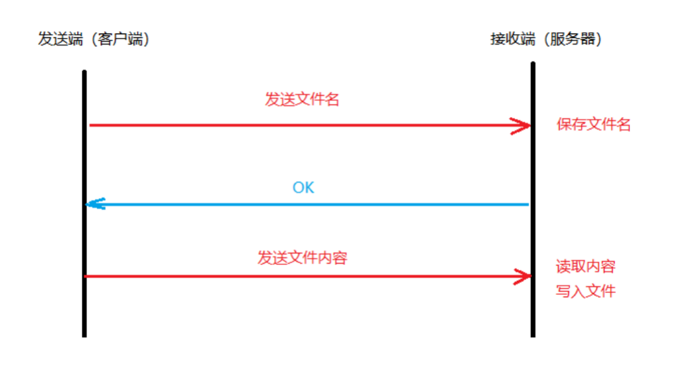

# 文件传输

<mark>写在前面：在tcp通讯中，如果一端不断开，那么另一端不会收到eof！</mark>

借助TCP完成文件的传输，基本思路如下：

1. 发送方（客户端）向服务端发送文件名，服务端保存该文件名。
2. 接收方（服务端）向客户端返回一个消息ok，确认文件名保存成功。
3. 发送方（客户端）收到消息后，开始向服务端发送文件数据。
4. 接收方（服务端）读取文件内容，写入到之前保存好的文件中。



客户端实现：

```
package main

import (
	"fmt"
	"net"
	"os"
	"io"
)

var path = "/Users/zhengjunling/Downloads/picture/linux-kernel-map.jpg"

func main() {
	fileInfo,_:=os.Stat(path)
	//和服务器创建连接
	conn, err := net.Dial("tcp", "127.0.0.1:8686")
	defer conn.Close()
	ControErr(err, "net dial err:")
	sendFileNameToServer(conn, fileInfo.Name())
	reciveFromServer(conn)
}
func reciveFromServer(conn net.Conn) {
	b := make([]byte, 4096)
	var result string
	n, err := conn.Read(b)
	if err != nil {
		return
	}
	result = string(b[:n])

	fmt.Println("result=", result)
	if result == "ok" {
		sendFileToServe(conn)
	}
}
func sendFileToServe(conn net.Conn) {
	f, err := os.Open(path)
	defer f.Close()
	ControErr(err, "os open err:")
	buf := make([]byte, 4096)
	for {
		n, err := f.Read(buf)
		conn.Write(buf[:n])
		if err == io.EOF {
			fmt.Println("发送完成")
			break
		}
		if err != nil {
			return
		}
	}
}
func sendFileNameToServer(conn net.Conn, fileName string) {
	//给服务器发送消息
	_, err := conn.Write([]byte(fileName))
	ControErr(err, "conn write err:")
}
func ControErr(err error, errMessage string) {
	if err != nil {
		fmt.Println(errMessage, err)
		os.Exit(1)
	}
}
```

服务器实现：

```
package main

import (
	"net"
	"io"
	"fmt"
	"os"
)

var fileName string

func main() {

	listener, err := net.Listen("tcp", "127.0.0.1:8686")
	defer listener.Close()
	ControErr(err, "net listen err:")
	conn, err := listener.Accept()
	defer conn.Close()
	ControErr(err, "listener accept err:")
	buf := make([]byte, 4096)
	n, err := conn.Read(buf)
	if err != nil {
		return
	}
	fileName = string(buf[:n])
	addr := conn.RemoteAddr()
	fmt.Printf("[%s]：%s", addr, fileName)
	sendOkToClient(conn)
	reciveFromClient(conn)
}
func reciveFromClient(conn net.Conn) {
	buf := make([]byte, 4096)
	f, err := os.Create(fileName)
	ControErr(err, "os create err:")
	for {
		n, err := conn.Read(buf)
		f.Write(buf[:n])
		if err == io.EOF {
			fmt.Println("接收完成")
			break
		}
		if err != nil {
			return
		}
	}
}
func sendOkToClient(conn net.Conn) {
	conn.Write([]byte("ok"))
}
func ControErr(err error, errMessage string) {
	if err != nil {
		fmt.Println(errMessage, err)
		os.Exit(1)
	}
}

```