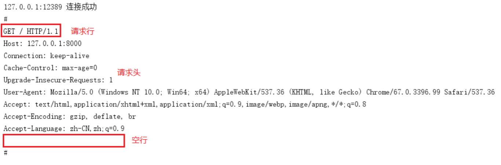

# HTTP编程

## 概述

我们平时浏览网页的时候,会打开浏览器，输入网址后按下回车键，然后就会显示出你想要浏览的内容。在这个看似简单的用户行为背后，到底隐藏了些什么呢？

对于普通的上网过程，系统其实是这样做的：

1. 浏览器本身是一个客户端，当你输入URL的时候，首先浏览器会去请求DNS服务器，通过DNS获取相应的域名对应的IP，
2. 然后通过IP地址找到IP对应的服务器后，要求建立TCP连接，等浏览器发送完HTTP Request（请求）包后，服务器接收到请求包之后才开始处理请求包，服务器调用自身服务，返回HTTP Response（响应）包；
3. 客户端收到来自服务器的响应后开始渲染这个Response包里的主体（body），等收到全部的内容随后断开与该服务器之间的TCP连接。


**DNS域名服务器（Domain Name Server）**是进行域名(domain name)和与之相对应的IP地址转换的服务器。DNS中保存了一张域名解析表，解析消息的域名。

一个**Web服务器也被称为HTTP服务器**，它通过HTTP (HyperText Transfer Protocol 超文本传输协议)协议与客户端通信。这个客户端通常指的是Web浏览器(其实手机端客户端内部也是浏览器实现的)。

Web服务器的工作原理可以简单地归纳为：

*	客户机通过TCP/IP协议建立到服务器的TCP连接
* 	客户端向服务器发送HTTP协议请求包，请求服务器里的资源文档
*  	服务器向客户机发送HTTP协议应答包，如果请求的资源包含有动态语言的内容，那么服务器会调用动态语言的解释引擎负责处理“动态内容”，并将处理得到的数据返回给客户端
*  	客户机与服务器断开。由客户端解释HTML文档，在客户端屏幕上渲染图形结果

## HTTP协议
>	超文本传输协议(HTTP，HyperText Transfer Protocol)是互联网上应用最为广泛的一种网络协议，它详细规定了浏览器和万维网服务器之间互相通信的规则，通过因特网传送万维网文档的数据传送协议。

HTTP协议通常承载于TCP协议之上，有时也承载于TLS或SSL协议层之上，这个时候，就成了我们常说的HTTPS。如下图所示：


## 地址（URL）

>	URL全称为Unique Resource Location，用来表示网络资源，可以理解为网络文件路径。

基本URL的结构包含:

*	模式（协议）、
* 	服务器名称（IP地址）、
*  	路径和文件名。

常见的协议/模式如http、https、ftp等。服务器的名称或IP地址后面有时还跟一个冒号和一个端口号。再后面是到达这个文件的路径和文件本身的名称。如：

```
http://localhost[":"port][abs_path]
http://192.168.31.1/html/index
https://pan.baidu.com/
```
URL的长度有限制，不同的服务器的限制值不太相同，但是不能无限长。

## HTTP报文解析


### 请求报文格式
**获取请求报文**

为了更直观的看到浏览器发送的请求包，我们借助前面学习的TCP通信模型，编写一个简单的web服务器，只接收浏览器发送的内容，打印查看。

服务器测试代码：

```
package main

import (
   "net"
   "fmt"
)

func main() {
   //创建、监听socket
   listenner, err := net.Listen("tcp", "127.0.0.1:8000")
   if err != nil {
      fmt.Println("Listen err:", err)
      return
   }
   defer listenner.Close()

   //阻塞等待客户端连接
   conn, err := listenner.Accept()
   if err != nil {
      fmt.Println("Accept err:", err)
      return
   }
   defer conn.Close()

   fmt.Println(conn.RemoteAddr().String(), "连接成功")       //连接客户端的网络地址

   buf := make([]byte, 4096)  //切片缓冲区，接收客户端发送数据
   n, err := conn.Read(buf)   //n 接收数据的长度
   if err != nil {
      fmt.Println("Read err:", err)
      return
   }
   result := buf[:n]        //切片截取

   fmt.Printf("#\n%s#", string(result))
}
```
在浏览器中输入url地址： 127.0.0.1:8000
服务器端运行打印结果如下：


**请求报文格式说明**

HTTP 请求报文由<mark>请求行、请求头部、空行、请求包体</mark>4个部分组成，如下图所示：


*	**请求行**

	请求行由<mark>方法字段、URL字段 和HTTP 协议版本字段</mark> 3个部分组成，他们之间使用空格隔开。常用的 HTTP 请求方法有 GET、POST。

GET：

*	当客户端要从服务器中读取某个资源时，使用GET 方法。GET 方法要求服务器将URL 定位的资源放在响应报文的数据部分，回送给客户端，即向服务器请求某个资源。
