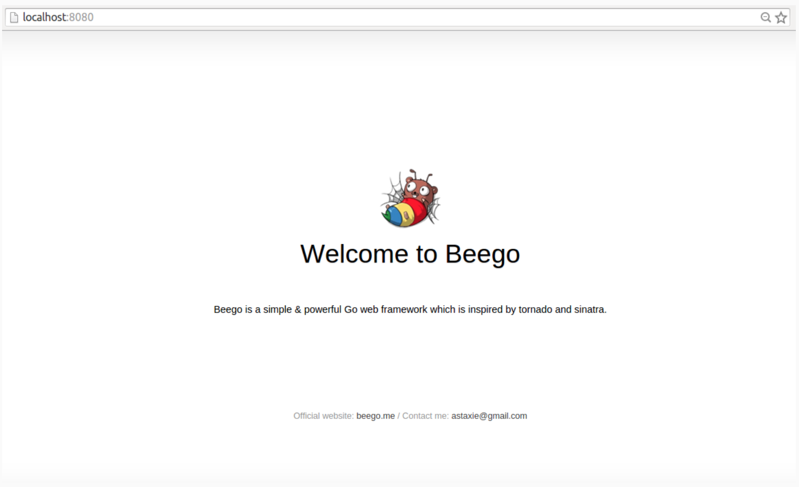
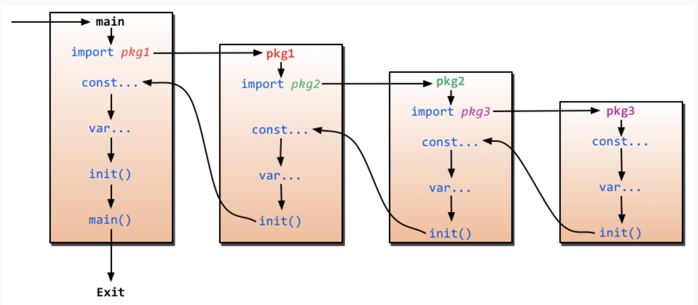

# 安装

1. 你需要安装或者升级 Beego 和 Bee 的开发工具:

	```
	$ go get -u github.com/astaxie/beego
	$ go get -u github.com/beego/bee
	```
2. 为了更加方便的操作，请将 $GOPATH/bin 加入到你的 $PATH 变量中。请确保在此之前您已经添加了 $GOPATH 变量。

	```
	// 如果您还没添加 $GOPATH 变量
	$ echo 'export GOPATH="$HOME/go"' >> ~/.profile # 或者 ~/.zshrc, ~/.cshrc, 您所使用的sh对应的配置文件
	//如果您已经添加了 $GOPATH 变量
	$ echo 'export PATH="$GOPATH/bin:$PATH"' >> ~/.profile # 或者 ~/.zshrc, ~/.cshrc, 您所使用的sh对应的配置文件
	$ exec $SHELL
	```

3. 想要快速建立一个应用来检测安装？
	
	```
	$ cd $GOPATH/src
	$ bee new hello
	$ cd hello
	$ bee run hello
	```

	**目录结构如下:**
	
	```
	apiproject
├── conf
│   └── app.conf
├── controllers
│   └── object.go
│   └── user.go
├── docs
│   └── doc.go
├── main.go
├── models
│   └── object.go
│   └── user.go
├── routers
│   └── router.go
└── tests
    └── default_test.go

	```
4. 这些指令帮助您：

*	安装 beego 到您的 $GOPATH 中。
*	在您的计算机上安装 Bee 工具。
*	创建一个名为 “hello” 的应用程序。
*	启动热编译。
*	一旦程序开始运行，您就可以在浏览器中打开 `http://localhost:8080/` 进行访问。


# 运行流程

1. main.go

	```
	import (
		_ "beedemo/routers"
		"github.com/astaxie/beego"
	)
	func main() {
		beego.Run()
	}
	```
	`_ "beedemo/routers"` init router

	我们看到 main 函数是入口函数，但是我们知道 Go 的执行过程是如下图所示的方式：	


2. routers.go

	```
	package routers
	import (
		"beedemo/controllers"
		"github.com/astaxie/beego"
	)
	func init() {
	    beego.Router("/", &controllers.MainController{})
	}
	```

3. controler.go
	
	```
	package controllers
	import (
		"github.com/astaxie/beego"
	)
	type MainController struct {
		beego.Controller
	}
	```