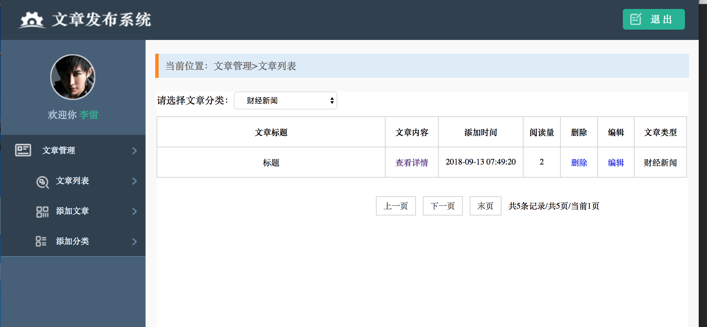

# 文章发布系统



*	文章列表（查询）
* 	文章详情（查询）
* 	添加文章（增加）
*  	更新文章（修改）
*  	删除文章（删除）

1. 路由 router.go

	```
	func init() {
		beego.Router("/showArticle", &controllers.ArticleController{},"get:ShowArticleList")
		beego.Router("/addArticle", &controllers.ArticleController{},"get:ShowAddArticle;post:HandleAddArticle")
		beego.Router("/articleContent", &controllers.ArticleController{},"get:ShowContent")
		beego.Router("/deleteArticle", &controllers.ArticleController{},"get:HandleDeleteArticle")
		beego.Router("/updateArticle", &controllers.ArticleController{},"get:ShowUpdateArticle;post:HandleUpdateArticle")
	}
	```
2. models models.go
	
	```
	type Article struct {
		Id2 int `orm:"pk;auto"`//手动设置为主键，自增长
		Title string `orm:"size(30)"`//不为空
		Content string `orm:"size(500)"`
		Img string `orm:"size(500);null"`
		//Type string
		Time time.Time `orm:"auto_now;type(date)"`
		Count int
	}
	
	func init()  {
		beego.Info("---------------init-------------------")
		orm.RegisterDataBase("default","mysql","root:123456@tcp(127.0.0.1:3306)/newweb?charset=utf8")
		orm.RegisterModel(new(Article))
		orm.RunSyncdb("default",false,true)
	}
	```

3. controllers article
4. ShowArticleList

	```
	func (this *ArticleController)ShowArticleList(){
		//new 一个orm
		o:=orm.NewOrm()
		//用QueryTable查询所有article数据
		qs:=o.QueryTable("article")
		var articles[]models.Article
		//用articles切片去接受
		qs.All(&articles)
		beego.Info(articles)
		//传给前端页面
		this.Data["article"]=articles
		this.TplName="index.html"
	}
	```
	前端使用这种方式接收数据
	
	```
	{{range $index ,$val := .article}}
     <tr>
        <td>{{$val.Title}}</td>
        <td><a href="/articleContent?id={{$val.Id2}}">查看详情</a></td>
        <td>{{$val.Time.Format "2006-01-02 15:04:05"}}</td>
        <td>{{$val.Count}}</td>
        <td><a href="/deleteArticle?id={{$val.Id2}}" class="dels">删除</a></td>
        <td><a href="/updateArticle?id={{$val.Id2}}">编辑</a></td>
        <td>财经新闻</td>
    </tr>
    {{end}
	```

5. ShowAddArticle

	```
	func (this *ArticleController)ShowAddArticle(){
		this.TplName = "add.html"
}
	```

6. HandleAddArticle

	```
	func (this *ArticleController)HandleAddArticle(){
	articleName:=this.GetString("articleName")
	artiContent:=this.GetString("content")
	beego.Info(articleName,artiContent)
	f,h,err:=this.GetFile("uploadname")
	var fileName string
	if err != nil {
		beego.Info("获取文件失败err:",err)
	}else {
		beego.Info(h.Filename)
		defer f.Close()
		//1.格式
		ext := path.Ext(h.Filename)
		if path.Ext(h.Filename) != ".jpg" && path.Ext(h.Filename) != ".png" && path.Ext(h.Filename) != ".jepg" {
			beego.Info("格式不正确")
			return
		}
		//2.大小
		if h.Size>1024*1024*10{
			beego.Info("文件过大")
			return
		}
		//3.不重名
		fileName = time.Now().Format("2006-01-02 15:04:05")+ext
		err = this.SaveToFile("uploadname", "./static/img/"+fileName+ext)
		if err != nil {
			beego.Info("上传失败", err)
			return
		}
		beego.Info("上传成功")
	}
	o:=orm.NewOrm()
	article:=models.Article{}
	article.Img="./static/img/"+fileName
	article.Title = articleName
	article.Content = artiContent
	_,err=o.Insert(&article)
	if err != nil {
		beego.Info("insert err:",err)
		return
	}
	beego.Info("插入成功")
	this.Redirect("showArticle",302)
	```
	
7. ShowContent

	```
	func (this *ArticleController)ShowContent(){
	//	获取id
		id:=this.GetString("id")
	//	查询数据
		o:=orm.NewOrm()
		article:=models.Article{}
		article.Id2,_= strconv.Atoi(id)
		err:=o.Read(&article)
		if err != nil {
			beego.Info("数据为空")
			return
		}
		article.Count+=1
		o.Update(&article)
	//	传递给视图
		this.Data["article"] = article
		this.TplName = "content.html"
	}
	```
8. HandleDeleteArticle

	```
	func (this *ArticleController)HandleDeleteArticle(){
	//	1,获取id
	//	2，新建article，
	//	3，delete
		id,err:=this.GetInt("id")
		if err != nil {
			beego.Info(err)
			return
		}
		o:=orm.NewOrm()
		article:= models.Article{Id2:id}
		_,err=o.Delete(&article)
		if err != nil {
			beego.Info("删除失败")
		}
		this.Redirect("/showArticle",302)
	}
	```

9. ShowUpdateArticle

	```
	func (this *ArticleController)ShowUpdateArticle(){
		id,err:=this.GetInt("id")
		if err != nil {
			beego.Info("获取id失败",err)
			return
		}
		beego.Info("用户id为：",id)
		o:=orm.NewOrm()
		article:=models.Article{}
		article.Id2 = id
		o.Read(&article)
		this.Data["article"] = article
		this.TplName = "update.html"
	}
	```

10. HandleUpdateArticle

	```
	func (this *ArticleController)HandleUpdateArticle(){
		title:=this.GetString("articleName")
		content:=this.GetString("content")
		id:= this.GetString("articleId")
		beego.Info("title",title)
		beego.Info("content",content)
		beego.Info("id",id)
		var fileName string
		f,h,err:=this.GetFile("uploadname")
		if err!=nil{
			beego.Info("获取文件失败err:",err)
		}else {
			defer f.Close()
			ext:=path.Ext(h.Filename)
			if ext!=".jpg"&&ext!=".png"&&ext!="jepg"{
				beego.Info("格式不正确")
				return
			}
			if h.Size>1024*1024*10{
				beego.Info("文件过大")
				return
			}
			fileName=time.Now().Format("2006-01-02 15:04:05")+ext
			err=this.SaveToFile("uploadname","./static/img/"+fileName)
			if err != nil {
				beego.Info("保存文件失败")
				return
			}
		}
	
		o := orm.NewOrm()
		article := models.Article{}
		article.Id2,_ = strconv.Atoi(id)
		article.Title = title
		article.Content = content
		article.Img = fileName
		_,err=o.Update(&article)
		if err != nil {
			beego.Info("err:",err)
			return
		}
		this.Redirect("showArticle",302)
	}
	```