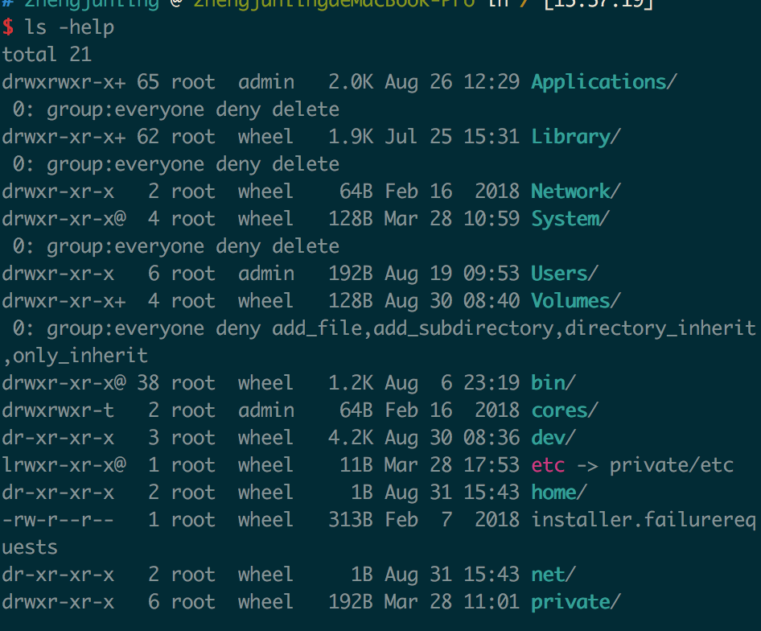
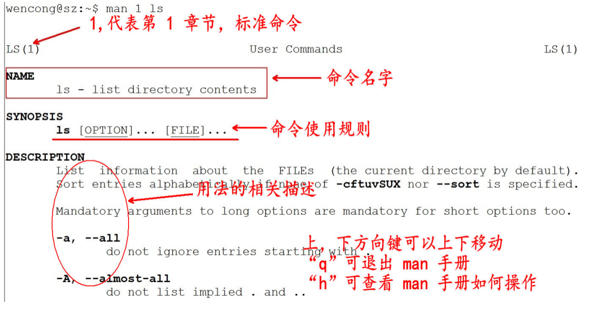
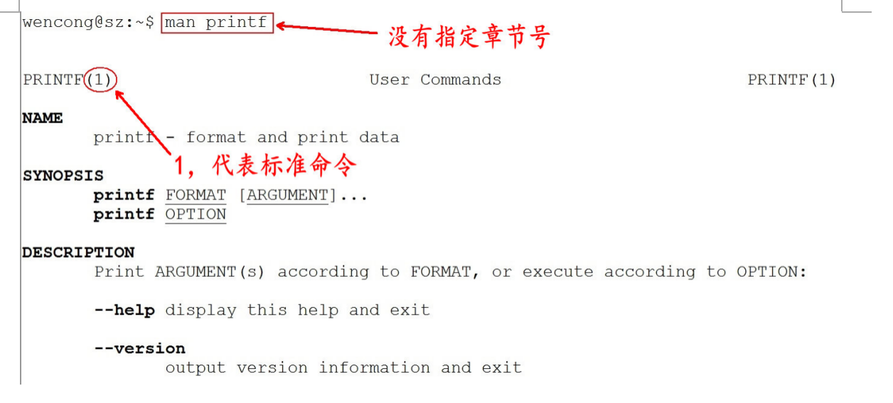

# 概述

*	很多人可能在电视或电影中看到过类似的场景，黑客面对一个黑色的屏幕，上面飘着密密麻麻的字符，梆梆一顿敲，就完成了窃取资料的任务。
*	Linux 刚出世时没有什么图形界面，所有的操作全靠命令完成，就如同电视里的黑客那样，充满了神秘与晦涩。
*	近几年来，尽管 Linux 发展得非常迅速，图形界面越来越友好，但是在真正的开发过程中，Linux 命令行的应用还是占有非常重要的席位，而且许多Linux功能在命令行界面要比图形化界面下运行的快。可以说不会命令行，就不算会 Linux。
*	Linux 提供了大量的命令，利用它可以有效地完成大量的工作，如磁盘操作、文件存取、目录操作、进程管理、文件权限设定等。Linux 发行版本最少的命令也有 200 多个，这里只介绍比较重要和使用频率最多的命令。

# 命令使用方法

## Linux 命令格式

command  [-options]  [parameter1]  … 
说明：

*	command：命令名，相应功能的英文单词或单词的缩写
*	省略，[]代表可选
*	parameter1 …：传给命令的参数，可以是零个一个或多个

## 查看帮助文档

###--help
一般是 Linux 命令自带的帮助信息，<mark>并不是所有命令都自带这个选项。</mark>

如我们想查看命令 ls 的用法：ls --help

### man(有问题找男人)

man 是 Linux 提供的一个手册，包含了绝大部分的命令、函数使用说明。

该手册分成很多章节（section），使用 man 时可以指定不同的章节来浏览不同的内容。

**man 中各个 section 意义如下：**

1. Standard commands（标准命令）
2. System calls（系统调用，如open,write）
3. Library functions（库函数，如printf,fopen）
4. Special devices（设备文件的说明，/dev下各种设备）
5. File formats（文件格式，如passwd）
6. Games and toys（游戏和娱乐）
7. Miscellaneous（杂项、惯例与协定等，例如Linux档案系统、网络协定、ASCII 码；environ全局变量）
8. Administrative Commands（管理员命令，如ifconfig）

**man使用格式如下：**

man [选项]  命令名

**man设置了如下的功能键：**

如，我们想查看 ls 的用法：man 1 ls ( 1：为数字“1”，代表第 1 个 section，标准命令 )

实际上，我们不用指定第几个章节也用查看，如，man ls。但是，有这个一种情况，假如，命令的名字和函数的名字刚好重名（如：printf），它既是命令，也可以是库函数，如果，我们不指定章节号，man printf，它只查看命令的用法，不会查询函数的用法，因为 man 是按照手册的章节号的顺序进行搜索的。

所以，使用 man 手册时，最好指定章节号：

##使用技巧
1. 自动补全

	在敲出命令的前几个字母的同时，按下tab键，系统会自动帮我们补全命令。

2. 历史命令

	当系统执行过一些命令后，可按上下键翻看以前的命令，history将执行过的命令列举出来。