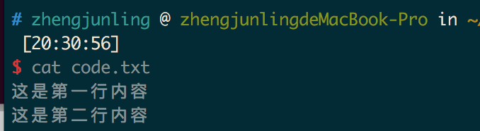

# git的两大特点

*	版本控制：可以解决多人同时开发的代码问题，也可以解决找回历史代码的问题。
*	分布式：Git是分布式版本控制系统，同一个Git仓库，可以分布到不同的机器上。首先找一台电脑充当服务器的角色，每天24小时开机，其他每个人都从这个“服务器”仓库克隆一份到自己的电脑上，并且各自把各自的提交推送到服务器仓库里，也从服务器仓库中拉取别人的提交。可以自己搭建这台服务器，也可以使用GitHub网站。

# 安装与配置

```
sudo apt-get install git
```

# 创建一个版本库

新建一个空目录git_test ，在git_test目录下创建一个版本库

```
git init
```
git_test目录下会生成一个.git隐藏目录，这就是版本库目录

# 版本创建与回退

创建一个code.txt 文件


## 创建版本
```
git add code.txt
git commit -m "版本1"
```

## 添加身份标识（git不做检查）
```
git config --global user.email "you@example.com"
git config --global user.name "Your Name"
```
## 查看版本记录
```
git log
```


继续编辑code.txt，在里面增加一行。



使用如下命令再创建一个版本并查看版本记录：


`git log`


## 回到上一个版本

```
git reset --hard HEAD^
```

*	其中HEAD表示当前最新版本
*  	HEAD^表示当前版本的前一个版本
*  	HEAD^^表示当前版本的前前个版本
*  	HEAD~1表示当前版本的前一个版本
*  	HEAD~100表示当前版本的前100版本。

如果想要回到版本1：


但是此时git log 只能查看版本1的记录

## 查看我们的操作记录

```
git reflog
```


可以看到版本2的版本号，我们再使用如下命令进行版本回退，版本重新回到了版本2。


