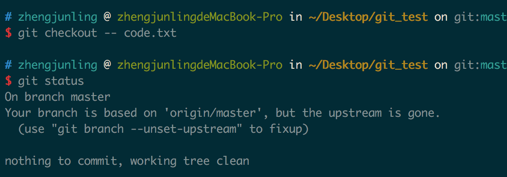
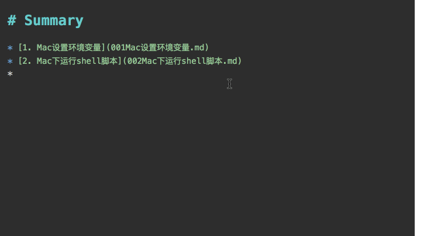

# Mac 运行shell脚本

1. 一个循环往表里插入数据的脚本 insert.sh

	```
for i in {1..10000}
do
        echo "insert into mytest values ($i, 'xiaohong_$i');"
done
```
2.  输入命令 `./insert.sh `
3.  出现 Permission denied 就是没有权限。
4. 	 解决办法：修改该文件aa.sh 的权限 ：使用命令： `chmod 777 aa.sh`
5.  `./insert.sh`


