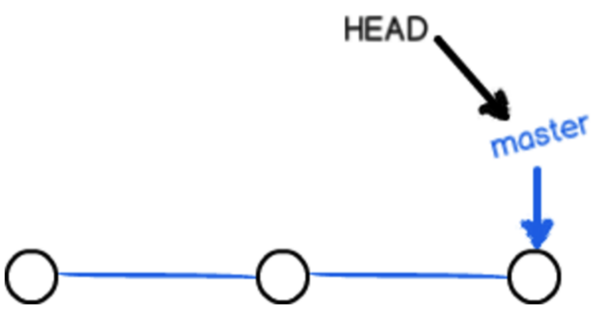
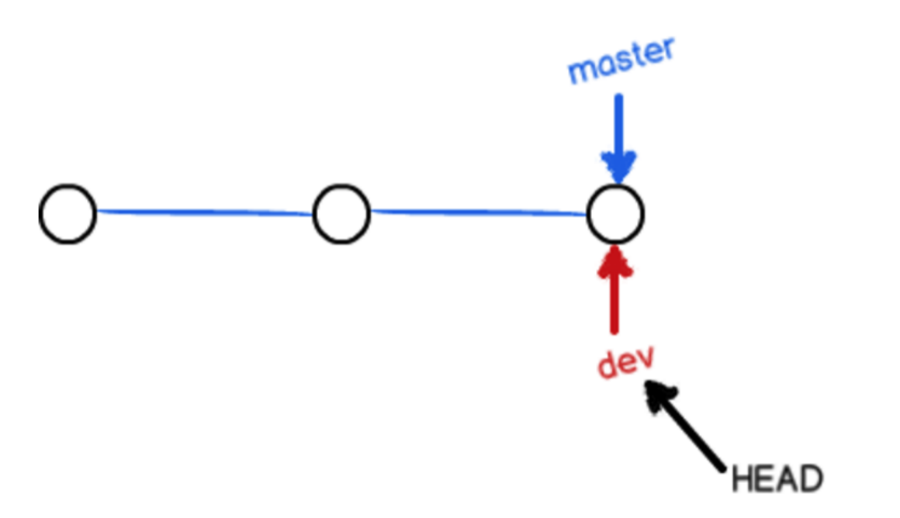
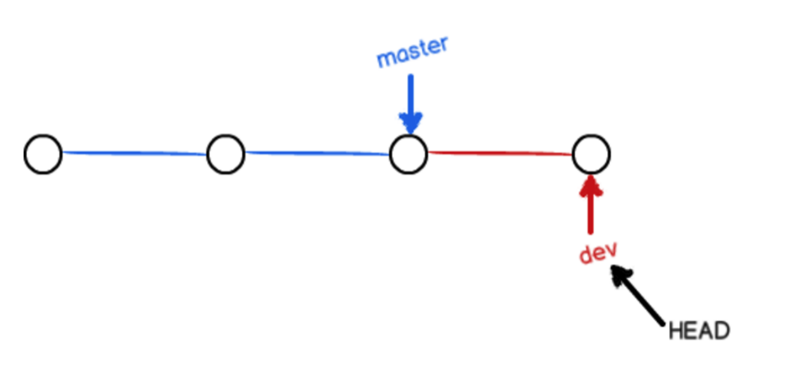
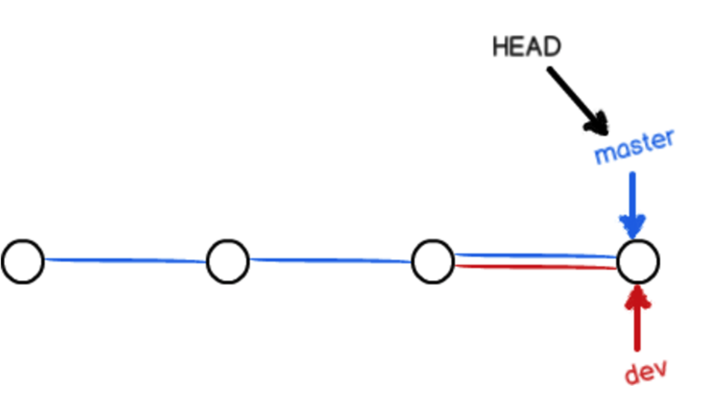
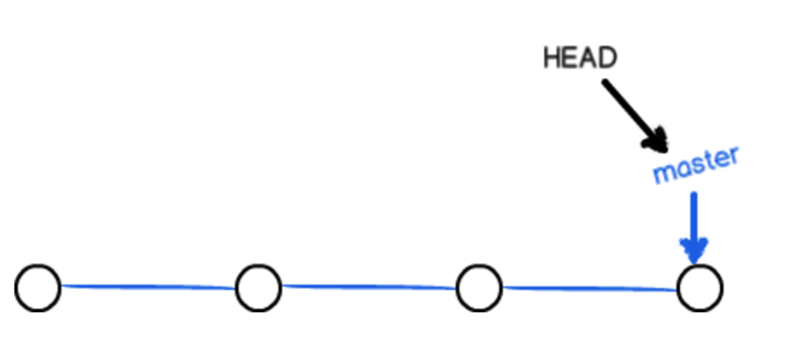
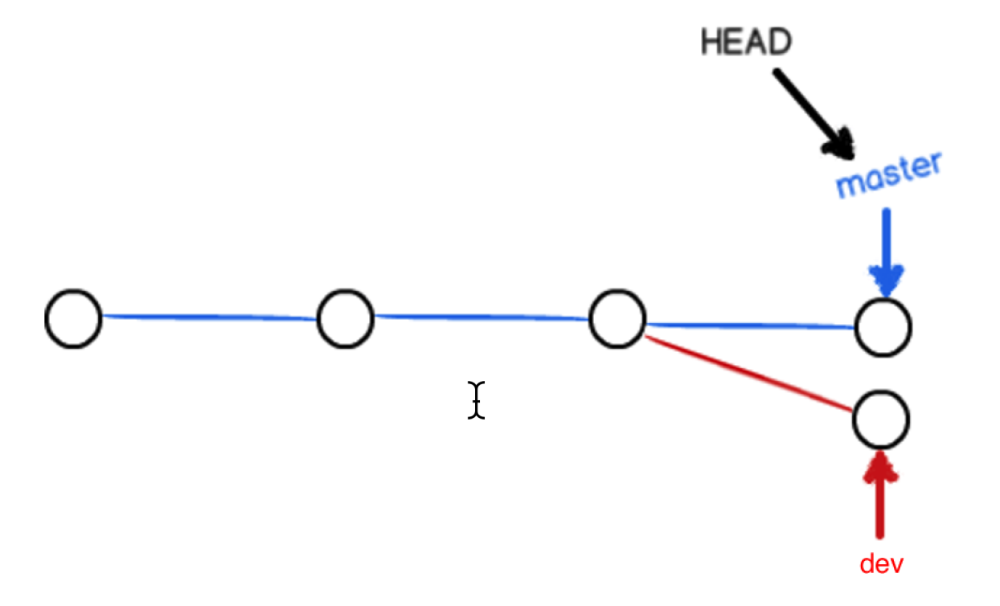
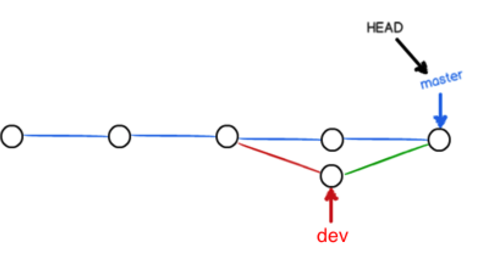
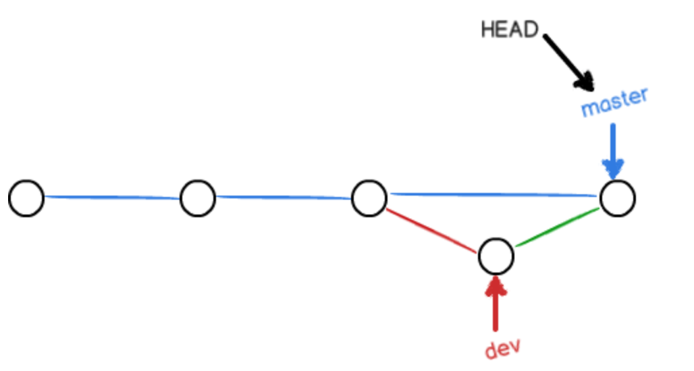
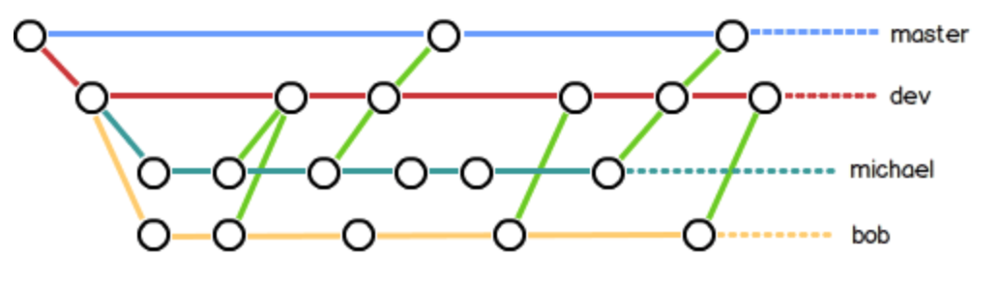

# 分支管理

分支在实际中有什么用呢？假设你准备开发一个新功能，但是需要两周才能完成，第一周你写了50%的代码，如果立刻提交，由于代码还没写完，不完整的代码库会导致别人不能干活了。如果等代码全部写完再一次提交，又存在丢失每天进度的巨大风险。

现在有了分支，就不用怕了。你创建了一个属于你自己的分支，别人看不到，还继续在原来的分支上正常工作，而你在自己的分支上干活，想提交就提交，直到开发完毕后，再一次性合并到原来的分支上，这样，既安全，又不影响别人工作。

# 创建与合并分支

>	git把我们之前每次提交的版本串成一条时间线，这条时间线就是一个分支。截止到目前只有一条时间线，在git里，这个分支叫主分支，即master分支。HEAD严格来说不是指向提交，而是指向master，master才是指向提交的，所以，HEAD指向的就是当前分支。

1. 一开始的时候，master分支是一条线，git用master指向最新的提交，再用HEAD指向master，就能确定当前分支，以及当前分支的提交点：

每次提交，master分支都会向前移动一步，这样，随着你不断提交，master分支的线也越来越长。

2. 当我们创建新的分支，例如dev时，git新建了一个指针叫dev，指向master相同的提交，再把HEAD指向dev，就表示当前分支在dev上：

git创建一个分支很快，因为除了增加一个dev指针，改变HEAD的指向，工作区的文件都没有任何变化。

3. 不过，从现在开始，对工作区的修改和提交就是针对dev分支了，比如新提交一次后，dev指针往前移动一步，而master指针不变：

4. 假如我们在dev上的工作完成了，就可以把dev合并到master上。git怎么合并呢？最简单的方法，就是直接把master指向dev的当前提交，就完成了合并：

git合并分支也很快，就改改指针，工作区内容也不变。
5. 合并完分支后，甚至可以删除dev分支。删除dev分支就是把dev指针给删掉，删掉后，我们就剩下了一条master分支：


#小结：
*	查看分支：`git branch`
*	创建分支：`git branch <name>`
*	切换分支：`git checkout <name>`
*	创建+切换分支：`git checkout -b <name>`
*	合并某分支到当前分支：`git merge <name>`
*	删除分支：`git branch -d <name>`

# 解决冲突
1. 再创建一个新分支dev。
2. 修改code.txt内容，并进行提交。
3. 切换回master分支。
4. 在master的code.txt添加一行内容并进行提交。
	现在，master分支dev分支各自都分别有新的提交，变成了这样：

	这种情况下，git无法执行“快速合并”，只能试图把各自的修改合并起来，但这种合并就可能会有冲突。
5. 执行如下命令尝试将dev分支合并到master分支上来。
	在master上执行
	
	```
	git merge dev
	```
	git告诉我们，code.txt文件存在冲突，必须手动解决冲突后再提交。
6. git status也可以告诉我们冲突的文件：
7. 查看code.txt的内容。
8. git用<<<<<<<，=======，>>>>>>>标记出不同分支的内容，我们修改如下后保存：
9. 解决冲突，提交
10. 现在，master分支和dev分支变成了下图所示：


# 分支管理策略

通常，合并分支时，如果可能，git会用`fast forward`模式，但是有些快速合并不能成功而且合并时没有冲突，这个时候会合并之后并做一次新的提交。但这种模式下，删除分支后，会丢掉分支信息。


如果要强制禁用`Fast forward`模式，Git就会在`merge`时生成一个新的`commit`，这样，从分支历史上就可以看出分支信息。

下面我们实战一下`--no-ff`方式的`git merge`：

首先，仍然创建并切换`dev`分支：

```
$ git checkout -b dev
Switched to a new branch 'dev'
```

修改readme.txt文件，并提交一个新的commit：

```
$ git add readme.txt 
$ git commit -m "add merge"
[dev f52c633] add merge
 1 file changed, 1 insertion(+)
```
现在，我们切换回master：

```
$ git checkout master
Switched to branch 'master'
```

准备合并`dev`分支，请注意`--no-ff`参数，表示禁用`Fast forward`：

```
$ git merge --no-ff -m "merge with no-ff" dev
Merge made by the 'recursive' strategy.
 readme.txt | 1 +
 1 file changed, 1 insertion(+)
```

因为本次合并要创建一个新的commit，所以加上-m参数，把commit描述写进去。

合并后，我们用`git log`看看分支历史：

```
$ git log --graph --pretty=oneline --abbrev-commit
*   e1e9c68 (HEAD -> master) merge with no-ff
|\  
| * f52c633 (dev) add merge
|/  
*   cf810e4 conflict fixed
...
```
可以看到，不使用Fast forward模式，merge后就像这样：


分支策略
在实际开发中，我们应该按照几个基本原则进行分支管理：

首先，`master`分支应该是非常稳定的，也就是仅用来发布新版本，平时不能在上面干活；

那在哪干活呢？干活都在`dev`分支上，也就是说，`dev`分支是不稳定的，到某个时候，比如1.0版本发布时，再把`dev`分支合并到`master`上，在`master`分支发布1.0版本；

你和你的小伙伴们每个人都在`dev`分支上干活，每个人都有自己的分支，时不时地往`dev`分支上合并就可以了。

所以，团队合作的分支看起来就像这样：


# Bug分支

软件开发中，bug就像家常便饭一样。有了bug就需要修复，在Git中，由于分支是如此的强大，所以，每个bug都可以通过一个新的临时分支来修复，修复后，合并分支，然后将临时分支删除。

当你接到一个修复一个代号101的bug的任务时，很自然地，你想创建一个分支issue-101来修复它，但是，等等，当前正在dev上进行的工作还没有提交：

```
$ git status
On branch dev
Changes to be committed:
  (use "git reset HEAD <file>..." to unstage)

    new file:   hello.py

Changes not staged for commit:
  (use "git add <file>..." to update what will be committed)
  (use "git checkout -- <file>..." to discard changes in working directory)

    modified:   readme.txt
```

并不是你不想提交，而是工作只进行到一半，还没法提交，预计完成还需1天时间。但是，必须在两个小时内修复该bug，怎么办？

幸好，Git还提供了一个`stash`功能，可以把当前工作现场“储藏”起来，等以后恢复现场后继续工作：

```
$ git stash
Saved working directory and index state WIP on dev: f52c633 add merge
```

现在，用git status查看工作区，就是干净的（除非有没有被Git管理的文件），因此可以放心地创建分支来修复bug。

首先确定要在哪个分支上修复bug，假定需要在master分支上修复，就从master创建临时分支：

```
$ git checkout master
Switched to branch 'master'
Your branch is ahead of 'origin/master' by 6 commits.
  (use "git push" to publish your local commits)

$ git checkout -b issue-101
Switched to a new branch 'issue-101'
```

现在修复bug，需要把“Git is free software ...”改为“Git is a free software ...”，然后提交：

```
$ git add readme.txt 
$ git commit -m "fix bug 101"
[issue-101 4c805e2] fix bug 101
 1 file changed, 1 insertion(+), 1 deletion(-)
```
修复完成后，切换到master分支，并完成合并，最后删除issue-101分支：

```
$ git checkout master
Switched to branch 'master'
Your branch is ahead of 'origin/master' by 6 commits.
  (use "git push" to publish your local commits)

$ git merge --no-ff -m "merged bug fix 101" issue-101
Merge made by the 'recursive' strategy.
 readme.txt | 2 +-
 1 file changed, 1 insertion(+), 1 deletion(-)
```

太棒了，原计划两个小时的bug修复只花了5分钟！现在，是时候接着回到dev分支干活了！

```
$ git checkout dev
Switched to branch 'dev'

$ git status
On branch dev
nothing to commit, working tree clean
```
工作区是干净的，刚才的工作现场存到哪去了？用git stash list命令看看：

```
$ git stash list
stash@{0}: WIP on dev: f52c633 add merge
```

工作现场还在，Git把stash内容存在某个地方了，但是需要恢复一下，有两个办法：

一是用git stash apply恢复，但是恢复后，stash内容并不删除，你需要用git stash drop来删除；

另一种方式是用git stash pop，恢复的同时把stash内容也删了：

```
$ git stash pop
On branch dev
Changes to be committed:
  (use "git reset HEAD <file>..." to unstage)

    new file:   hello.py

Changes not staged for commit:
  (use "git add <file>..." to update what will be committed)
  (use "git checkout -- <file>..." to discard changes in working directory)

    modified:   readme.txt

Dropped refs/stash@{0} (5d677e2ee266f39ea296182fb2354265b91b3b2a)
```

再用git stash list查看，就看不到任何stash内容了：

```
$ git stash list
```

你可以多次stash，恢复的时候，先用git stash list查看，然后恢复指定的stash，用命令：

```
$ git stash apply stash@{0}
```