# 工作区和暂存区

## 工作区(Working Directory)

电脑中的目录，比如我们的git_test，就是一个工作区。

## 版本库(Repository)

工作区有一个隐藏目录.git，这个不是工作区，而是git的版本库。

git的版本库里存了很多东西，其中最重要的就是

*	称为index(或者叫stage)的暂存区，
* 	还有git为我们自动创建的第一个分支master，
*  	以及指向master的一个指针叫HEAD。

因为我们创建git版本库时，git自动为我们创建了唯一一个master分支，所以，现在，git commit就是往master分支上提交更改。

你可以简单理解为，需要提交的文件修改通通放到暂存区，然后，一次性提交暂存区的所有修改。

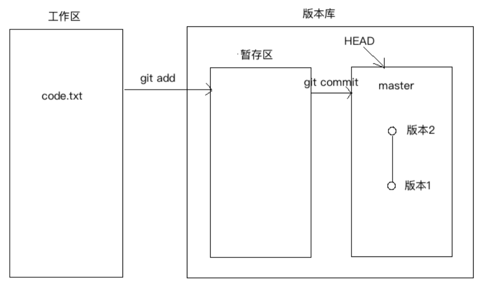

前面讲了我们把文件往git版本库里添加的时候，是分两步执行的：

*	第一步是用git add把文件添加进去，实际上就是把文件修改添加到暂存区；
*	第二步是用git commit提交更改，实际上就是把暂存区的所有内容提交到当前分支。

下面在git_test目录下再创建一个文件code2.txt，然后编辑内容如下：

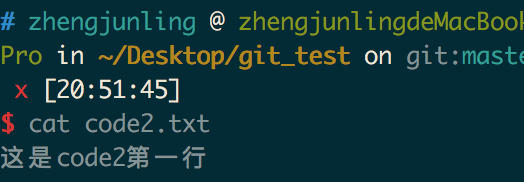

然后再次编辑code.txt内容，在其中加入一行，编辑后内容如下：
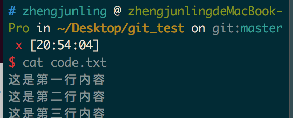

## 查看当前工作树的状态

```
git status
```
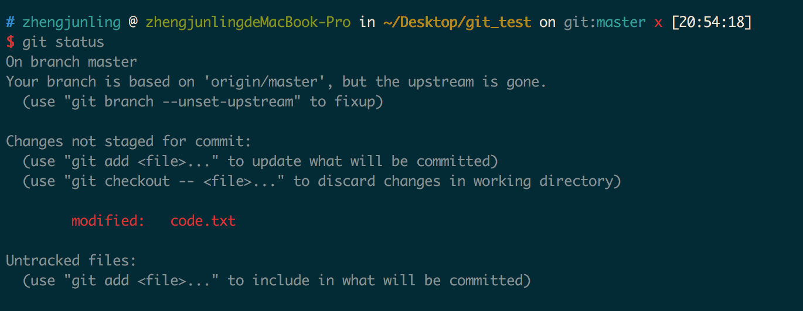
上面提示我们code.txt被修改，而code2.txt没有被跟踪。

我们使用如下命令把code.txt和code2.txt加入到暂存区，然后再执行`git status`命令，结果如下：
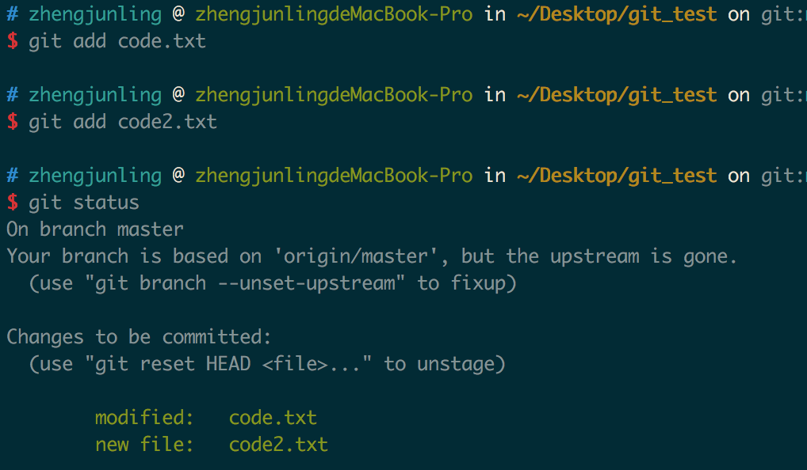

所以`git add`命令是把所有提交的修改存放到暂存区。

然后，执行git commit就可以一次性把暂存区的所有修改提交到分支创建一个版本。

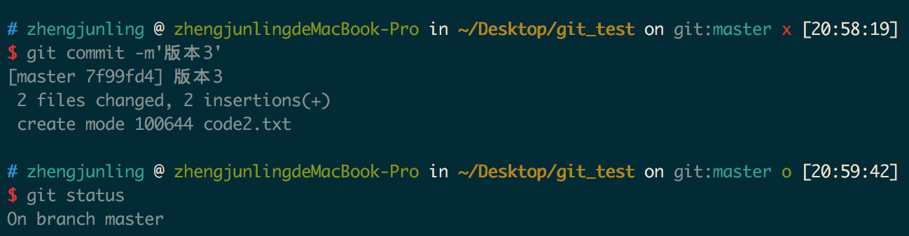

## 管理修改
git管理的文件的修改，它只会提交暂存区的修改来创建版本。

1. 编辑code.txt，并使用git add 命令将其添加到暂存区中。
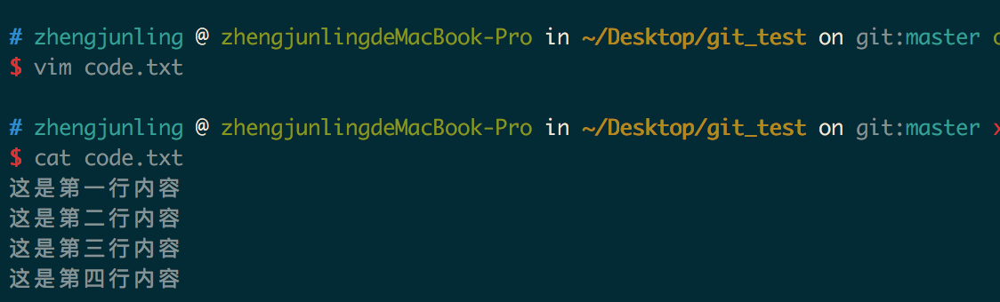

2. 继续编辑code.txt，并在其中添加一行。
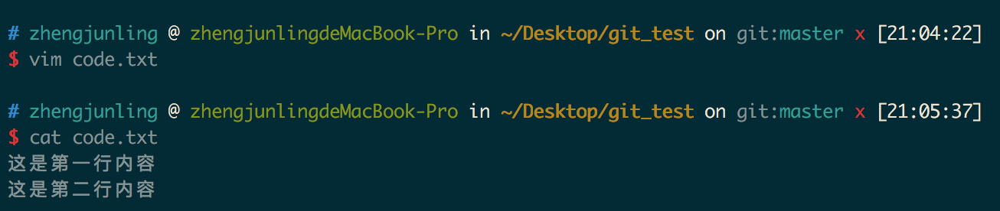

3. git commit创建一个版本，并使用git status查看，发现第二次修改code.txt内容之后，并没有将其添加的工作区，所以创建版本的时候并没有被提交。
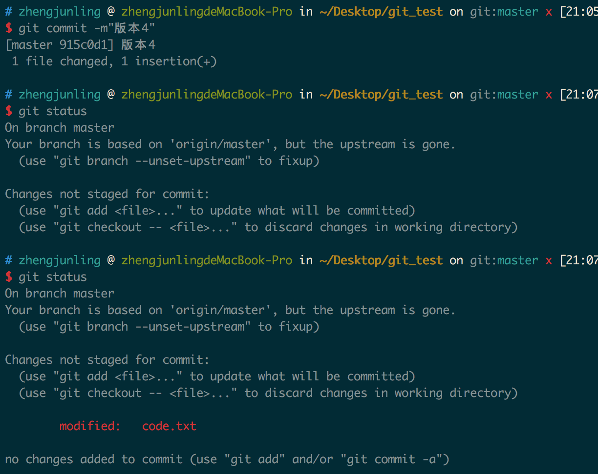

## 撤销修改
```
git checkout --<文件>
```

1. 继续上面的操作，提示我们可以使用 git checkout -- <文件> 来丢弃工作区的改动。执行如下命令，发现工作区干净了，第二次的改动内容也没了。
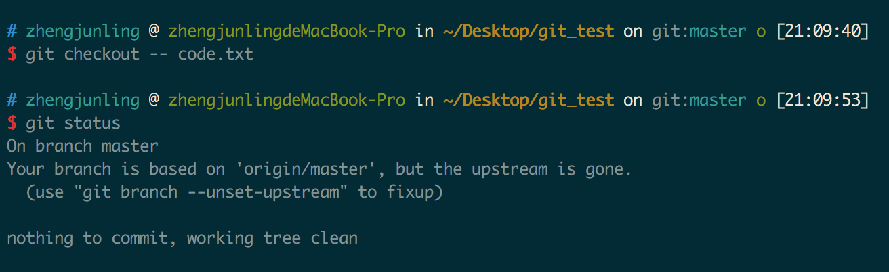

2. 我们继续编辑code.txt，并在其中添加如下内容，并将其添加的暂存区。
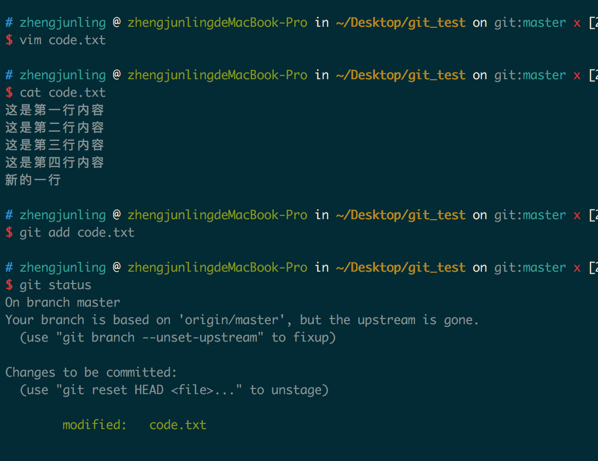
3. git同样告诉我们，用命令git reset HEAD file可以把暂存区的修改撤销掉，重新放回工作区。
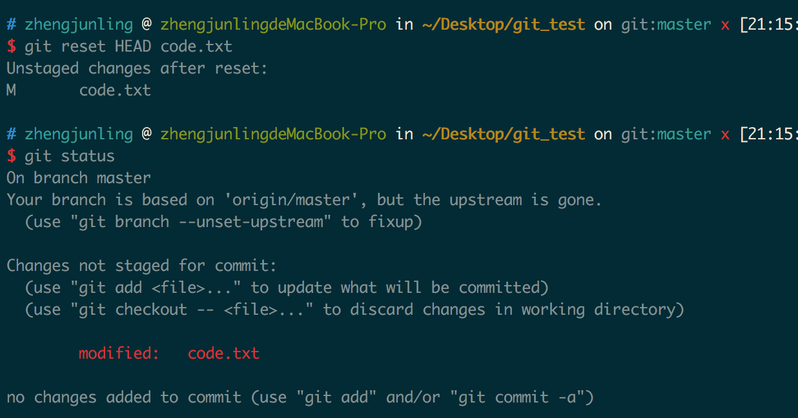
4. 现在若想丢弃code.txt的修改，执行如下命令即可

	```
	git checkout -- code.txt
	```
	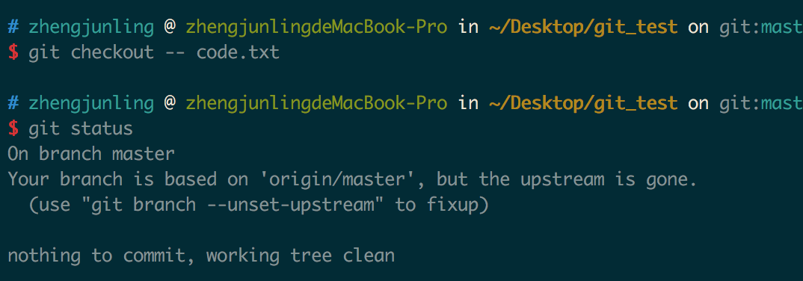
	现在，如果你不但改错了东西，还从暂存区提交到了版本库，则需要进行版本回退。

## 小结：

*	**场景1：**当你改乱了工作区某个文件的内容，想直接丢弃工作区的修改时，用命令git checkout -- file。
*	**场景2：**当你不但改乱了工作区某个文件的内容，还添加到了暂存区时，想丢弃修改，分两步，第一步用命令git reset HEAD file，就回到了场景1，第二步按场景1操作。
*	**场景3：**已经提交了不合适的修改到版本库时，想要撤销本次提交，参考版本回退一节。

## 对比文件的不同

1. 继续编辑文件code.txt，在其中添加一行内容。
	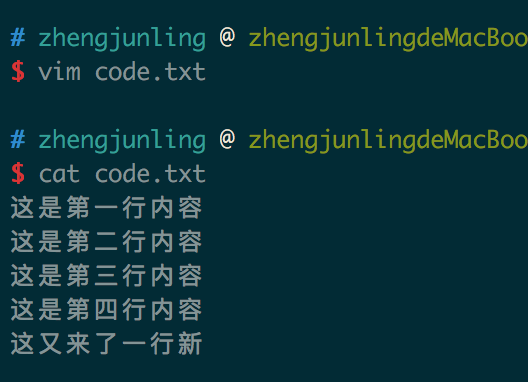
2. 现在要对比工作区中code.txt和HEAD版本中code.txt的不同。使用如下命令：

	```
	git diff HEAD – 文件名
	```
	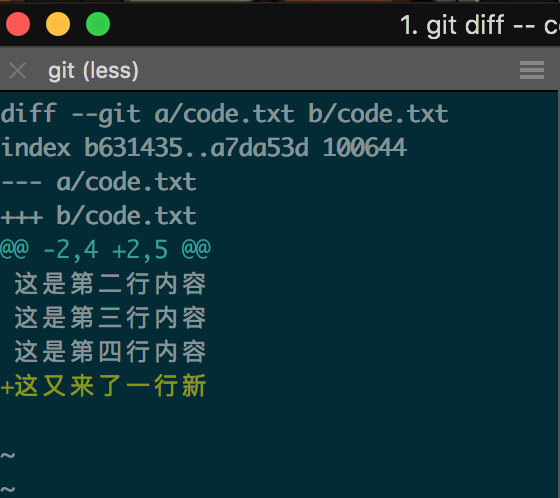
3. 使用如下命令丢弃工作区的改动。
	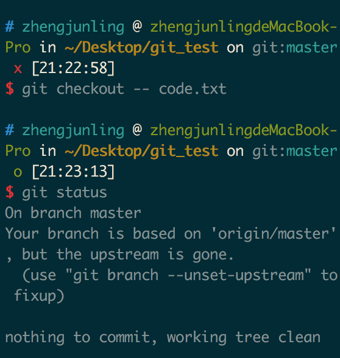

现在要对比HEAD和HEAD^版本中code.txt的不同，使用如下命令：

```
git diff HEAD HEAD^ -- code.txt
```
	
## 删除文件

我们把目录中的code2.txt删除。
这个时候，git知道删除了文件，因此，工作区和版本库就不一致了，git status命令会立刻提示哪些文件被删除了。
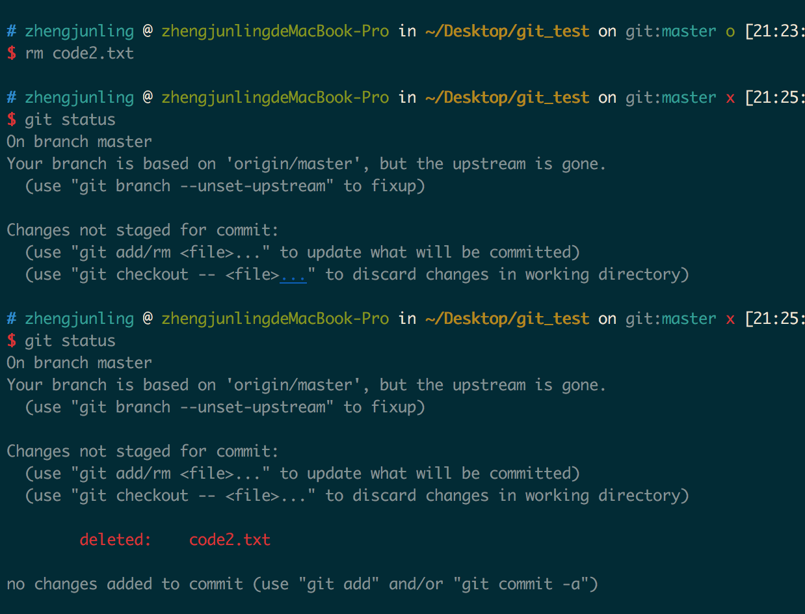

现在你有两个选择，一是确实要从版本库中删除该文件，那就用命令`git rm`删掉，并且git commit：
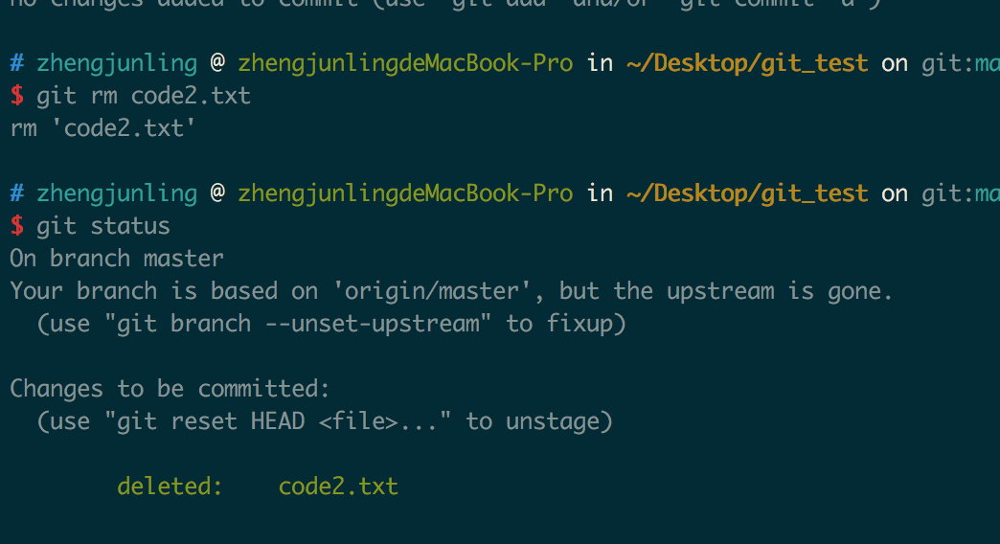
另一种情况是删错了，可以直接使用git checkout – code2.txt,这样文件code2.txt又回来了。
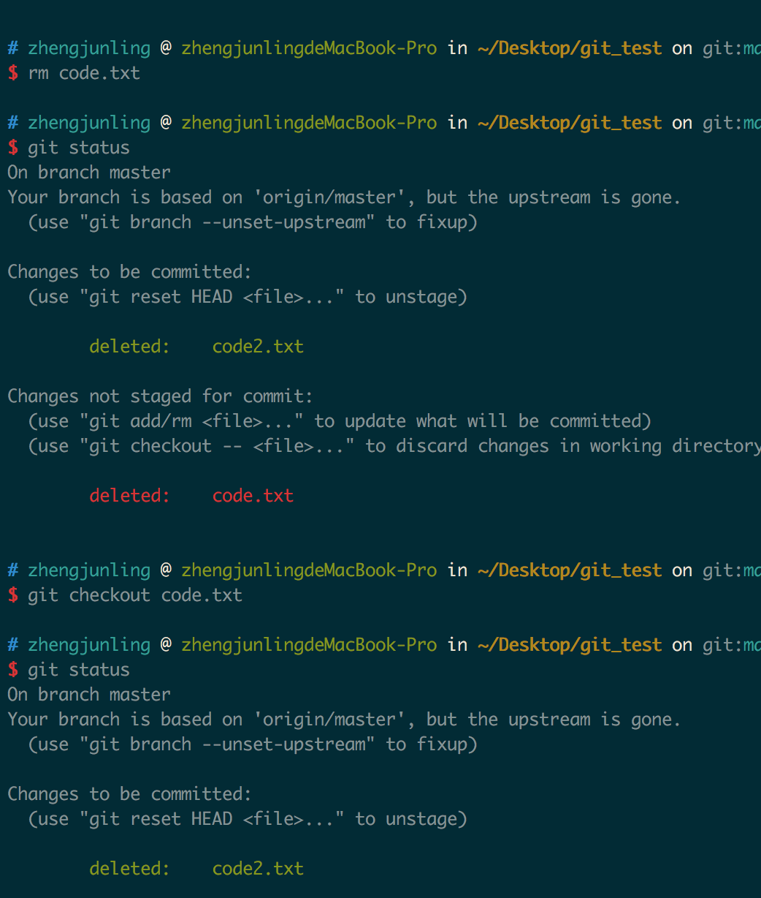
## 小结：
命令git rm用于删除一个文件。如果一个文件已经被提交到版本库，那么你永远不用担心误删，但是要小心，你只能恢复文件到最新版本，你会丢失最近一次提交后你修改的内容。