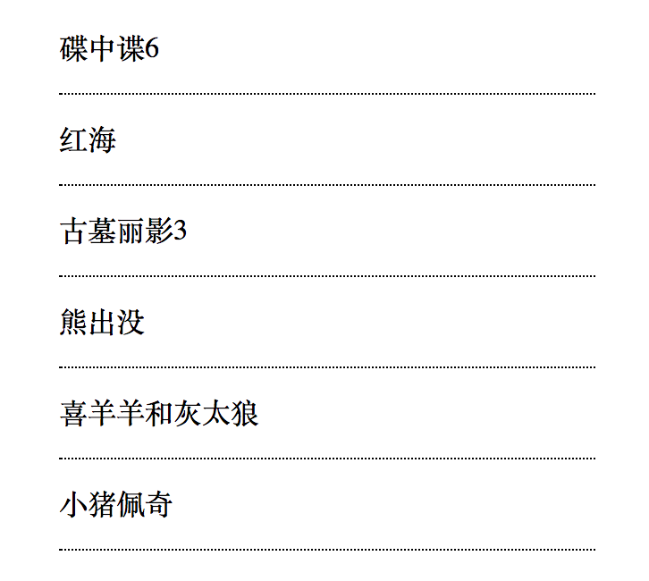

# 循环语句

程序中进行有规律的重复性操作，需要用到循环语句。

## for循环
```
for(var i=0;i<len;i++)
{
    ......
}
```
## 练习 

1. 数组去重

	```
	var aList = [1,2,3,4,4,3,2,1,2,3,4,5,6,5,5,3,3,4,2,1];
	
	var aList2 = [];
	
	for(var i=0;i<aList.length;i++)
	{
	    if(aList.indexOf(aList[i])==i)
	    {
	        aList2.push(aList[i]);
	    }
	}
	
	alert(aList2);
	```
2. 将数组数据放入页面

	
	
	```
	<!DOCTYPE html>
<html lang="en">
<head>
    <meta charset="UTF-8">
    <meta name="viewport" content="width=device-width, initial-scale=1.0">
    <meta http-equiv="X-UA-Compatible" content="ie=edge">
    <title>Document</title>
    <style>
        .list{
            width:300px;
            list-style:none;
            padding:0px;
            margin:50px auto;
        }

        .list li{
            line-height:50px;
            border-bottom:1px dotted black;
        }
    
    </style>
    <script>
        window.onload = function(){
            var aList = ['碟中谍6','红海','古墓丽影3','熊出没','喜羊羊和灰太狼','小猪佩奇']
            var sTr = '';
            var oUl = document.getElementById('list');

            for(var i=0;i<aList.length;i++){
                sTr += '<li>' + aList[i] + '</li>';
            }

            //alert(sTr);
            oUl.innerHTML = sTr;

        }    
    
    </script>
</head>
<body>
    <ul class="list" id="list">
        <!-- <li>电影名称排行</li>
        <li>电影名称排行</li>
        <li>电影名称排行</li>
        <li>电影名称排行</li>
        <li>电影名称排行</li>
        <li>电影名称排行</li> -->
    </ul>
</body>
</html>
	```