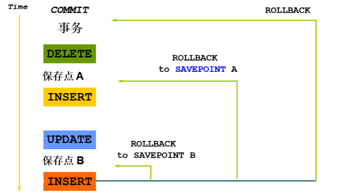

# mysql的事务处理 
联想现实生活中的银行转账业务, 从A账户把钱转给B账户.
>	数据库事务，是由有限的数据库操作序列组成的逻辑执行单元，这一系列操作要么全部执行，要么全部放弃执行。

数据库事务由以下的部分组成:

*	一个或多个DML 语句
*	一个 DDL(Data Definition Language – 数据定义语言) 语句
*	一个 DCL(Data Control Language – 数据控制语言) 语句

事务的特点：**要么都成功，要么都失败。**
## 事务的特性
**事务4大特性(ACID) ：原子性、一致性、隔离性、持久性。**

*	原子性 (Atomicity)：事务中的全部操作在数据库中是不可分割的，要么全部完成，要么均不执行。
*	一致性 (Consistency)：几个并行执行的事务, 其执行结果必须与按某一顺序串行执行的结果相一致。
*	隔离性 (Isolation)：事务的执行不受其他事务的干扰，当数据库被多个客户端并发访问时，隔离它们的操作，使他们之间的操作相互独立, 互不干扰。
*	持久性 (Durability)：对于任意已提交事务，系统必须保证该事务对数据库的改变不被丢失，即使数据库出现故障。

## 隔离级别: 
*	对于同时运行的多个事务, 当这些事务访问数据库中相同的数据时, **如果没有采取必要的隔离机制, 就会导致各种并发问题:**

	*	脏读: 对于两个事物 T1, T2, T1 读取了已经被 T2 更新但还没有被提交的字段. 之后, 若 T2 回滚, T1读取的内容就是临时且无效的.
	* 	不可重复读: 对于两个事物 T1, T2, T1 读取了一个字段, 然后 T2 更新了该字段. 之后, T1再次读取同一个字段, 值就不同了.
	*	幻读: 对于两个事物 T1, T2, T1 从一个表中读取了一个字段, 然后 T2 在该表中插入了一些新的行. 之后, 如果 T1 再次读取同一个表, 就会多出几行.
*	数据库事务的隔离性: 数据库系统必须具有隔离并发运行各个事务的能力, 使它们不会相互影响, 避免各种并发问题. 
*	一个事务与其他事务隔离的程度称为隔离级别. 数据库规定了多种事务隔离级别, 不同隔离级别对应不同的干扰程度, 隔离级别越高, 数据一致性就越好, 但并发性越弱

SQL99定义4中隔离级别：

1. 	Read Uncommitted	读未提交数据。
2.	Read Commited		读已提交数据。
3.	Repeatable Read		可重复读。			
4.	Serializable

这4种MySQL都支持  序列化、串行化。（查询也要等前一个事务结束）

查询当前使用的mysql数据库是哪一种方式:
mysql> select @@tx_isolation;
结果显示: REPEATABLE-READ

关于隔离级别, 可以查看: [https://www.cnblogs.com/huanongying/p/7021555.html](https://www.cnblogs.com/huanongying/p/7021555.html)

## 事务控制语句

在 MySQL 命令行的默认设置下，事务都是自动提交的，即执行 SQL 语句后就会马上执行 `COMMIT` 操作。因此要显式地开启一个事务务须使用命令 `BEGIN` 或 `START TRANSACTION`，或者执行命令 `SET AUTOCOMMIT=0`，用来禁止使用当前会话的自动提交。

*	BEGIN或START TRANSACTION；显式地开启一个事务；
*	COMMIT；也可以使用COMMIT WORK，不过二者是等价的。COMMIT会提交事务，并使已对数据库进行的所有修改成为永久性的；
*	ROLLBACK；有可以使用ROLLBACK WORK，不过二者是等价的。回滚会结束用户的事务，并撤销正在进行的所有未提交的修改；
*	SAVEPOINT identifier；SAVEPOINT允许在事务中创建一个保存点，一个事务中可以有多个SAVEPOINT；
*	RELEASE SAVEPOINT identifier；删除一个事务的保存点，当没有指定的保存点时，执行该语句会抛出一个异常；
*	ROLLBACK TO identifier；把事务回滚到标记点；

**MYSQL 事务处理主要有两种方法：**

1. 用 BEGIN, ROLLBACK, COMMIT来实现
	*	BEGIN 开始一个事务
	*	ROLLBACK 事务回滚
	*	COMMIT 事务确认

2. 直接用 SET 来改变 MySQL 的自动提交模式: 
	*	SET AUTOCOMMIT=0 禁止自动提交
	*	SET AUTOCOMMIT=1 开启自动提交 

**保存点savepoint**

测试的时候mysql应该设置为手动提交.
   
*	保存点（savepoint）可以防止错误操作影响整个事务，方便进行事务控制。



【示例】：

1. create table testsp ( tid int, tname varchar(20)); 
 DDL语句会隐式commit之前操作.
2. insert into testsp values(1, 'Tom');
3. insert into testsp values(2, 'Mary');
4. savepoint aaa;
5. insert into testsp values(3, 'Moke');	故意将“Mike”错写成“Moke”。
6. select * from testsp;    三条数据都显示出来。
7. rollback to savepoint aaa;	 回滚到保存点aaa
8. select * from testsp;   发现表中的数据保存到第二条操作结束的位置

需要注意，前两次的操作仍然没有提交。如操作完成应该显示的执行 commit 提交。

savepoint主要用于在事务上下文中声明一个中间标记, 将一个长事务分隔为多个较小的部分, 和我们编写文档时, 习惯性保存一下一样, 都是为了防止出错和丢失。如果保存点设置名称重复，则会删除之前的那个保存点。一但commit之后，所有的savepoint将失效。

##存储过程

介绍: Mysql储存过程是一组为了完成特定功能的SQL语句集，经过编译之后存储在数据库中，当需要使用该组SQL语句时用户只需要通过指定储存过程的名字并给定参数就可以调用执行它了，简而言之就是一组已经写好的命令，需要使用的时候拿出来用就可以了。
使用存储过程的好处:

1. 存储过程能实现较快的执行速度。

	如果某一操作包含大量的Transaction-SQL代码或分别被多次执行，那么存储过程	要比批处理的执行速度快很多。因为存储过程是预编译的。在首次运行一个存储过	
	
	程时查询，优化器对其进行分析优化，并且给出最终被存储在系统表中的执行计划。而批处理的Transaction-SQL语句在每次运行时都要进行编译和优化，速度相对要慢一些。
	
	心得：编译优化，快！

2. 存储过程允许标准组件是编程。 

	存储过程被创建后，可以在程序中被多次调用，而不必重新编写该存储过程的SQL语句。而且数据库专业人员可以随时对存储过程进行修改，对应用程序源代码毫无影响。 
	
	心得：封装与抽象，简单调用

3. 存储过程可以用流控制语句编写，有很强的灵活性，可以完成复杂的判断和较复杂的运算。 

	心得：功能强大，逻辑强大

4.	存储过程可被作为一种安全机制来充分利用。 

	系统管理员通过执行某一存储过程的权限进行限制，能够实现对相应的数据的访问权限的限制，避免了非授权用户对数据的访问，保证了数据的安全。 

	心得：限制与安全

5. 存储过程能过减少网络流量。 

	针对同一个数据库对象的操作（如查询、修改），如果这一操作所涉及的Transaction-SQL语句被组织程存储过程，那么当在客户计算机上调用该存储过程时，网络中传送的只是该调用语句，从而大大增加了网络流量并降低了网络负载。 
	心得：减少网络流量（封装的好）
## 一. 创建存储过程
1. 基本语法：

```
create procedure sp_name()
begin
.........
end
```

2. 参数传递
## 二. 调用存储过程
1. 基本语法：call sp_name()

注意：存储过程名称后面必须加括号，哪怕该存储过程没有参数传递

## 三. 删除存储过程

1. 基本语法：
drop procedure sp_name//
2. 注意事项

	不能在一个存储过程中删除另一个存储过程，只能调用另一个存储过程

## 四. 区块，条件，循环

1. 区块定义，常用

	```
begin
......
end;
也可以给区块起别名，如：
lable:begin
...........
end lable;
可以用leave lable;跳出区块，执行区块以后的代码
```
2. 条件语句

	```
if 条件 then
statement
else
statement
end if;
```
3.循环语句

	(1).while循环
	
	```
	[label:] WHILE expression DO
	
	statements
	
	END WHILE [label] ;
	```


	(2).loop循环
	
	```
	[label:] LOOP
	
	statements
	
	END LOOP [label];
	```

	(3).repeat until循环
	
	```
	[label:] REPEAT
	
	statements
	
	UNTIL expression
	
	END REPEAT [label] ;
	```
	
其他常用命令

1. show procedure status
显示数据库中所有存储的存储过程基本信息，包括所属数据库，存储过程名称，创建时间等
2. show create procedure sp_name
显示某一个存储过程的详细信息
MySQL存储过程中要用到的运算符

**存储过程可以使用的运算符:**

*	算术运算符

	```
+     加   SET var1=2+2;       4
-     减   SET var2=3-2;       1
*     乘   SET var3=3*2;       6
/     除   SET var4=10/3;      3.3333
DIV   整除 SET var5=10 DIV 3;  3
%     取模 SET var6=10%3 ;     1
```
*	比较运算符

	```
>            大于 1>2 False
<             小于 2<1 False
< =           小于等于 2<=2 True
> =           大于等于 3>=2 True
BETWEEN      在两值之间 5 BETWEEN 1 AND 10 True
NOT BETWEEN  不在两值之间 5 NOT BETWEEN 1 AND 10 False
IN           在集合中 5 IN (1,2,3,4) False
NOT IN       不在集合中 5 NOT IN (1,2,3,4) True
=            等于 2=3 False
<> , !=       不等于 2<>3 False
< =>          严格比较两个NULL值是否相等 NULL<=>NULL True
LIKE         简单模式匹配 "Guy Harrison" LIKE "Guy%" True
REGEXP       正则式匹配 "Guy Harrison" REGEXP "[Gg]reg" False
IS NULL      为空 0 IS NULL False
IS NOT NULL  不为空 0 IS NOT NULL True
```
*	逻辑运算符

	```
与(AND)
或(OR)
异或(XOR)
位运算符
|   位或
&   位与
<<  左移位
>>  右移位
~   位非(单目运算，按位取反)
```

## 使用存储过程的案例:

*	最简单的一个存储过程

	```
	DELIMITER //    ----设置语句块结束标志
	drop procedure if exists sp//
	create procedure sp() select 1 //
	call sp()//
	```

*	带输入参数的存储过程

	```
	drop procedure if exists sp1 //

	create procedure sp1(in p int)
	comment 'insert into a int value'
	begin
	/* 定义一个整形变量 */
	declare v1 int;

	/* 将输入参数的值赋给变量 */
	set v1 = p;

	/* 执行插入操作 */
	insert into test(id) values(v1);
	end
	//
	/* 调用这个存储过程 */
	call sp1(1)//
	/* 去数据库查看调用之后的结果 */
	select * from test// 
	
	```

*	带输出参数的存储过程
	
	```
	drop procedure if exists sp2 //
	create procedure sp2(out p int)
	begin
		select max(id) into p from test;
	end
	//
	
	```
	```
	/* 调用该存储过程，注意：输出参数必须是一个带@符号的变量 */
	call sp2(@pv)//
	/* 查询刚刚在存储过程中使用到的变量 */

	select @pv//
	```
*	带输入和输出参数的存储过程

	```
	drop procedure if exists sp3 //
	create procedure sp3(in p1 int , out p2 int)
	begin

	if p1 = 1 then
	/* 用@符号加变量名的方式定义一个变量，与declare类似 */
	set @v = 10;
	else
	set @v = 20;
	end if;

	/* 语句体内可以执行多条sql，但必须以分号分隔 */

	insert into test(id) values(@v);
	select max(id) into p2 from test;

	end
	//
	```
	```
	/* 调用该存储过程，注意：输入参数是一个值，而输出参数则必须是一个带@符号的变量 */
	call sp3(1,@ret)//

	select @ret//
	```

*	既做输入又做输出参数的存储过程

	```
	drop procedure if exists sp4 //
	create procedure sp4(inout p4 int)
	begin
	if p4 = 4 then
	set @pg = 400;
	else
	set @pg = 500;
	end if; 
	set p4 = @pg;
	end//
	```
	```
	call sp4(@pp)//

	/* 这里需要先设置一个已赋值的变量，然后再作为参数传入 */
	set @pp = 4//
	call sp4(@pp)//
	select @pp;
	```

```
DELIMITER //
  CREATE PROCEDURE myproc(OUT s int)
    BEGIN
      SELECT COUNT(*) INTO s FROM emp;
    END
    //
    
DELIMITER ;
call myproc(@s);
select @s;
```

关于存储过程学习的网站: [https://www.cnblogs.com/YuyuanNo1/p/7778061.html](https://www.cnblogs.com/YuyuanNo1/p/7778061.html)                     