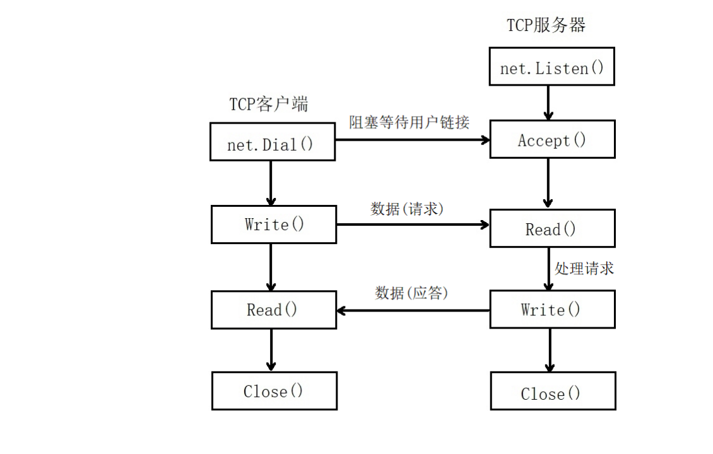
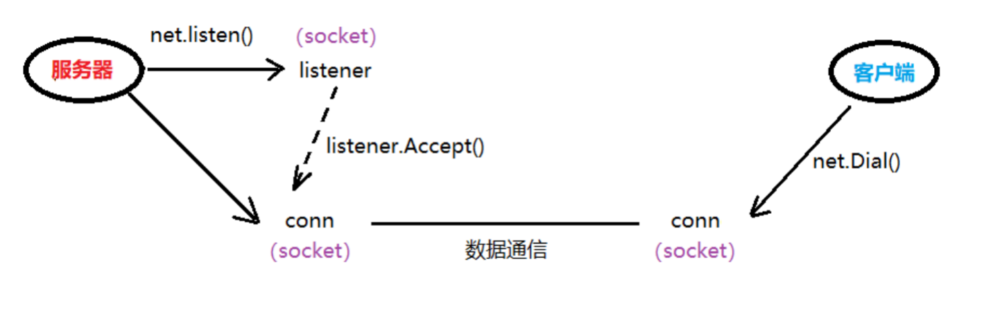

# 网络应用程序设计模式

## C/S模式

>	传统的网络应用设计模式，客户机(client)/服务器(server)模式。需要在通讯两端各自部署客户机和服务器来完成数据通信。

## B/S模式

>	浏览器(Browser)/服务器(Server)模式。只需在一端部署服务器，而另外一端使用每台PC都默认配置的浏览器即可完成数据的传输。

### 优缺点

**C/S优点：**

*	对于C/S模式来说，其优点明显。客户端位于目标主机上可以保证性能，将数据缓存至客户端本地，从而提高数据传输效率。且，一般来说客户端和服务器程序由一个开发团队创作，所以他们之间所采用的协议相对灵活。可以在标准协议的基础上根据需求裁剪及定制。例如，腾讯所采用的通信协议，即为ftp协议的修改剪裁版。因此，传统的网络应用程序及较大型的网络应用程序都首选C/S模式进行开发。如，知名的网络游戏魔兽世界。3D画面，数据量庞大，使用C/S模式可以提前在本地进行大量数据的缓存处理，从而提高观感。

**C/S缺点：**

*	C/S模式的缺点也较突出。由于客户端和服务器都需要有一个开发团队来完成开发。工作量将成倍提升，开发周期较长。另外，从用户角度出发，需要将客户端安插至用户主机上，对用户主机的安全性构成威胁。这也是很多用户不愿使用C/S模式应用程序的重要原因。

**B/S优点：**

*	B/S模式相比C/S模式而言，由于它没有独立的客户端，使用标准浏览器作为客户端，其工作开发量较小。只需开发服务器端即可。另外由于其采用浏览器显示数据，因此移植性非常好，不受平台限制。如早期的偷菜游戏，在各个平台上都可以完美运行。

**B/S缺点：**

*	B/S模式的缺点也较明显。由于使用第三方浏览器，因此网络应用支持受限。另外，没有客户端放到对方主机上，缓存数据不尽如人意，从而传输数据量受到限制。应用的观感大打折扣。第三，必须与浏览器一样，采用标准http协议进行通信，协议选择不灵活。因此在开发过程中，模式的选择由上述各自的特点决定。根据实际需求选择应用程序设计模式。

## TCP的C/S架构



### 简单的C/S模型通信

**Server端：**

*	Listen函数：

	```
	func Listen(network, address string) (Listener, error)
		network：选用的协议：TCP、UDP， 	如：“tcp”或 “udp”
		address：IP地址+端口号, 			如：“127.0.0.1:8000”或 “:8000”
	```
*	Listener 接口：

	```
	type Listener interface {
			Accept() (Conn, error)
			Close() error
			Addr() Addr
	}
	```
*	Conn 接口：
	
	```
	type Conn interface {
		Read(b []byte) (n int, err error)
		Write(b []byte) (n int, err error)
		Close() error
		LocalAddr() Addr
		RemoteAddr() Addr
		SetDeadline(t time.Time) error
		SetReadDeadline(t time.Time) error
		SetWriteDeadline(t time.Time) error
	}
	```

示例代码：

TCP服务器.go

```
package main

import (
   "net"
   "fmt"
)

func main()  {
   // 创建监听
   listener, err:= net.Listen("tcp", ":8000")
   if err != nil {
      fmt.Println("listen err:", err)
      return
   }
   defer listener.Close()          // 主协程结束时，关闭listener

   fmt.Println("服务器等待客户端建立连接...")
   // 等待客户端连接请求
   conn, err := listener.Accept()
   if err != nil {
      fmt.Println("accept err:", err)
      return
   }
   defer conn.Close()             // 使用结束，断开与客户端链接
   fmt.Println("客户端与服务器连接建立成功...")

   // 接收客户端数据
   buf := make([]byte, 1024)        // 创建1024大小的缓冲区，用于read
   n, err := conn.Read(buf)
   if err != nil {
      fmt.Println("read err:", err)
      return
   }
   fmt.Println("服务器读到:", string(buf[:n])) // 读多少，打印多少。
}
```
如图，在整个通信过程中，服务器端有两个socket参与进来，但用于通信的只有 conn 这个socket。它是由 listener创建的。隶属于服务器端。



Client 端：

Dial函数：

```
func Dial(network, address string) (Conn, error)
		network：选用的协议：TCP、UDP，如：“tcp”或 “udp”
		address：服务器IP地址+端口号, 如：“121.36.108.11:8000”或 “www.itcast.cn:8000”
```

Conn 接口：

```
type Conn interface {
	Read(b []byte) (n int, err error)
	Write(b []byte) (n int, err error)
	Close() error
	LocalAddr() Addr
	RemoteAddr() Addr
	SetDeadline(t time.Time) error
	SetReadDeadline(t time.Time) error
	SetWriteDeadline(t time.Time) error
}
```

```
package main

import (
   "net"
   "fmt"
)

func main() {
   // 主动发起连接请求
   conn, err := net.Dial("tcp", "127.0.0.1:8000")
   if err != nil {
      fmt.Println("Dial err:", err)
      return
   }
   defer conn.Close()         // 结束时，关闭连接

   // 发送数据
   _, err = conn.Write([]byte("Are u ready?"))
   if err != nil {
      fmt.Println("Write err:", err)
      return
   }
}
```

## 并发C/S模型通信

###并发Server
现在已经完成了客户端与服务端的通信，但是服务端只能接收一个用户发送过来的数据，怎样接收多个客户端发送过来的数据，实现一个高效的并发服务器呢？

Accept()函数的作用是等待客户端的链接，如果客户端没有链接，该方法会阻塞。如果有客户端链接，那么该方法返回一个Socket负责与客户端进行通信。所以，每来一个客户端，该方法就应该返回一个Socket与其通信，因此，可以使用一个死循环，将Accept()调用过程包裹起来。

需要注意的是，实现并发处理多个客户端数据的服务器，就需要<mark>针对每一个客户端连接，单独产生一个Socket，并创建一个单独的goroutine与之完成通信。</mark>

```
//监听
    listener, err := net.Listen("tcp", "127.0.0.1:8001") 	// tcp 不能使用大写
    if err != nil {
        	fmt.Println("err = ", err)
        	return
    }
    defer listener.Close()
    //接收多个用户
    for {
        	conn, err := listener.Accept()
        	if err != nil {
          		fmt.Println("err = ", err)
            		return
       	 }
       	 //处理用户请求, 新建一个协程
       	 go HandleConn(conn)
}
```

将客户端的数据处理工作封装到HandleConn方法中，需将Accept()返回的Socket传递给该方法，变量conn的类型为：net.Conn。可以使用conn.RemoteAddr()来获取成功与服务器建立连接的客户端IP地址和端口号：

```
Conn 接口：
type Conn interface {
	Read(b []byte) (n int, err error)
	Write(b []byte) (n int, err error)
	Close() error
	LocalAddr() Addr
	RemoteAddr() Addr
	SetDeadline(t time.Time) error
	SetReadDeadline(t time.Time) error
	SetWriteDeadline(t time.Time) error
}

 //获取客户端的网络地址信息
    addr := conn.RemoteAddr().String()
    fmt.Println(addr, " conncet sucessful")
```
客户端可能持续不断的发送数据，因此接收数据的过程可以放在for循环中，服务端也持续不断的向客户端返回处理后的数据。

添加一个限定，如果客户端发送一个“exit”字符串，表示客户端通知服务器不再向服务端发送数据，此时应该结束HandleConn方法，同时关闭与该客户端关联的Socket。

```
buf := make([]byte, 2048)	 //创建一个切片，存储客户端发送的数据

for {
        //读取用户数据 
        n, err := conn.Read(buf)
        if err != nil {
            fmt.Println("err = ", err)
            return
        }
        fmt.Printf("[%s]: %s\n", addr, string(buf[:n]))
        if  "exit" == string(buf[:n-2]) { 		//自己写的客户端测试, 发送时，多了2个字符, "\r\n"
            fmt.Println(addr, " exit")
            return
        }
        //服务器处理数据：把客户端数据转大写，再写回给client
        conn.Write([]byte(strings.ToUpper(string(buf[:n]))))
 }
```

在上面的代码中，Read()方法获取客户端发送过来的数据，填充到切片buf中，返回的是实际填充的数据的长度，所以将客户端发送过来的数据进行打印，打印的是实际接收到的数据。

fmt.Printf("[%s]: %s\n", addr, string(buf[:n])).同时也可以将客户端的网络地址信息打印出来。

在判断客户端数据是否为“exit”字符串时，要注意，客户端会自动的多发送2个字符：“\r\n”（这在windows系统下代表回车、换行）

Server使用Write方法将数据写回给客户端，参数类型是 []byte，需使用strings包下的ToUpper函数来完成大小写转换。转换的对象即为string(buf[:n])
综上，HandleConn方法完整定义如下：

```
/处理用户请求
func HandleConn(conn net.Conn) {
//函数调用完毕，自动关闭conn
defer conn.Close()

          //获取客户端的网络地址信息
          addr := conn.RemoteAddr().String()
          fmt.Println(addr, " conncet sucessful")

          buf := make([]byte, 2048)

          for {
                  //读取用户数据
                 n, err := conn.Read(buf)
                 if err != nil {
                         fmt.Println("err = ", err)
                         return
            		}
            		fmt.Printf("[%s]: %s\n",  addr,  string(buf[:n]))
            	fmt.Println("len = ", len(string(buf[:n])))	

            		//if "exit" == string(buf[:n-1]) { 	// nc测试，发送时，只有 \n
                 if  "exit" == string(buf[:n-2]) {	// 自己写的客户端测试, 发送时，多了2个字符, "\r\n"
                        fmt.Println(addr, " exit")
                        return
                 }

                 //把数据转换为大写，再给用户发送
                 conn.Write([]byte(strings.ToUpper(string(buf[:n]))))
          }
}
```

### 并发Client

客户端不仅需要持续的向服务端发送数据，同时也要接收从服务端返回的数据。因此可将发送和接收放到不同的协程中。

主协程循环接收服务器回发的数据（该数据应已转换为大写），并打印至屏幕；子协程循环从键盘读取用户输入数据，写给服务器。读取键盘输入可使用 os.Stdin.Read(str)。定义切片str，将读到的数据保存至str中。

这样，客户端也实现了多任务。

**客户端代码实现：**

```
package main

import (
   "net"
   "fmt"
   "os"
)

func main() {
   // 主动发起连接请求
   conn, err := net.Dial("tcp", "127.0.0.1:8001")
   if err != nil {
      fmt.Println("Dial err:", err)
      return
   }
   defer conn.Close() 		  			// 客户端终止时，关闭与服务器通信的 socket 

   // 启动子协程，接收用户键盘输入
   go func() {
  	  str := make([]byte, 1024)   		// 创建用于存储用户键盘输入数据的切片缓冲区。
      for {                    			// 反复读取
         n, err :=os.Stdin.Read(str)    	// 获取用户键盘输入
         if err != nil {
            fmt.Println("os.Stdin.Read err:", err)
            return
         }
         // 将从键盘读到的数据，发送给服务器
         _, err = conn.Write(str[:n])   	// 读多少，写多少
         if err != nil {
            fmt.Println("conn.Write err:", err)
            return
         }
      }
   }()

   // 主协程，接收服务器回发数据，打印至屏幕
   buf := make([]byte, 1024)        		// 定义用于存储服务器回发数据的切片缓冲区
   for {
      n, err := conn.Read(buf)	  		// 从通信 socket 中读数据，存入切片缓冲区
      if err != nil {
         fmt.Println("conn.Read err:", err)
         return
      }
      fmt.Printf("服务器回发：%s\n", string(buf[:n]))
   }
}
```


