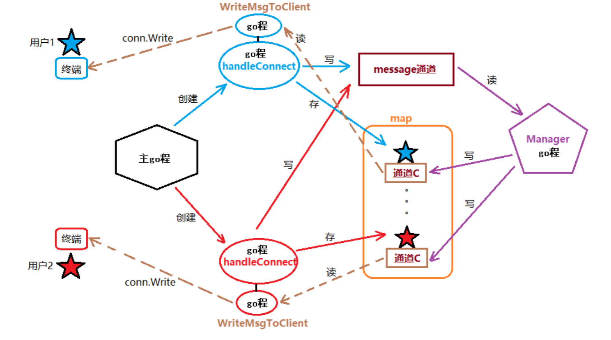

# 并发聊天室



后期可以扩展一对一聊天

```
package main

import (
	"net"
	"fmt"
	"os"
	"strings"
	"time"
)

type Client struct {
	C    chan string
	Addr string
	Name string
	conn net.Conn
}

var message = make(chan string)
var onlineMap = make(map[string]*Client)
//1，创建连接
//2，循环创建监听
//3，handleconnect，
//4，读取用户上线消息发给
//5，创建结构体，map，channel
//6，创建manage
//7，创建writeToClient

func main() {

	listener, err := net.Listen("tcp", "127.0.0.1:8989")
	handleErr(err, "net.listen err")
	defer listener.Close()
	//Manage全句只能有一个，并且要在前面以go的方式启动
	go Manage()
	for {
		conn, err := listener.Accept()
		handleErr(err, "listener accept err")
		go handleConnect(conn)
	}
}

func Manage() {
	for {
		msg := <-message
		for _, v := range onlineMap {
			v.C <- msg
		}
	}
}

func handleConnect(conn net.Conn) {
	var quit = make(chan bool)
	var alive = make(chan bool)
	defer conn.Close()
	addr := conn.RemoteAddr().String()
	fmt.Println(addr, "上线了")
	//创建结构体，存入map
	clt := Client{make(chan string), addr, addr, conn}
	onlineMap[addr] = &clt
	//要在广播前启动
	go writeToClient(clt)
	message <- makeMsg(addr, "login!!!")
	//启动一个go程 readmsg
	go func() {
		buf := make([]byte, 4096)
		var msg string
		for {
			n, err := conn.Read(buf)
			fmt.Println(n, err)
			if err != nil {
				quit <- true
				return
			}
			msg = string(buf[:n-1])
			//Label:
			fmt.Println("read finish")
			fmt.Println(makeMsg(addr, msg))
			if strings.Contains(msg, "who") {
				var userInfo string
				for _, v := range onlineMap {
					userInfo += makeMsg(v.Addr, v.Name)
				}
				conn.Write([]byte(userInfo))
				continue
			} else if strings.HasPrefix(msg, "rename|") {
				clt.Name = string(msg[7:])
				onlineMap[addr] = &clt
				conn.Write([]byte("rename success\n"))
				continue
			}
				message <- makeMsg(addr, msg)
			alive <- true
		}
	}()
	for {
		select {
		case <-quit:
			close(clt.C)
			delete(onlineMap, addr)
			message <- makeMsg(clt.Name, "quit!!!")
			return
		case <-time.After(time.Second * 10000):
			close(clt.C)
			delete(onlineMap, addr)
			message <- makeMsg(clt.Name, "quit!!!")
			return
		case <-alive:

		}
	}

}

func writeToClient(clt Client) {
	for msg := range clt.C {
		clt.conn.Write([]byte(msg))
	}
}
func makeMsg(addr string, s string) string {
	return "[" + addr + "]" + s + "\n"
}
func handleErr(err error, str string) {
	if err != nil {
		fmt.Println(str, err)
		os.Exit(1)
	}
}
```