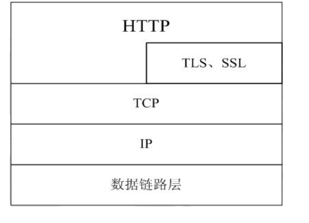
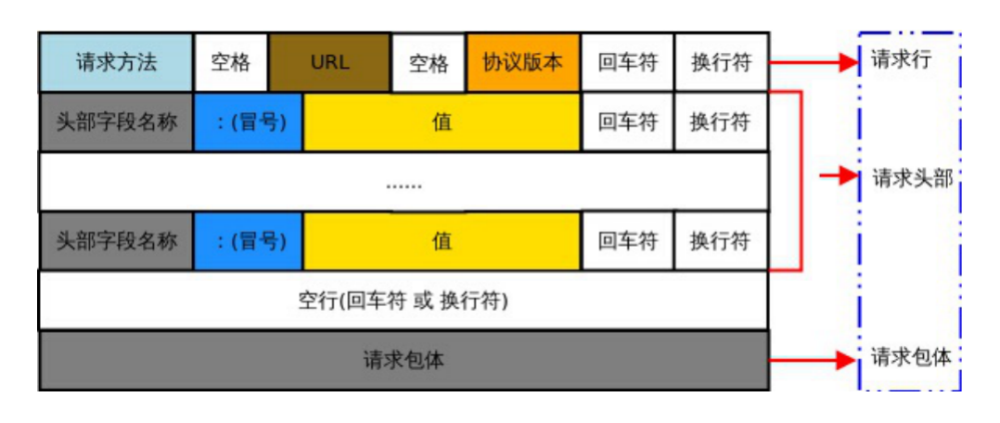
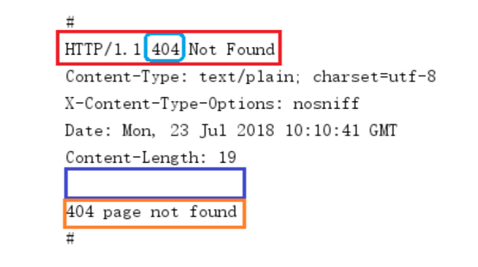

# HTTP编程

## 概述

我们平时浏览网页的时候,会打开浏览器，输入网址后按下回车键，然后就会显示出你想要浏览的内容。在这个看似简单的用户行为背后，到底隐藏了些什么呢？

对于普通的上网过程，系统其实是这样做的：

1. 浏览器本身是一个客户端，当你输入URL的时候，首先浏览器会去请求DNS服务器，通过DNS获取相应的域名对应的IP，
2. 然后通过IP地址找到IP对应的服务器后，要求建立TCP连接，等浏览器发送完HTTP Request（请求）包后，服务器接收到请求包之后才开始处理请求包，服务器调用自身服务，返回HTTP Response（响应）包；
3. 客户端收到来自服务器的响应后开始渲染这个Response包里的主体（body），等收到全部的内容随后断开与该服务器之间的TCP连接。


**DNS域名服务器（Domain Name Server）**是进行域名(domain name)和与之相对应的IP地址转换的服务器。DNS中保存了一张域名解析表，解析消息的域名。

一个**Web服务器也被称为HTTP服务器**，它通过HTTP (HyperText Transfer Protocol 超文本传输协议)协议与客户端通信。这个客户端通常指的是Web浏览器(其实手机端客户端内部也是浏览器实现的)。

Web服务器的工作原理可以简单地归纳为：

*	客户机通过TCP/IP协议建立到服务器的TCP连接
* 	客户端向服务器发送HTTP协议请求包，请求服务器里的资源文档
*  	服务器向客户机发送HTTP协议应答包，如果请求的资源包含有动态语言的内容，那么服务器会调用动态语言的解释引擎负责处理“动态内容”，并将处理得到的数据返回给客户端
*  	客户机与服务器断开。由客户端解释HTML文档，在客户端屏幕上渲染图形结果

## HTTP协议
>	超文本传输协议(HTTP，HyperText Transfer Protocol)是互联网上应用最为广泛的一种网络协议，它详细规定了浏览器和万维网服务器之间互相通信的规则，通过因特网传送万维网文档的数据传送协议。

HTTP协议通常承载于TCP协议之上，有时也承载于TLS或SSL协议层之上，这个时候，就成了我们常说的HTTPS。如下图所示：



## 地址（URL）

>	URL全称为Unique Resource Location，用来表示网络资源，可以理解为网络文件路径。

基本URL的结构包含:

*	模式（协议）、
* 	服务器名称（IP地址）、
*  	路径和文件名。

常见的协议/模式如http、https、ftp等。服务器的名称或IP地址后面有时还跟一个冒号和一个端口号。再后面是到达这个文件的路径和文件本身的名称。如：

```
http://localhost[":"port][abs_path]
http://192.168.31.1/html/index
https://pan.baidu.com/
```
URL的长度有限制，不同的服务器的限制值不太相同，但是不能无限长。

## HTTP报文解析


### 请求报文格式
**获取请求报文**

为了更直观的看到浏览器发送的请求包，我们借助前面学习的TCP通信模型，编写一个简单的web服务器，只接收浏览器发送的内容，打印查看。

服务器测试代码：

```
package main

import (
   "net"
   "fmt"
)

func main() {
   //创建、监听socket
   listenner, err := net.Listen("tcp", "127.0.0.1:8000")
   if err != nil {
      fmt.Println("Listen err:", err)
      return
   }
   defer listenner.Close()

   //阻塞等待客户端连接
   conn, err := listenner.Accept()
   if err != nil {
      fmt.Println("Accept err:", err)
      return
   }
   defer conn.Close()

   fmt.Println(conn.RemoteAddr().String(), "连接成功")       //连接客户端的网络地址

   buf := make([]byte, 4096)  //切片缓冲区，接收客户端发送数据
   n, err := conn.Read(buf)   //n 接收数据的长度
   if err != nil {
      fmt.Println("Read err:", err)
      return
   }
   result := buf[:n]        //切片截取

   fmt.Printf("#\n%s#", string(result))
}
```
在浏览器中输入url地址： 127.0.0.1:8000
服务器端运行打印结果如下：


### 请求报文格式说明

HTTP 请求报文由<mark>请求行、请求头部、空行、请求包体</mark>4个部分组成，如下图所示：



**1. 请求行**

请求行由<mark>方法字段、URL字段 和HTTP 协议版本字段</mark> 3个部分组成，他们之间使用空格隔开。常用的 HTTP 请求方法有 GET、POST。

GET：

*	当客户端要从服务器中读取某个资源时，使用GET 方法。GET 方法要求服务器将URL 定位的资源放在响应报文的数据部分，回送给客户端，即向服务器请求某个资源。
*	使用GET方法时，请求参数和对应的值附加在 URL 后面，利用一个问号(“?”)代表URL 的结尾与请求参数的开始，传递参数长度受限制，因此GET方法不适合用于上传数据。
* 	通过GET方法来获取网页时，参数会显示在浏览器地址栏上，因此保密性很差。

POST:

*	当客户端给服务器提供信息较多时可以使用POST 方法，POST 方法向服务器提交数据，比如完成表单数据的提交，将数据提交给服务器处理。
* 	GET 一般用于获取/查询资源信息，POST 会附带用户数据，一般用于更新资源信息。POST 方法将请求参数封装在HTTP 请求数据中，而且长度没有限制，因为POST携带的数据，在HTTP的请求正文中，以名称/值的形式出现，可以传输大量数据。

**2. 请求头部**

请求头部为请求报文添加了一些附加信息，由“名/值”对组成，每行一对，名和值之间使用冒号分隔。请求头部通知服务器有关于客户端请求的信息，典型的请求头有：

请求头 | 含义
------------- | -------------
User-Agent	|请求的浏览器类型
Accept	|客户端可识别的响应内容类型列表，星号“ * ”用于按范围将类型分组，用“ * / *  ”指示可接受全部类型，用“ type/* ”指示可接受 type 类型的所有子类型
Accept-Language	|客户端可接受的自然语言
Accept-Encoding	|客户端可接受的编码压缩格式
Accept-Charset	|可接受的应答的字符集
Host	|请求的主机名，允许多个域名同处一个IP 地址，即虚拟主机
connection	|连接方式(close或keepalive)
Cookie	|存储于客户端扩展字段，向同一域名的服务端发送属于该域的cookie

**3. 空行**

最后一个请求头之后是一个空行，发送回车符和换行符，通知服务器以下不再有请求头。

**4. 请求包体**

请求包体不在GET方法中使用，而在POST方法中使用。POST方法适用于需要客户填写表单的场合。与请求包体相关的最常使用的是包体类型Content-Type和包体长度Content-Length。

### 响应报文格式

*	要想获取响应报文，必须先发送请求报文给web服务器。服务器收到并解析浏览器（客户端）发送的请求报文后，借助http协议，回复相对应的响应报文。
*	下面我们借助net/http包，创建一个最简单的服务器，给浏览器回发送响应包。首先注册处理函数http.HandleFunc()，设置回调函数handler。而后绑定服务器的监听地址http.ListenAndserve()。
*	这个服务器启动后，当有浏览器发送请求，回调函数被调用，会向浏览器回复“hello world”作为网页内容。当然，是按照http协议的格式进行回复。

**创建简单的响应服务器**

服务器示例代码：

```
package main

import "net/http"

// 浏览器访问时，该函数被回调
func handler(w http.ResponseWriter, r *http.Request) {
   w.Write([]byte("hello http"))
}

func main()  {
   // 注册处理函数
   http.HandleFunc("/hello", handler)

   // 绑定服务器监听地址
   http.ListenAndServe("127.0.0.1:8000", nil)
}
```

测试：启动服务器。打开浏览器，在URL中写入127.0.0.1:8000/hello，向服务器发送请求。会在浏览器中看到服务器回发的“hello http”。 

回调函数handler会在浏览器访问服务器时被调用。服务器使用w.Write向浏览器写了“hello http”。

但服务器是怎样借助http协议将“hello http”字符串写回来的呢，服务器响应报文的具体格式是什么样的呢？

接下来我们编写一个客户端，模拟浏览器给服务器发送“请求报文”的行为，然后将服务器回发的响应报文打印出来就可以看到了。

客户端测试示例代码：

```
package main

import (
   "net"
   "fmt"
)

func main()  {
   // 客户端主动连接服务器
   conn, err := net.Dial("tcp", "127.0.0.1:8000")
   if err != nil {
      fmt.Println("Dial err:", err)
      return
   }
   defer conn.Close()

   // 模拟浏览器，组织一个最简单的请求报文。包含请求行，请求头，空行即可。
   requestHttpHeader := "GET /hello HTTP/1.1\r\nHost:127.0.0.1:8000\r\n\r\n"

   // 给服务器发送请求报文
   conn.Write([]byte(requestHttpHeader))

   buf := make([]byte, 4096)
   // 读取服务器回复 响应报文
   n, err := conn.Read(buf)
   if err != nil {
      fmt.Println("Read err:", err)
      return
   }
   // 打印观察
   fmt.Printf("#\n%s#", string(buf[:n]))
}
```

启动程序，测试http的成功响应报文：


启动程序，测试http的失败响应报文：



### 响应报文格式说明

HTTP 响应报文由<mark>状态行、响应头部、空行、响应包体</mark>4个部分组成，如下图所示：


**1. 状态行**
状态行由 HTTP 协议版本字段、状态码和状态码的描述文本3个部分组成，他们之间使用空格隔开。

状态码：状态码由三位数字组成，第一位数字表示响应的类型，常用的状态码有五大类如下所示：

状态码	|含义
------------- | -------------
1xx	|表示服务器已接收了客户端请求，客户端可继续发送请求
2xx	|表示服务器已成功接收到请求并进行处理
3xx	|表示服务器要求客户端重定向
4xx	|表示客户端的请求有非法内容
5xx	|表示服务器未能正常处理客户端的请求而出现意外错误
**常见的状态码举例：**

状态码	|含义
------------- | -------------
200 |OK	客户端请求成功
400 |Bad Request	请求报文有语法错误
401 |Unauthorized	未授权
403 |Forbidden	服务器拒绝服务
404 |Not Found	请求的资源不存在
500 |Internal Server Error	服务器内部错误
503 |Server Unavailable	服务器临时不能处理客户端请求(稍后可能可以)

**2. 响应头部**

响应头可能包括：

响应头	|含义
------------- | -------------
Location	|Location响应报头域用于重定向接受者到一个新的位置
Server	|Server 响应报头域包含了服务器用来处理请求的软件信息及其版本
Vary	|指示不可缓存的请求头列表
Connection	|连接方式

**3. 空行**

最后一个响应头部之后是一个空行，发送回车符和换行符，通知服务器以下不再有响应头部。

**4. 响应包体**

服务器返回给客户端的文本信息。

### Go语言HTTP编程

Go语言标准库内建提供了net/http包，涵盖了HTTP客户端和服务端的具体实现。使用net/http包，我们可以很方便地编写HTTP客户端或服务端的程序。

**HTTP服务端**

```
package main

import (
    "fmt"
    "net/http"
)

//服务端编写的业务逻辑处理程序 —— 回调函数
func myHandler(w http.ResponseWriter, r *http.Request) {
    fmt.Println("method = ", r.Method) 	//请求方法
    fmt.Println("URL = ", r.URL)		// 浏览器发送请求文件路径
    fmt.Println("header = ", r.Header)		// 请求头
    fmt.Println("body = ", r.Body)		// 请求包体
    fmt.Println(r.RemoteAddr, "连接成功")  	//客户端网络地址

    w.Write([]byte("hello http")) 	//给客户端回复数据
}

func main() {
    http.HandleFunc("/hello", myHandler)	// 注册处理函数

    //该方法用于在指定的 TCP 网络地址 addr 进行监听，然后调用服务端处理程序来处理传入的连接请求。
    //该方法有两个参数：第一个参数 addr 即监听地址；第二个参数表示服务端处理程序，通常为nil
    //当参2为nil时，服务端调用 http.DefaultServeMux 进行处理
    http.ListenAndServe("127.0.0.1:8000", nil)
}
```
浏览器输入url地址：127.0.0.1:8000/hello

回调函数myHandler的函数原型固定。func myHandler(w http.ResponseWriter, r * http.Request) 有两个参数：w http.ResponseWriter 和 r *http.Request。w用来“给客户端回发数据”。它是一个interface：

```
type ResponseWriter interface {
   Header() Header			
   Write([]byte) (int, error)	
   WriteHeader(int)			
}
```
r 用来“接收客户端发送的数据”。浏览器发送给服务器的http请求包的内容可以借助r来查看。它对应一个结构体：

```
type Request struct {
	Method string		// 浏览器请求方法 GET、POST…
	URL *url.URL		// 浏览器请求的访问路径
	……
	Header Header		// 请求头部
	Body io.ReadCloser	// 请求包体
	RemoteAddr string	// 浏览器地址
	……
    	ctx context.Context
}
```
查看一下结构体成员：

```
fmt.Println("Method = ", r.Method)
fmt.Println("URL = ", r.URL)
fmt.Println("Header = ", r.Header)
fmt.Println("Body = ", r.Body)
fmt.Println(r.RemoteAddr, "连接成功")
```

**HTTP客户端**

客户端访问web服务器数据，主要使用func Get(url string) (resp *Response, err error)函数来完成。读到的响应报文数据被保存在 Response 结构体中。

```
type Response struct {
   Status     string // e.g. "200 OK"
   StatusCode int    // e.g.  200
   Proto      string // e.g. "HTTP/1.0"
   ……
   Header Header
   Body io.ReadCloser
   ……
}
```
服务器发送的响应包体被保存在Body中。可以使用它提供的Read方法来获取数据内容。保存至切片缓冲区中，拼接成一个完整的字符串来查看。

<mark>结束的时候，需要调用Body中的Close()方法关闭io。

```
package main

import (
   "net/http"
   "fmt"
   "io"
)

func main()  {
   // 使用Get方法获取服务器响应包数据
   //resp, err := http.Get("http://www.baidu.com")
   resp, err := http.Get("http://127.0.0.1:8000/hello")
   if err != nil {
      fmt.Println("Get err:", err)
      return
   }
   defer resp.Body.Close()

   // 获取服务器端读到的数据
   fmt.Println("Status = ", resp.Status)           // 状态
   fmt.Println("StatusCode = ", resp.StatusCode)   // 状态码
   fmt.Println("Header = ", resp.Header)           // 响应头部
   fmt.Println("Body = ", resp.Body)               // 响应包体

   buf := make([]byte, 4096)         // 定义切片缓冲区，存读到的内容
   var result string
   // 获取服务器发送的数据包内容
   for {
      n, err := resp.Body.Read(buf)  // 读body中的内容。
      if n == 0 {
         fmt.Println("--Read finish!")
         break
      }
      if err != nil && err != io.EOF {
         fmt.Println("resp.Body.Read err:", err)
         return
      }
      result += string(buf[:n])     // 累加读到的数据内容
   }
   // 打印从body中读到的所有内容
   fmt.Println("result = ", result)
}
```

## 练习：

在计算机中选定一个目录，存放jpg、png、txt、mp3、gif、m4a等类型文件。编写一个服务器程序，可以给浏览器提供该目录下文件的访问服务。
如：目录中存有图片文件：lf.jpg。用户在浏览器中输入：127.0.0.1:8000/lf.jpg 可以查看该图片。

```
package main

import (
	"net/http"
	"fmt"
	"os"
)

func main() {
	http.HandleFunc("/", handle)
	http.ListenAndServe("127.0.0.1:8000", nil)
}
func handle(writer http.ResponseWriter, request *http.Request) {
	url := request.URL.String()
	burl := []byte(url)
	burl = burl[1:]
	url = string(burl)
	fmt.Println("url:", url)
	path := "/Users/zhengjunling/Downloads/picture/"
	dir, err := os.OpenFile(path, os.O_RDONLY, os.ModeDir)
	if err != nil {
		fmt.Println(" os.OpenFile err:", err)
	}
	defer dir.Close()
	info, err := dir.Readdir(-1)
	if err != nil {
		fmt.Println("dir.Readdir err:", err)
	}
	var isShowAllFile = false
	var allFileStr string
	if url == "all" {
		isShowAllFile = true
	}
	for n, file := range info {
		fmt.Println("n=",n)
		if !file.IsDir() {
			allFileStr += file.Name() + "\n"
		}
	}
	if isShowAllFile {
		writer.Write([]byte(allFileStr))
	}
	sendFileToClient(path+url, writer)
}
func sendFileToClient(path string, writer http.ResponseWriter) {
	fp, err := os.Open(path)
	if err != nil {
		fmt.Println("os.Open err:", err)
		return
	}
	defer fp.Close()
	buf := make([]byte, 4096)
	for {
		n, err := fp.Read(buf)
		fmt.Println(n,err)
		if err != nil {
			fmt.Println("fp.Read err:", err)
			return
		}
		writer.Write(buf[:n])
	}

}
```
效果

