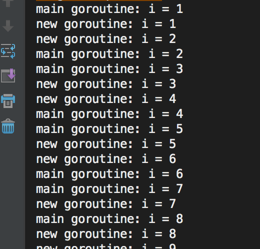
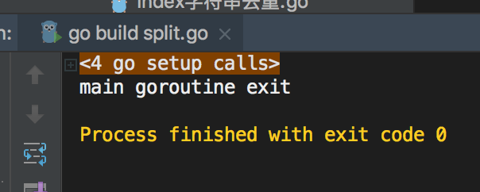

# 什么是Goroutine

goroutine是Go语言并行设计的核心，有人称之为go程。 goroutine说到底其实就是协程，它比线程更小，十几个goroutine可能体现在底层就是五六个线程，Go语言内部帮你实现了这些goroutine之间的内存共享。执行goroutine只需极少的栈内存(大概是4~5KB)，当然会根据相应的数据伸缩。也正因为如此，可同时运行成千上万个并发任务。goroutine比thread更易用、更高效、更轻便。

一般情况下，一个普通计算机跑几十个线程就有点负载过大了，但是同样的机器却可以轻松地让成百上千个goroutine进行资源竞争。

# Goroutine的创建

只需在函数调⽤语句前添加 go 关键字，就可创建并发执⾏单元。开发⼈员无需了解任何执⾏细节，调度器会自动将其安排到合适的系统线程上执行。

在并发编程中，我们通常想将一个过程切分成几块，然后让每个goroutine各自负责一块工作，当一个程序启动时，主函数在一个单独的goroutine中运行，我们叫它main goroutine。新的goroutine会用go语句来创建。而go语言的并发设计，让我们很轻松就可以达成这一目的。

示例代码：

```
func newTask() {
    i := 0
    for {
        i++
        fmt.Printf("new goroutine: i = %d\n", i)
        time.Sleep(1*time.Second) //延时1s
    }
}

func main() {
    //创建一个 goroutine，启动另外一个任务
    go newTask()
    i := 0
    //main goroutine 循环打印
    for {
        i++
        fmt.Printf("main goroutine: i = %d\n", i)
        time.Sleep(1 * time.Second) //延时1s
    }
}
```


## Goroutine特性
主goroutine退出后，其它的工作goroutine也会自动退出：


```
func newTask() {
    i := 0
    for {
        i++
        fmt.Printf("new goroutine: i = %d\n", i)
        time.Sleep(1 * time.Second) //延时1s
    }
}

func main() {
    //创建一个 goroutine，启动另外一个任务
    go newTask()

    fmt.Println("main goroutine exit")
}
```


##runtime包

###Gosched
runtime.Gosched() （go schedule）用于让出CPU时间片，让出当前goroutine的执行权限，调度器安排其他等待的任务运行，并在下次再获得cpu时间轮片的时候，从该出让cpu的位置恢复执行。
有点像跑接力赛，A跑了一会碰到代码runtime.Gosched() 就把接力棒交给B了，A歇着了，B继续跑。

示例代码：

```
func main() {
    //创建一个goroutine
    go func(s string) {
        for i := 0; i < 2; i++ {
            fmt.Println(s)
        }
    }("world")

    for i := 0; i < 2; i++ {
        runtime.Gosched()  //import "runtime" 包
        /*
            屏蔽runtime.Gosched()运行结果如下：
                hello
                hello

            没有runtime.Gosched()运行结果如下：
                world
                world
                hello
                hello
        */
        fmt.Println("hello")
    }
}
```
以上程序的执行过程如下：

主协程进入main()函数，进行代码的执行。当执行到go func()匿名函数时，创建一个新的协程，开始执行匿名函数中的代码，主协程继续向下执行，执行到runtime.Gosched( )时会暂停向下执行，直到其它协程执行完后，再回到该位置，主协程继续向下执行。

### Goexit 

调用 runtime.Goexit() 将立即终止当前 goroutine 执⾏，调度器确保所有已注册 defer延迟调用被执行。

示例代码：

```
func main() {
    go func() {
        defer fmt.Println("A.defer")

        func() {
            defer fmt.Println("B.defer")
            runtime.Goexit() // 终止当前 goroutine, import "runtime"
            fmt.Println("B") // 不会执行
        }()

        fmt.Println("A") // 不会执行
    }() 	//不要忘记()

    //死循环，目的不让主goroutine结束
    for {
    }
}
```
运行结果：B.defer A.defer

### GOMAXPROCS

调用 runtime.GOMAXPROCS() 用来设置可以并行计算的CPU核数的最大值，并返回之前的值。

示例代码：

```
func main() {
//n := runtime.GOMAXPROCS(1) 	// 第一次 测试
//打印结果：111111111111111111110000000000000000000011111...

n := runtime.GOMAXPROCS(2)         // 第二次 测试
//打印结果：010101010101010101011001100101011010010100110...
    fmt.Printf("n = %d\n", n)

    for {
        go fmt.Print(0)
        fmt.Print(1)
    }
}
```

在第一次执行runtime.GOMAXPROCS(1) 时，最多同时只能有一个goroutine被执行。所以会打印很多1。过了一段时间后，GO调度器会将其置为休眠，并唤醒另一个goroutine，这时候就开始打印很多0了，在打印的时候，goroutine是被调度到操作系统线程上的。

在第二次执行runtime.GOMAXPROCS(2) 时， 我们使用了两个CPU，所以两个goroutine可以一起被执行，以同样的频率交替打印0和1。
