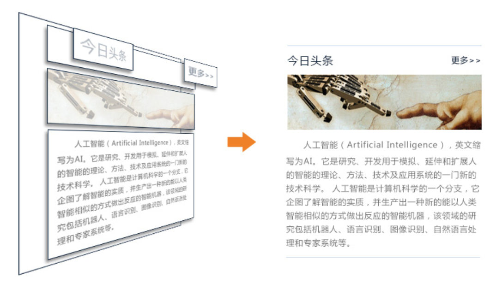

# html布局
## 网页布局原理

标签在网页中会显示成一个个的方块，先按照行的方式，把网页划分成多个行，再到行里面划分列，也就是在表示行的标签中再嵌套标签来表示列，整体按照先整体，后局部，先大后小的顺序来书写结构。



## 布局示例

根据网页布局的原理以及上面的实例，写出网页的html结构代码。

## 标签语义化

在布局中需要尽量使用带语义的标签，使用带语义的标签的目的首先是为了让搜索引擎能更好地理解网页的结构，提高网站在搜索中的排名(也叫做SEO)，其次是方便代码的阅读和维护。

## 带语义的标签 

```
1、h1~h6：表示标题
2、p：表示段落
3、img：表示图片
4、a：表示链接
```

## 不带语义的标签 

```
1、div：表示一块内容

2、span：表示行内的一块内容
```


所以我们要根据网页上显示的内容，使用适合的标签，可以优化之前的代码。

# 练习

实现上图的效果

```
<!-- 1. 生成基本的html结构，!+enter -->
<!DOCTYPE html>
<html lang="en">

<head>
    <meta charset="UTF-8">
    <meta name="viewport" content="width=device-width, initial-scale=1.0">
    <meta http-equiv="X-UA-Compatible" content="ie=edge">
    <title>Document</title>
    <!-- 3. 设置标签样式,大小 -->
    <style>
        .news {
            width: 285px;
            /* 4. 上下边线 */
            border-bottom: 1px solid #c8dcf2;
            border-top: 1px solid #c8dcf2;
        }

        .news div {
            height: 40px;
        }

        .news h3 {
            margin: 0px;
            font-size:16px;
            /* 4. 左右浮动 */
            float: left;
            line-height: 40px;
            font-size: 16px;
        }

        .news a {
            margin: 0px;
            /* 4. 左右浮动 */
            float: right;
            line-height: 40px;
            font-size: 12px;
            color: black;
            /* 4. 去掉下划线 */
            text-decoration: none;
        }

        .news p {
            margin: 0px;
            color: #737373;
            font-size: 12px;
            text-indent: 24px;
            line-height: 20px;
        }

        .news h3 .news a .news p {
            font-family: 'Microsoft YaHei';
        }
    </style>
</head>

<body>
    <div class="news">
        <!-- 2. 第一行 -->
        <div>
            <!-- 2. 尽量使用具有语义化的标签，便于被搜索 -->
            <h3>今日头条</h3>
            <!-- 2. &lt;&gt;左右括号，以防有些浏览器不兼容 -->
            <a href="#">更多&gt;&gt;</a>
        </div>
        <!-- 2. alt在图片不显示时显示的文字 -->
        
        <!-- 2. 段落文字 -->
        <p>人工智能（Artificial Intelligence），英文缩写为AI。它是研究、开发用于模拟、延伸和扩展人的智能的理论、方法、技术及应用系统的一门新的技术科学。人工智能是计算机科学的一个分支，它企图了解智能的实质，并生产出一种新的能以人类智能相似的方式做出反应的智能机器，该领域的研究包括机器人、语言识别、图像识别、自然语言处理和专家系统等。</p>
    </div>
</body>

</html>
```
