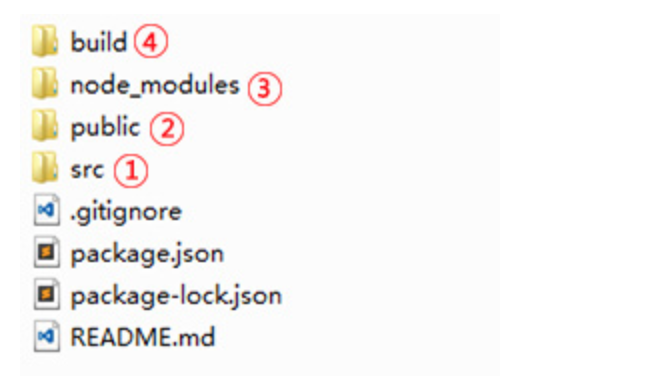

# 脚手架开发

脚手架开发指的是react提供了完整的自动化开发工具及规划好了开发一个应用的项目目录，这些工具是通过nodejs开发的，我们可以通过npm(nodejs包管理命令)来安装这些工具，同时可以通过这个工具生成一个应用的项目目录。

## 安装脚手架工具

脚手架工具是nodejs的一个包，安装这个工具之前需要先安装nodejs，然后在终端执行以下命令：

```
1、设置npm淘宝景象
npm config set registry https://registry.npm.taobao.org

2、安装
npm install -g create-react-app
```

## 生成应用项目目录

```
3、生成app
create-react-app my-app

4、启动
cd my-app
npm start

5、生成上线文件
npm run build
```

## 项目目录说明



以上是执行生成命令自动生成的项目目录，对应的文件夹作用如下：

*	目录一：src目录，主开发目录，里面包含所有项目的组件，开发组件都是基于此目录
*	目录二：public目录，项目入口文件目录，目录中的文件不用动
*	目录三：项目开发依赖包文件目录，项目安装的包都会自动安装在这个文件夹中
*	目录四：build目录，项目上线时，执行npm run build生成的目录，这里面是自动化工具生成的上线文件

## 安装axios模块

```
1、在终端的项目目录，执行如下命令
npm install axios

2、在模块文件中引入
import axios from 'axios';
```
