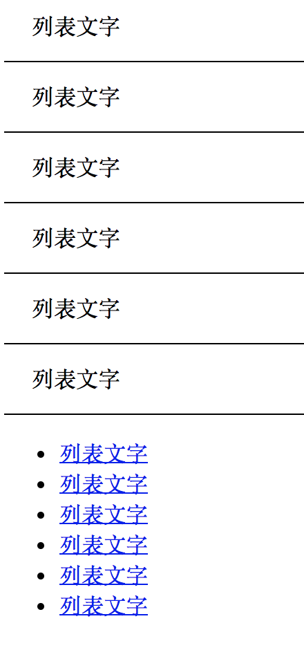

# 列表标签

列表一般应用在布局中的新闻标题列表和文章标题列表以及菜单，**它是含有语义的**，标签结构如下：

```
<ul>
    <li>列表标题一</li>
    <li>列表标题二</li>
    <li>列表标题三</li>
</ul>
```
**列表相关样式**

list-style 去掉列表项的小圆点，比如：list-style:none

# 练习：



```
<!DOCTYPE html>
<html lang="en">
<head>
    <meta charset="UTF-8">
    <meta name="viewport" content="width=device-width, initial-scale=1.0">
    <meta http-equiv="X-UA-Compatible" content="ie=edge">
    <title>Document</title>
    <style>
        .list{
            /* 去掉列表的小圆点 */
            list-style:none;

            /* 清除列表默认的内边距 */
            padding:0px;

            /* 清除列表默认的外边距 */
            margin:0px;
        }
        .list li{
            line-height:50px;
            border-bottom:1px solid black;
            text-indent:20px;
        }    
    </style>
</head>
<body>
    <!-- ul>li{列表文字}*6 -->
    <ul class="list">
        <li>列表文字</li>
        <li>列表文字</li>
        <li>列表文字</li>
        <li>列表文字</li>
        <li>列表文字</li>
        <li>列表文字</li>
    </ul>

    <!-- ul>(li>a{列表文字})*6 -->
    <ul>
        <li><a href="#">列表文字</a></li>
        <li><a href="#">列表文字</a></li>
        <li><a href="#">列表文字</a></li>
        <li><a href="#">列表文字</a></li>
        <li><a href="#">列表文字</a></li>
        <li><a href="#">列表文字</a></li>
    </ul>

   
</body>
</html>
```