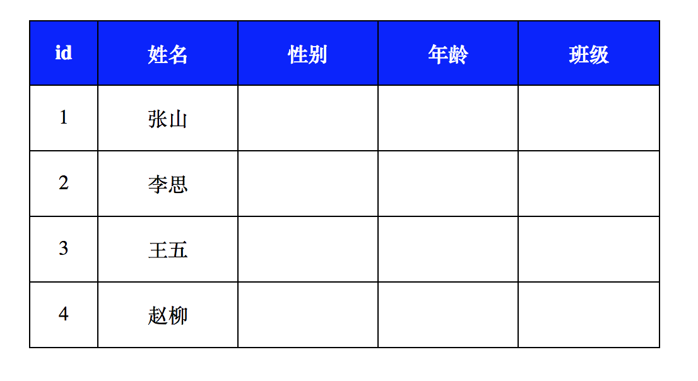

# 表格元素及相关样式
1. `<table>`标签：声明一个表格
2. `<tr>`标签：定义表格中的一行
3. `<td>`和`<th>`标签：定义一行中的一个单元格，td代表普通单元格，th表示表头单元格

## 表格相关样式属性

border-collapse 设置表格的边线合并，如：border-collapse:collapse;

## 练习


```
<!DOCTYPE html>
<html lang="en">
<head>
    <meta charset="UTF-8">
    <meta name="viewport" content="width=device-width, initial-scale=1.0">
    <meta http-equiv="X-UA-Compatible" content="ie=edge">
    <title>Document</title>
    <style>
        .tablestyle01{
            width:500px;
            height:260px;
            border:1px solid black;
            /* 让表格水平居中 */
            margin:50px auto;

            /* 将表格的边线合并成一条线 */
            border-collapse:collapse;
        }
        .tablestyle01 td{
            border:1px solid black;
            /* 设置文字的水平对齐方式 */
            text-align:center;
        }
        .tablestyle01 th{
            border:1px solid black;
            background:blue;
            color:white;
        }   
    
    </style>
</head>
<body>
    <!-- table>(tr>td*5)*4 -->
    <table class="tablestyle01">
        <tr>
            <th>id</th>
            <th>姓名</th>
            <th>性别</th>
            <th>年龄</th>
            <th>班级</th>
        </tr>
        <tr>
            <td>1</td>
            <td>张山</td>
            <td></td>
            <td></td>
            <td></td>
        </tr>
        <tr>
            <td>2</td>
            <td>李思</td>
            <td></td>
            <td></td>
            <td></td>
        </tr>
        <tr>
            <td>3</td>
            <td>王五</td>
            <td></td>
            <td></td>
            <td></td>
        </tr>
        <tr>
            <td>4</td>
            <td>赵柳</td>
            <td></td>
            <td></td>
            <td></td>
        </tr>
    </table>
   
</body>
</html>
```