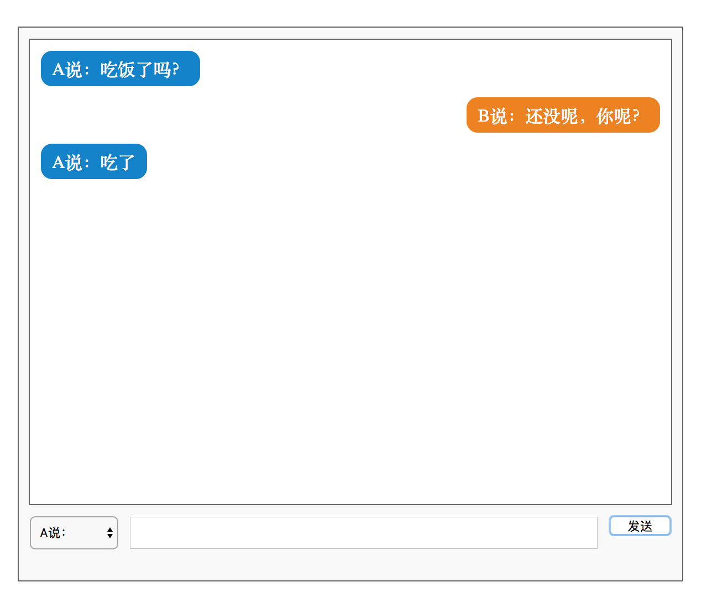

# jquery属性操作

## html() 取出或设置html内容
```
// 取出html内容

var $htm = $('#div1').html();

// 设置html内容

$('#div1').html('<span>添加文字</span>');
```
## prop() 取出或设置某个属性的值

```
// 取出图片的地址

var $src = $('#img1').prop('src');

// 设置图片的地址和alt属性

$('#img1').prop({src: "test.jpg", alt: "Test Image" });
```

## 练习 
聊天效果



```
<!DOCTYPE html>
<html lang="en">

<head>
    <meta charset="UTF-8">
    <meta name="viewport" content="width=device-width, initial-scale=1.0">
    <meta http-equiv="X-UA-Compatible" content="ie=edge">
    <title>Document</title>
    <style type="text/css">
        .talk_con {
            width: 600px;
            height: 500px;
            border: 1px solid #666;
            margin: 50px auto 0;
            background: #f9f9f9;
        }

        .talk_show {
            width: 580px;
            height: 420px;
            border: 1px solid #666;
            background: #fff;
            margin: 10px auto 0;
            overflow: auto;
        }

        .talk_input {
            width: 580px;
            margin: 10px auto 0;
        }

        .whotalk {
            width: 80px;
            height: 30px;
            float: left;
            outline: none;
        }

        .talk_word {
            width: 420px;
            height: 26px;
            padding: 0px;
            float: left;
            margin-left: 10px;
            outline: none;
            text-indent: 10px;
        }

        .talk_sub {
            width: 56px;
            height: 30px;
            float: left;
            margin-left: 10px;
        }

        .atalk {
            margin: 10px;
        }

        .atalk span {
            display: inline-block;
            background: #0181cc;
            border-radius: 10px;
            color: #fff;
            padding: 5px 10px;
        }

        .btalk {
            margin: 10px;
            text-align: right;
        }

        .btalk span {
            display: inline-block;
            background: #ef8201;
            border-radius: 10px;
            color: #fff;
            padding: 5px 10px;
        }
    </style>
    <script src="js/jquery-1.12.4.min.js"></script>
    <script type="text/javascript">      
        $(function () {
            var $words = $('#words'),
                $who = $('#who'),
                $talk = $('#talkwords'),
                $btn = $('#talksub');

            $btn.click(function () {

                // 读取属性值
                /*var sVal01 = $who.prop('value');
                var sVal02 = $talk.prop('value');
                */

                // 清空输入框里面的内容
                // $talk.prop({'value':''});

                // 操作value属性可以改成下面 val() 方法的写法：
                // 读取属性值
                var sVal01 = $who.val();
                var sVal02 = $talk.val();

                // 清空输入框里面的内容
                $talk.val('');

                // 判断输入框是否为空
                if (sVal02 == '') {
                    alert('请输入内容！');
                    return;
                }

                var sTr = ''

                if (sVal01 == 0) {
                    sTr = '<div class="atalk"><span>A说：' + sVal02 + '</span></div>';
                }
                else {
                    sTr = ' <div class="btalk"><span>B说：' + sVal02 + '</span></div>';
                }

                $words.html($words.html() + sTr);

            })


        })

    </script>
</head>

<body>
    <div class="talk_con">
        <div class="talk_show" id="words">
            <div class="atalk"><span>A说：吃饭了吗？</span></div>
            <div class="btalk"><span>B说：还没呢，你呢？</span></div>
        </div>
        <div class="talk_input">
            <select class="whotalk" id="who">
                <option value="0">A说：</option>
                <option value="1">B说：</option>
            </select>
            <input type="text" class="talk_word" id="talkwords">
            <input type="button" value="发送" class="talk_sub" id="talksub">
        </div>
    </div>
</body>

</html>
```